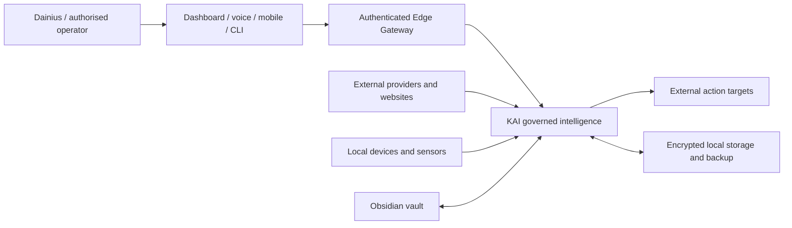
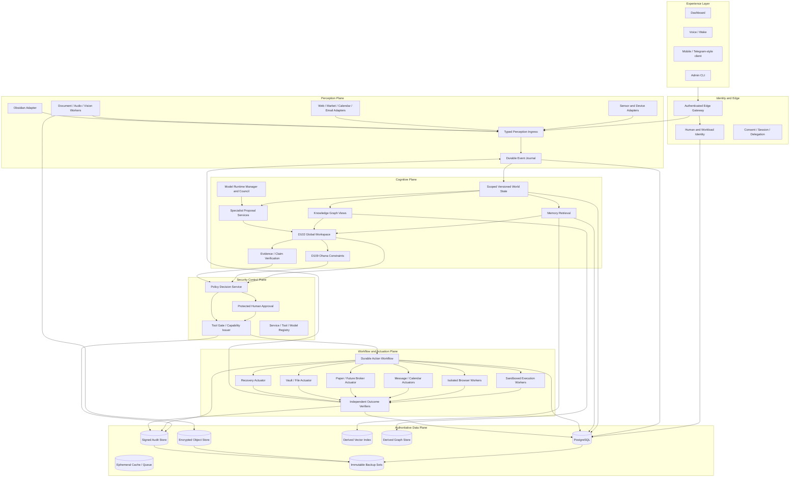
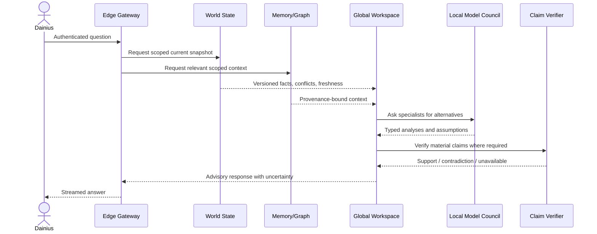
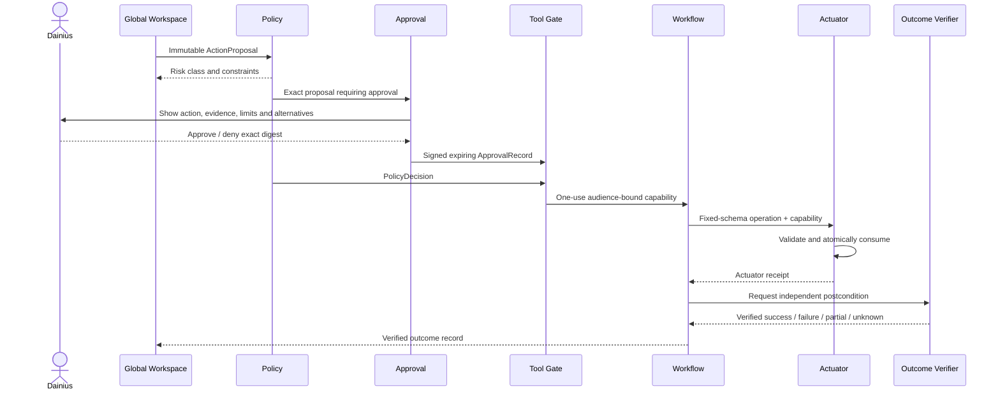
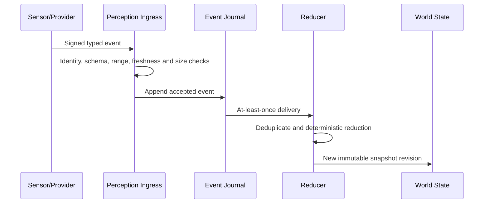

# KAI Final Product Architecture Specification

Repository: `dainius1234/kai-system`  
Architecture status: **TARGET PRODUCT DESIGN — PLANNING ONLY**  
Prepared: 27 July 2026  
Runtime remediation performed by this document: **NONE**  
Findings closed by this document: **ZERO**  
Current release decision: **NO_GO**

This specification defines the intended final KAI product: its hardware placement, logical architecture, security boundaries, data contracts, model runtime, user approval model, workflows, preserved capabilities, deployment topology, migration sequence and acceptance criteria.

It is the complete product-level architecture above the detailed audit and remediation plans. It does not replace finding evidence or authorise implementation.

Authoritative supporting documents:

- `kai-pm/CODE_AUDIT_MASTER.md`
- `kai-pm/CODE_AUDIT_FINAL_REPORT.md`
- `kai-pm/CODE_AUDIT_IMPLEMENTATION_SEQUENCE_AND_CLOSURE_MATRIX.md`
- `kai-pm/KAI_UNIFIED_HUNTER_ARCHITECTURE_AND_ROADMAP.md`
- `kai-pm/CODE_AUDIT_P0_CONTAINMENT_PLAN.md`
- `kai-pm/CODE_AUDIT_P1_SECURITY_FOUNDATION_PLAN.md`
- `kai-pm/CODE_AUDIT_P2_ISOLATION_AND_INTEGRITY_PLAN.md`
- `kai-pm/CODE_AUDIT_P3_RELIABILITY_AUDIT_PRIVACY_RECOVERY_PLAN.md`
- `kai-pm/CODE_AUDIT_P4_CAPABILITY_REQUALIFICATION_PLAN.md`

---

# 1. Product definition

## 1.1 Vision

KAI is intended to be a private, portable, locally controlled intelligence that:

- understands the operator’s current situation;
- gathers information through specialised senses and tools;
- combines that information into one coherent view;
- reasons through alternatives rather than allowing isolated modules to act independently;
- asks for the operator’s approval where consequence requires it;
- executes only exact authorised operations;
- verifies what actually happened;
- learns from confirmed outcomes;
- remains useful when disconnected from cloud services;
- can grow through controlled, reviewed capability additions.

The product metaphor is:

> **One hunter, many senses and tools, one governed judgement path, controlled hands and independently verified outcomes.**

## 1.2 What is retained

The final design retains the intended functionality rather than discarding it:

- conversational KAI interface;
- personal memory and long-term continuity;
- Obsidian Brain / vault synchronisation;
- local knowledge graph;
- emotional and narrative continuity;
- operator preferences and confirmed values;
- Cortex and ambient situational awareness;
- Global Workspace / unified deliberation;
- specialist model council and debate;
- forecasting, adversarial review and causal reasoning;
- proactive observations and suggestions;
- document, image, audio, screen and sensor processing;
- browsing and controlled external research;
- calendar, email and notification assistance;
- financial awareness, market analysis and paper trading;
- future narrow financial automation only after separate qualification;
- health monitoring, backup and recovery;
- self-assessment and controlled skill growth;
- portable operation on the selected Strix Halo device;
- future expansion to additional trusted compute nodes.

The objective is to **rewire and qualify** these capabilities, not to remove the product vision.

## 1.3 What the final product is not

KAI is not:

- a collection of independent agents with separate authority;
- an unauthenticated LAN of microservices;
- a chatbot that can directly call every tool;
- a single all-powerful LLM process;
- a feature-flag collection where enabled means safe;
- a self-certifying autonomy system;
- a system where confidence, loyalty or eloquent wording grants permission;
- a system that silently treats missing information as neutral;
- a system that learns permanent values from its own replies;
- a system that retries uncertain external actions blindly;
- a system that declares success solely because the executor returned `200 OK`.

---

# 2. Core architecture principles

## FP-INV-01 — One coherent decision path

Every consequential action follows:

`Perception → World State → Deliberation → Proposal → Policy → Approval → Capability → Workflow → Actuation → Observation → Verification → Learning`

No protected deployment may retain a direct specialist-to-actuator bypass.

## FP-INV-02 — Roles are separated

A component may be a perception provider, reducer, proposal specialist, policy authority, actuator or verifier. A component must not independently propose, approve, execute and verify the same consequential action.

## FP-INV-03 — D102 coordinates reasoning only

Global Workspace assembles context, alternatives and proposals. It does not hold actuator credentials, issue capabilities or execute operations.

## FP-INV-04 — The operator remains sovereign

Dainius is the final authority for high-consequence actions. Approval is authenticated, exact, expiring and bound to the proposed operation—not inferred from ordinary chat.

## FP-INV-05 — Security is enforced at the final hand

The service or worker performing a side effect must validate and atomically consume an audience-bound, one-use capability for the exact operation.

## FP-INV-06 — Data is scoped and attributable

Every durable record has principal, tenant, purpose, classification, provenance, revision and lifecycle metadata.

## FP-INV-07 — Unknown remains unknown

Unavailable, stale, conflicting, partial and unverified states are explicit. They are never converted into normal success, neutral evidence or false confidence.

## FP-INV-08 — Learning follows reality

Only independently verified outcomes can alter trust, calibration, durable value models or autonomy qualification.

## FP-INV-09 — Local-first does not mean implicitly trusted

All internal services authenticate and authorise each other. Loopback, container network placement and static IP addresses are not identity.

## FP-INV-10 — Graceful reduction, not fail-open

When models, sensors, policy, approval, audit or verification are unavailable, KAI reduces capability or blocks the operation. It does not silently bypass controls.

## FP-INV-11 — Capability-specific release

There is no blanket “KAI is safe.” Each capability is released for a specific revision, model/tool set, data class, risk tier and operating mode.

## FP-INV-12 — Portable operation remains recoverable

Sleep, battery loss, restart and thermal throttling must not corrupt state, duplicate actions or restore permissive authority.

---

# 3. Hardware architecture

## 3.1 Selected primary device

The selected target platform is the **ASUS ROG Flow Z13 (2025) with AMD Strix Halo / Ryzen AI Max+ 395**, preferably the **128GB unified-memory configuration**.

Architecture assumption:

- 128GB is the full-product target;
- 64GB may support a reduced model council and smaller context budgets;
- 32GB is a development/minimal configuration, not the intended full local organism;
- exact model residency and throughput remain benchmark gates, not promises.

## 3.2 Compute-role allocation

### XDNA 2 NPU — low-power sentinel and perception acceleration

Intended workloads:

- wake-word and voice-activity detection;
- small ASR front-end or audio classifiers where supported;
- lightweight intent, anomaly and safety classifiers;
- embeddings where the chosen model/runtime is supported;
- Cortex feature extraction and low-rate situation classification;
- battery-aware Pulse/sentinel functions;
- device-state monitoring that does not require the full model council.

The NPU is not assumed to run arbitrary large LLMs. Every NPU workload requires model conversion, supported-operator validation, accuracy comparison and power measurement.

### Radeon 8060S integrated GPU — local reasoning and multimodal inference

Intended workloads:

- primary local conversational model;
- specialist council models;
- vision-language inference;
- heavier embeddings/reranking when beneficial;
- causal simulation and batch reasoning;
- controlled dream/consolidation jobs;
- local fine-tuning experiments only in isolated development mode.

### Zen 5 CPU — control, data and deterministic services

Intended workloads:

- identity and policy services;
- Tool Gate and approval logic;
- event ingestion and World State reducers;
- workflow orchestration;
- PostgreSQL, object metadata and durable queues;
- vector/graph coordination;
- audit, backup and verification;
- normal APIs and lightweight adapters;
- process isolation and worker lifecycle control.

## 3.3 Operating power modes

### Mode H0 — Battery Sentinel

- NPU and minimal CPU services only;
- no heavy model council;
- no consequential actuation;
- encrypted event capture and wake triggers;
- operator-visible battery and privacy state.

### Mode H1 — Portable Assistant

- one primary local model;
- bounded Cortex/perception services;
- normal chat, memory retrieval and advisory functions;
- heavy background jobs paused;
- external actions remain approval-controlled.

### Mode H2 — Docked Deep Reasoning

- expanded model council within measured memory/thermal budget;
- larger contexts and batch reasoning;
- graph maintenance, indexing and backups;
- simulation and dream/consolidation windows;
- full supervised capability set that has passed release gates.

### Mode H3 — Maintenance / Recovery

- models and actuators disabled;
- integrity checks, migrations, backup verification and restore testing;
- network exposure minimised;
- explicit operator entry and exit.

## 3.4 Memory budget authority

A dedicated **Model Runtime Manager** owns memory allocation. Individual modules may not load models independently.

The manager records:

- model name and immutable digest;
- quantisation and runtime;
- CPU/GPU/NPU placement;
- weight memory;
- KV-cache budget;
- context limit;
- adapter memory;
- measured startup time;
- measured token throughput;
- thermal/power profile;
- current residency and eviction priority.

Admission control rejects a requested model set that would leave insufficient memory for the operating system, databases, event buffers, workflows, audit and emergency headroom.

## 3.5 Optional future nodes

The product may later add:

- encrypted local NAS/object storage;
- a trusted home compute node;
- a dedicated GPU server;
- a small independent sentinel device;
- secure remote access through an authenticated tunnel.

Additional nodes are workloads with explicit identity and narrow trust. They do not automatically become part of one trusted LAN.

---

# 4. System context



Only the Edge Gateway is exposed to user interfaces. Internal services are not directly published as operator APIs.

---

# 5. Logical product architecture



---

# 6. Architectural planes and responsibilities

## 6.1 Experience layer

The experience layer provides:

- conversational interface;
- visual state and evidence display;
- approval prompts;
- notifications;
- capability status;
- privacy and sensor indicators;
- administration through a separate protected mode.

It does not hold reusable internal administrator credentials and does not proxy anonymous callers with fleet-wide authority.

## 6.2 Identity and edge layer

Responsibilities:

- authenticate the human operator;
- establish secure sessions;
- enforce CSRF/origin protections;
- bind requests to principal, purpose and device;
- issue narrow delegation to internal workloads;
- rate limit and reject malformed input;
- expose only approved APIs;
- keep administrative operations separate from ordinary chat.

## 6.3 Perception plane

Responsibilities:

- collect observations;
- authenticate producers;
- validate typed schemas;
- classify sensitivity;
- record source and receipt time;
- preserve provenance;
- mark untrusted/model-generated/simulated content;
- deduplicate and bound inputs;
- append accepted events to the durable journal.

A perception provider reports what it observed. It does not create permission.

## 6.4 Cognitive plane

Responsibilities:

- construct scoped World State views;
- retrieve relevant memory and graph context;
- run specialist analysis;
- expose assumptions and conflicts;
- generate alternatives and no-action options;
- produce immutable proposals;
- assess values and constraints;
- verify claims and evidence.

The cognitive plane does not execute side effects.

## 6.5 Security control plane

Responsibilities:

- service and tool registry;
- risk classification;
- policy decision;
- human approval requirements;
- exact operation digest;
- one-use capability issuance;
- revocation and expiry;
- security audit linkage.

This plane is deterministic and does not rely solely on an LLM judgement.

## 6.6 Workflow and actuation plane

Responsibilities:

- persist action state;
- reserve idempotency;
- dispatch to the correct isolated worker;
- enforce capability at the final side-effect boundary;
- track timeout and unknown state;
- reconcile before retry;
- perform compensation where valid;
- collect postconditions.

Actuators are narrow hands. They cannot broaden objectives or parameters.

## 6.7 Outcome and learning plane

Responsibilities:

- independently observe target state;
- verify complete, partial, failed or unknown outcomes;
- link evidence to operation digest;
- update calibration and trust only from verified results;
- preserve contradiction and negative evidence;
- stop self-generated claims becoming proof.

---

# 7. Target service catalogue

The final product uses clear bounded services. Exact process boundaries may be consolidated where operationally sensible, but role boundaries remain enforced.

## 7.1 Core control services

### `edge-gateway`

- only general user-facing API ingress;
- authentication, session, request validation and rate limiting;
- no reusable actuator credential.

### `identity-service`

- human/device/workload identity;
- key and certificate lifecycle;
- delegation and revocation;
- step-up authentication state.

### `registry-service`

- immutable service, model, tool and capability registry;
- expected revision/digest/readiness;
- release status and suspension.

### `policy-service`

- deterministic policy evaluation;
- risk tier and required controls;
- fail-closed when required policy is unavailable.

### `approval-service`

- displays exact proposal and operation;
- authenticates approval/denial;
- signs an expiring approval record;
- ordinary chat cannot call this implicitly.

### `tool-gate`

- verifies policy and approval;
- issues narrow one-use actuator capabilities;
- records immutable decision linkage.

## 7.2 Perception and state services

### `perception-ingress`

- validates `PerceptionEvent`;
- authenticates producer;
- enforces payload limits and classification;
- writes durable journal/outbox.

### `event-journal`

- append-only accepted event sequence;
- replay, offsets and retention;
- no untrusted direct writes.

### `world-state`

- deterministic reducers;
- immutable snapshots;
- scoped views;
- explicit conflict/stale/unknown semantics.

### `cortex`

- low-rate situation synthesis;
- observed facts separated from model interpretation;
- inferred intent remains hypothesis;
- NPU acceleration where validated.

## 7.3 Cognitive services

### `model-runtime-manager`

- model admission and placement;
- memory/thermal budgets;
- exact model digest and readiness;
- controlled fallback and eviction;
- no hidden model substitution.

### `specialist-hub`

- registered proposal specialists;
- market, construction, research, forecasting and adversarial analysis;
- evidence and dependency declarations;
- no actuator access.

### `global-workspace`

- proposal orchestration;
- compares alternatives and contradictions;
- requests missing evidence;
- creates one immutable `ActionProposal`;
- no security or execution authority.

### `ohana-service`

- operator-confirmed values and constraints;
- separates preference from safety/legal/security controls;
- cannot convert loyalty into permission or factual confidence.

### `claim-verifier`

- claim/evidence typing;
- source independence and contradiction;
- proposition-level support;
- produces advisory/required verification records.

## 7.4 Memory and knowledge services

### `memory-service`

- principal/purpose-scoped memory;
- source/derived record distinction;
- supersession and deletion lineage;
- vector index treated as derived.

### `knowledge-graph-service`

- scoped entities and relationships;
- provenance on every edge;
- contradiction and confidence type;
- graph store treated as derived/read model.

### `obsidian-bridge`

- controlled bidirectional note synchronisation;
- vault path/object policy;
- explicit export proposal and approval rules;
- checksum/provenance/lineage;
- imported note content remains untrusted data.

## 7.5 Actuator services

### `workflow-service`

- durable action state machine;
- idempotency and reconciliation;
- capability dispatch;
- compensation and timeout handling.

### `executor-worker`

- fixed-schema operations only;
- disposable sandbox;
- restricted mounts and egress;
- no general shell/Python/Make/Git/Pip/Curl authority in protected modes.

### `browser-worker`

- isolated principal/workflow context;
- destination policy and SSRF controls;
- exact browser actions;
- no shared authenticated page state.

### `message-actuator`

- draft/send/calendar/notification operations;
- exact recipients/content/destination digest;
- delivery verification.

### `file-vault-actuator`

- object/path-safe writes, moves and deletes;
- no arbitrary host paths;
- versioned change and recovery plan.

### `paper-trader-actuator`

- simulated positions behind capability;
- explicit position/quantity/price source;
- transactional or durable per-position workflow;
- independent portfolio verification.

### `broker-actuator`

- absent/disabled until separate P4 financial qualification;
- never activated merely because paper trading works.

### `recovery-actuator`

- service-specific controlled operations;
- separate from health observation;
- requires exact authority and verified postcondition.

## 7.6 Verification and operations services

### `outcome-verifier`

- checks real target state independently;
- distinguishes success, failure, partial and unknown;
- feeds verified outcomes to learning.

### `audit-service`

- authoritative sequence;
- structured records;
- signed segments and external anchors;
- no reusable secrets in reader views.

### `supervisor`

- observes liveness/readiness/capability health;
- does not directly mutate recovery state;
- raises incidents to policy/recovery workflow.

### `backup-service`

- coherent manifests;
- encryption and integrity;
- immutable retention;
- isolated restore qualification.

---

# 8. Authoritative data architecture

## 8.1 PostgreSQL

Authoritative for:

- identities and delegations;
- registry metadata;
- accepted event metadata and offsets;
- World State snapshot metadata;
- proposals and assessments;
- policy decisions and approvals;
- capability consumption records;
- action workflows and idempotency;
- verified outcomes;
- memory source records and lineage;
- backup manifests;
- release and qualification records.

Use separate service accounts and schemas with least privilege.

## 8.2 Encrypted object store

Authoritative for large immutable or versioned objects:

- documents;
- images/audio/video;
- raw provider captures where retention is justified;
- model artefacts and adapters;
- vault objects where applicable;
- audit segments;
- backup artefacts.

Objects use content digests, classification, owner/purpose and retention metadata.

## 8.3 Vector index

The vector index is a **derived acceleration structure**, not the source of truth.

Requirements:

- rebuildable from authoritative records;
- generation ownership;
- single-writer or fenced writer;
- principal/purpose partitions;
- deleted/superseded source records removed from active retrieval;
- index revision attached to results.

## 8.4 Knowledge graph

The graph is a derived read model with provenance. It must not create authority merely because a relationship exists.

## 8.5 Redis

Redis is used only for ephemeral cache, bounded queue or session acceleration. Security-critical durable authority cannot exist only in Redis.

## 8.6 Secret storage

Secrets are not committed to Git or ordinary configuration files.

Target options include:

- operating-system protected secret storage;
- TPM-backed keys where available;
- encrypted local secret manager;
- short-lived workload credentials;
- offline recovery keys protected separately.

---

# 9. Canonical contracts

The contract details are frozen during P1/UH-1. The final product requires the following versioned schemas:

- `PerceptionEvent`
- `WorldStateSnapshot`
- `Claim`
- `EvidenceRecord`
- `ActionProposal`
- `ConstraintAssessment`
- `PolicyDecision`
- `ApprovalRecord`
- `ActionCapability`
- `ActionWorkflow`
- `ActuatorReceipt`
- `VerifiedOutcome`
- `LearningUpdate`
- `CapabilityReleaseRecord`

Common required fields include:

- schema version;
- unique identifier;
- authenticated source/workload;
- principal and purpose;
- created/observed/received/expiry times;
- correlation and causation identifiers;
- content/operation digest;
- source and transformation provenance;
- classification;
- revision and policy context;
- typed state;
- explicit unknown/conflict/degraded status.

Executable control fields reject unrecognised extras. Narrative text is never parsed as hidden control authority.

---

# 10. Main product workflows

## 10.1 Advisory conversation



No action is executed merely because the answer is confident.

## 10.2 Consequential action



## 10.3 Perception and World State



## 10.4 Obsidian Brain

Import:

1. File change is detected.
2. Path is resolved under the approved vault root.
3. Content is read into quarantine and classified.
4. A provenance-bound note event is created.
5. The note is stored as source content, not system instruction.
6. Memory and graph derivatives reference the source event.
7. Deletion/supersession propagates through lineage.

Export:

1. KAI proposes a note and destination.
2. Policy checks classification, path and overwrite behaviour.
3. Human approval is requested where content or overwrite risk requires it.
4. File actuator writes an exact versioned object.
5. Read-back digest verifies the result.
6. Audit records the proposal, approval and verified write.

## 10.5 Paper-trading vertical slice

1. Market/alpha providers emit typed observations.
2. World State records event time, freshness, source and independence group.
3. Strategy and opportunity services create proposals only.
4. Global Workspace compares alternatives, risk and no-action option.
5. Policy requires explicit paper-trading approval during qualification.
6. Tool Gate issues an exact operation capability.
7. Paper Trader acts only on the specified position/quantity.
8. Portfolio verifier confirms the resulting position and valuation state.
9. Trust/calibration receive only verified outcome data.
10. Legacy `auto_trade()` is disabled and removed.

## 10.6 Controlled self-growth

KAI may detect a capability gap and produce a **SkillProposal**.

It may not install or activate arbitrary packages automatically in a protected mode.

Required path:

1. gap evidence;
2. proposed capability and source;
3. licence, provenance and dependency assessment;
4. malware/static/dependency scan;
5. isolated build/test;
6. defined fixed-schema interface;
7. adversarial tests;
8. human review/approval;
9. signed registry entry;
10. probationary release with narrow scope;
11. suspension on failure.

---

# 11. Human authority and autonomy model

## 11.1 Risk tiers

### R0 — Observation and computation

Automatic under authenticated policy. No external side effect.

### R1 — Reversible isolated test mutation

Automatic only within a pre-approved disposable environment and fixed limits.

### R2 — Sensitive read or external research

Requires purpose, data scope, destination policy and isolation. Human approval depends on sensitivity and destination.

### R3 — External communication or consequential reversible action

Exact human approval unless a separately qualified narrow standing policy exists.

### R4 — Financial, destructive, administrative, public, recovery or self-modifying action

Disabled until separate domain qualification. Per-action step-up approval is the default.

## 11.2 Autonomy levels

- `A0_DISABLED`
- `A1_ADVISORY`
- `A2_PREPARE_ONLY`
- `A3_SUPERVISED_EXECUTION`
- `A4_NARROW_AUTONOMY`

An autonomy grant contains:

- capability and domain;
- allowed operations;
- principal and purpose;
- model/tool revisions;
- budget and rate limits;
- data classes;
- validity period;
- revocation conditions;
- required monitoring;
- evidence bundle and expiry.

No universal trust score unlocks all tools.

---

# 12. Model and reasoning architecture

## 12.1 Model classes

### Primary dialogue model

Produces conversational understanding and explanations.

### Specialist reasoning models

Used for selected domains such as research, construction, financial analysis, coding, adversarial review and verification.

### Small local classifiers

Intent, safety, routing, wake, anomaly and extraction tasks; candidates for NPU placement.

### Embedding/reranking models

Memory, knowledge and evidence retrieval; results include model revision and index generation.

### Vision/audio models

Run in isolated workers with bounded inputs and explicit provenance.

## 12.2 Council rules

- models are registered by exact digest and runtime;
- the council is not automatically independent merely because it has several model names;
- correlated models, same training lineage or same evidence are grouped;
- unavailable models do not become neutral votes;
- stubs cannot participate in consensus;
- majority vote is not labelled statistical confidence;
- disagreement and abstention are preserved;
- only task-qualified models participate in consequential proposals.

## 12.3 Context construction

Context is assembled from typed sections:

- operator request;
- authenticated session/delegation;
- current World State snapshot;
- retrieved source records;
- untrusted external content;
- system policy constraints;
- confirmed operator preferences/values;
- tool capability summary;
- explicit task instructions.

Untrusted content is never inserted as system authority. Context includes source IDs and truncation decisions.

## 12.4 Ohana and values

Ohana stores only operator-confirmed durable values. It distinguishes:

- temporary request;
- preference;
- value;
- safety boundary;
- legal/policy constraint;
- domain-specific risk appetite.

Ohana can:

- identify conflicts;
- request clarification;
- caution;
- block where a confirmed boundary applies;
- require human review.

Ohana cannot:

- prove a fact;
- increase source quality;
- grant a capability;
- override security controls;
- learn a durable value from KAI’s own response.

---

# 13. Security architecture

## 13.1 Trust zones

- Edge zone
- Identity/control zone
- Cognitive zone
- Data zone
- Execution zone
- Egress/browser zone
- Sensor zone
- Observability/audit zone
- Backup/recovery zone

Default network policy denies cross-zone access except explicitly registered flows.

## 13.2 Authentication

- authenticated human sessions;
- unique workload identity;
- short-lived credentials;
- mutual authentication for protected internal calls;
- explicit audience and scope;
- rotation and revocation;
- no body-supplied role or user ID as authority.

## 13.3 Authorisation

- versioned policy;
- resource/action/context evaluation;
- exact proposal and operation digest;
- human approval where required;
- one-use attenuated capability;
- final-boundary enforcement;
- deny on missing mandatory dependency.

## 13.4 Execution isolation

- disposable workers;
- read-only root filesystem;
- minimal mounts;
- no Docker socket;
- no host process namespace;
- bounded CPU/RAM/time/output;
- controlled egress;
- descendant process containment;
- verified cleanup;
- immutable worker image digest.

## 13.5 Egress and SSRF protection

- one controlled egress authority;
- destination policy by purpose;
- DNS resolution and re-resolution checks;
- block loopback, private, link-local and metadata ranges unless explicitly required;
- validate every redirect;
- response size/content limits;
- authenticated browser context isolated by principal and workflow.

## 13.6 Supply-chain controls

- pinned dependency locks;
- signed or verified artefacts where available;
- SBOM;
- vulnerability and licence checks;
- reproducible builds where practical;
- immutable image/model digests;
- no unreviewed runtime package installation;
- protected branch and reviewed PRs;
- release evidence bound to built artefacts.

---

# 14. Reliability architecture

## 14.1 Health semantics

Every service exposes separately:

- liveness;
- readiness;
- capability readiness;
- degraded dependencies;
- revision/configuration;
- last successful operation;
- backlog/lag where relevant.

`ok` cannot be returned when a required capability is absent.

## 14.2 Durable workflows

Consequential actions use explicit states:

- proposed;
- policy blocked;
- waiting approval;
- approved;
- capability issued;
- dispatched;
- running;
- succeeded unverified;
- failed;
- unknown;
- compensating;
- compensated;
- verified success;
- verified failure;
- closed.

## 14.3 Retry policy

Retry requires:

- operation classification;
- idempotency key;
- target-specific safety;
- attempt budget;
- backoff;
- reconciliation after unknown outcome;
- no retry that could duplicate an external effect without proof.

## 14.4 Recovery

Supervisor observes and creates incidents. Recovery Actuator executes service-specific authorised procedures. Generic unauthenticated `/recover` is not part of the final product.

## 14.5 Backup and restore

Backup set includes a signed manifest of:

- database snapshot;
- object-store objects;
- audit checkpoints;
- registry/policy/schema revisions;
- model/tool digests;
- vector/graph rebuild information;
- encryption metadata;
- retention and expiry.

Restore is tested in isolation and promoted only after application-level verification.

---

# 15. Privacy and data lifecycle

Every data field/class is mapped to:

- owner/principal;
- purpose;
- classification;
- consent or operating basis;
- source;
- location;
- encryption state;
- retention;
- derivative stores;
- deletion method;
- legal hold where relevant;
- backup expiry.

Sensitive sensor, screen, audio, financial and personal records are minimised. Collection state is visible to the operator and can be disabled reliably.

Deletion follows lineage through:

- authoritative source record;
- object storage;
- vector index;
- graph view;
- World State snapshots subject to lawful/audit retention;
- proposals and context derivatives;
- learning/calibration derivatives;
- backup expiry schedule.

---

# 16. Observability and audit

## 16.1 Correlation chain

`request → perception events → World State snapshot → proposal → policy → approval → capability → workflow → actuator → observations → verified outcome → learning update`

Every step records immutable IDs and digests.

## 16.2 Metrics

Required metrics include:

- event validation rejection rates;
- event lag and reducer offsets;
- World State staleness/conflict counts;
- model residency, memory and thermal state;
- proposal abstention and disagreement;
- policy blocks and approval latency;
- capability issue/replay/rejection;
- workflow unknown/partial states;
- verification delay and contradiction;
- data deletion backlog;
- audit checkpoint state;
- backup and restore qualification age.

## 16.3 Logging

- structured fields;
- correlation IDs;
- no raw reusable credentials;
- no uncontrolled sensitive payload logging;
- log-injection-safe encoding;
- explicit retention and access;
- protected debug traces.

---

# 17. Target deployment topology

## 17.1 Default portable deployment

- host OS provides disk encryption, secure boot and device authentication;
- only Edge Gateway binds to an operator-accessible interface;
- internal services use private networks and workload identity;
- databases are not host-published;
- dangerous workers are profile-disabled until requested;
- execution/browser/parser workers are disposable;
- backup destination is encrypted and separate from live state;
- operator administration uses a distinct protected route or local CLI.

## 17.2 Container groups

### Always-on minimal group

- edge gateway;
- identity/session;
- policy and registry;
- event ingress/journal;
- World State;
- memory metadata;
- audit;
- lightweight Cortex/Pulse;
- supervisor observation.

### On-demand cognitive group

- local model runtime;
- specialists;
- Global Workspace;
- verifier;
- graph/vector services.

### On-demand isolated worker group

- browser;
- document/parser;
- execution;
- vision/audio;
- file/vault mutation;
- paper trader;
- recovery.

### Maintenance group

- backup;
- restore qualification;
- index/graph rebuild;
- migrations;
- dependency/model validation.

## 17.3 Network rules

- UX → Edge only;
- Edge → approved control/cognitive APIs;
- providers → Perception Ingress only;
- cognitive services → scoped World State/memory/model APIs;
- cognitive services cannot reach actuators directly;
- Tool Gate/Workflow → specific actuator;
- actuator → only required target and verifier channel;
- supervisor → health read only;
- recovery actuator → explicit service-specific target;
- audit accepts append from registered services and exposes minimised read views.

---

# 18. Target repository structure

The architecture should move toward a contract-first structure without requiring an immediate big-bang directory rewrite.

```text
contracts/
  perception/
  world_state/
  claims_evidence/
  proposals/
  policy_approval/
  capabilities/
  workflows/
  outcomes/

services/
  edge_gateway/
  identity/
  registry/
  policy/
  approval/
  tool_gate/
  perception_ingress/
  event_journal/
  world_state/
  cortex/
  model_runtime/
  specialist_hub/
  global_workspace/
  ohana/
  verifier/
  memory/
  knowledge_graph/
  obsidian_bridge/
  workflow/
  audit/
  supervisor/
  backup/

workers/
  executor/
  browser/
  document/
  vision_audio/
  message_calendar/
  file_vault/
  paper_trader/
  recovery/
  outcome_verifiers/

adapters/
  market/
  news_web/
  email/
  calendar/
  sensors/
  obsidian/
  external_models/

libs/
  identity_client/
  policy_client/
  capability_enforcement/
  operation_digest/
  provenance/
  structured_errors/
  health_contract/
  audit_client/

architecture/
  decisions/
  schemas/
  threat_models/
  data_classification/
  side_effect_registry/

tests/
  contract/
  architecture/
  adversarial/
  integration/
  chaos/
  restore/
  qualification/

deploy/
  compose/
  policy/
  network/
  secrets_templates/
  profiles/
```

Existing source is migrated incrementally behind these contracts. File movement alone is not remediation.

---

# 19. CI/CD and architecture governance

Every PR must state:

- programme wave and Unified Hunter workstream;
- findings addressed;
- module role before/after;
- contracts and schema revisions;
- side-effect routes;
- identity/delegation/capability path;
- data classes and lineage;
- failure/retry/reconciliation behaviour;
- legacy path disabled/removed;
- positive and adversarial tests;
- audit/outcome evidence;
- rollback-to-disabled behaviour;
- residual risks.

Automated architecture checks reject:

- provider/planner imports of actuator packages;
- direct HTTP calls to actuator routes outside Workflow/Tool Gate libraries;
- unregistered side-effect endpoints;
- privileged schemas accepting unknown control fields;
- development secrets in protected profiles;
- fail-open exception handling in protected paths;
- success-shaped errors;
- model/stub fallback contributing to release qualification;
- mutable global authority singletons;
- missing capability enforcement at final routes;
- self-reported outcome used as verified success.

Release evidence includes source commit, images, model digests, resolved configuration, policy/registry/schema revisions, negative tests and qualification expiry.

---

# 20. Migration and build sequence

The complete build is delivered in controlled stages, not as one rewrite.

## Stage 0 — Evidence and containment

- preserve immutable evidence;
- lock exposure and dangerous profiles;
- freeze recovery and direct financial/execution actions;
- inventory modules, data, events and side effects;
- add no-new-bypass architecture rule.

## Stage 1 — Security and contracts

- human/workload identity;
- typed canonical contracts;
- exact operation digests;
- policy and protected approval;
- one-use capabilities;
- final-boundary enforcement pilot;
- side-effect registry.

## Stage 2 — Perception and state spine

- typed ingress;
- event journal and outbox;
- scoped World State reducers;
- provenance, freshness and conflict;
- memory/data partitioning;
- isolated document/browser/executor foundations.

## Stage 3 — Durable action platform

- action workflow service;
- idempotency and reconciliation;
- independent outcome verification;
- authoritative audit;
- privacy lifecycle;
- backup/restore qualification;
- paper-trading vertical slice.

## Stage 4 — Cognitive requalification

- proposal-only D102;
- verified specialist registry;
- claim/evidence Verifier;
- operator-confirmed Ohana;
- outcome-based Trust/Wisdom;
- calibrated uncertainty;
- capability-specific autonomy.

## Stage 5 — Capability migration order

1. advisory chat and retrieval;
2. scoped Obsidian import/read;
3. document and external research;
4. paper-trading proposal and simulation;
5. controlled note export and drafts;
6. calendar/message actions;
7. file mutations;
8. browser actions;
9. recovery/admin operations;
10. real financial, destructive, public and self-modifying capabilities last and separately qualified.

---

# 21. First vertical slices

## Slice A — Advisory chat

Success criteria:

- authenticated session;
- scoped memory/World State;
- no tool execution;
- provenance-visible answer;
- unavailable/conflicting evidence shown;
- no automatic durable values learning.

## Slice B — Obsidian import and controlled export

Success criteria:

- path/object safety;
- note provenance;
- untrusted content boundary;
- principal and purpose scope;
- lineage deletion;
- export proposal and exact verified write;
- no direct vault-write bypass.

## Slice C — Paper trading

Success criteria:

- typed market observations;
- source freshness and correlation groups;
- proposal-only strategies;
- explicit position and quantity;
- human approval during qualification;
- capability-bound paper trader;
- independent portfolio verification;
- unknown/partial handling;
- old `auto_trade()` route removed.

These slices prove the architecture before broader migration.

---

# 22. Final product acceptance criteria

KAI is not considered architecturally complete until all applicable criteria pass.

## Identity and authority

- every protected ingress has authenticated principal;
- every workload has unique identity;
- no shared/body-supplied identity grants authority;
- high-consequence approval is exact and step-up authenticated;
- every side effect consumes a one-use exact capability.

## Coherent intelligence

- every specialist has a registered role and contract;
- no specialist can directly execute a consequential action;
- D102 produces proposals only;
- conflicts and missing evidence are visible;
- correlated specialists do not create false consensus;
- Ohana values cannot create factual confidence or permission.

## Data and memory

- every record is principal/purpose/class scoped;
- source and derived records are distinct;
- provenance reaches every trusted fact;
- vector/graph views are rebuildable;
- deletion and supersession propagate through derivatives;
- current untrusted legacy state is migrated or quarantined.

## Execution

- generic command authority absent from protected modes;
- isolated workers pass escape, egress and resource tests;
- direct actuator calls fail;
- idempotency and unknown-outcome reconciliation pass;
- executor response alone cannot create verified success.

## Reliability and recovery

- health states are truthful;
- failures cannot look successful;
- multi-worker state converges;
- stale leaders cannot commit;
- recovery is authorised and service-specific;
- backup sets restore successfully in isolation;
- restrictive state survives restart and rollback.

## Privacy and audit

- data classification and retention are enforced;
- sensor collection is visible and controllable;
- audit is complete, signed and linked end to end;
- protected effects cannot succeed without mandatory audit;
- logs do not expose reusable secrets.

## Models and autonomy

- every model/tool is exact-revision registered;
- stubs/fallbacks cannot qualify capability;
- task-specific benchmarks and calibration exist;
- trust derives from independently verified outcomes;
- autonomy is narrow, expiring, budgeted and revocable;
- financial/public/destructive/recovery/self-modifying domains pass separate qualification.

## Hardware

- measured memory budget supports the selected resident model set with safety headroom;
- thermal/power modes are stable;
- NPU workloads match CPU/GPU reference accuracy;
- sleep/restart does not duplicate or corrupt operations;
- battery mode cannot trigger unapproved consequential action;
- backup and emergency recovery work without the main model council.

---

# 23. Product release states

- `LAB_ONLY`
- `ISOLATED_TEST`
- `ADVISORY_LOCAL`
- `SUPERVISED_INTERNAL`
- `SUPERVISED_PRODUCTION`
- `NARROW_AUTONOMOUS`
- `SUSPENDED`
- `REVOKED`

The current repository remains:

# **LAB_ONLY / NO_GO**

because runtime remediation and independent qualification have not started.

---

# 24. Key design decisions still requiring measured selection

The architecture is complete at the logical level, but these implementation selections must be resolved through ADRs and benchmarks:

1. exact operating-system and container runtime;
2. 64GB versus 128GB procurement baseline, with 128GB preferred;
3. local model set, quantisation and context budgets;
4. supported NPU model/runtime set;
5. event journal implementation;
6. durable workflow implementation;
7. workload identity mechanism;
8. policy engine implementation;
9. capability credential format;
10. encrypted object-store implementation;
11. vector and graph implementations after integrity testing;
12. backup destination and offline key custody;
13. mobile/remote access model;
14. model-update and rollback process;
15. exact separation between consolidated processes and containers.

Selections must satisfy this specification; a product choice does not change the invariant.

---

# 25. Final judgement

The final product should preserve the full KAI vision while replacing fragmented, self-authorising modules with a coherent governed organism.

The desired result is not merely “secure microservices.” It is:

> **A portable local intelligence that can perceive broadly, reason coherently, explain itself, request permission honestly, act narrowly, prove what happened and learn only from reality.**

The selected Strix Halo unified-memory platform is a strong architectural fit for that product because it supports a portable local model runtime, CPU control plane and low-power NPU workloads in one device. Actual model concurrency and performance remain benchmark-controlled.

This document provides the complete final-product blueprint. Implementation must continue through the audit P0–P4 and Unified Hunter gates. No runtime changes or finding closures are created by this planning commit.
