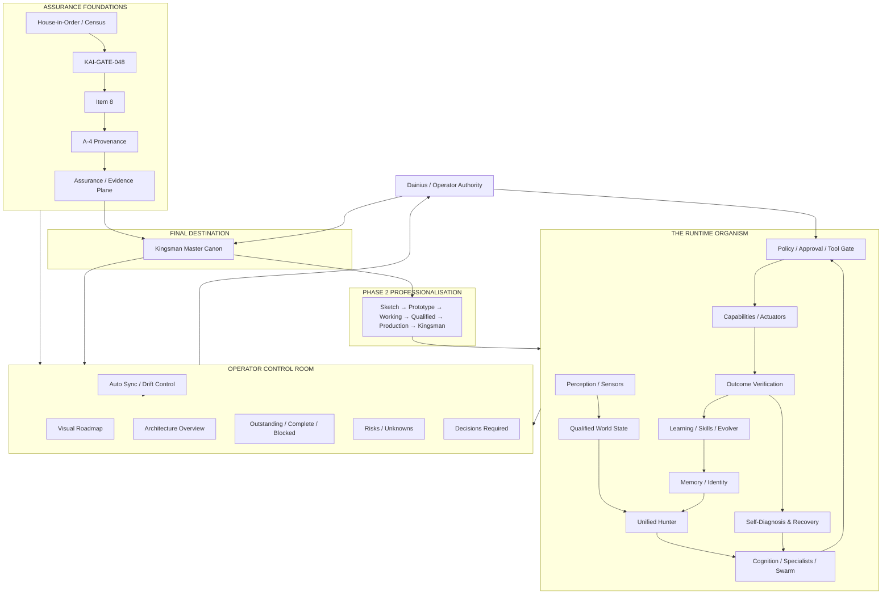

# Kai Kingsman Puzzle Map & Reconciliation Strategy

> **STATUS: MASTER SYNTHESIS / PLANNING INPUT — NOT IMPLEMENTATION AUTHORITY.**
>
> Purpose: show how the major Kai workstreams, historical ideas, assurance programmes, runtime architecture, professionalisation effort and operator-control surfaces fit together as one system. This document exists to help Dainius, Kai, Orion and external reviewers reason about the same puzzle rather than maintaining separate mental models.
>
> Where this synthesis conflicts with the latest D-numbered programme decision, **the D-numbered decision wins**.

---

## 1. The puzzle in one sentence

Kai is not missing a vision. The vision, most of the component ideas and a large amount of working machinery already exist. The current problem is that they were created across different generations and therefore need to be **qualified, reconciled, professionally re-engineered and presented as one deliberate Kingsman system**.

The job is not to invent a new Kai from scratch.

The job is:

> **recover intent → prove reality → reconcile overlaps → freeze one final blueprint → professionalise each piece toward it → verify → keep the operator view current.**

---

## 2. The five layers of the puzzle

Most apparent duplication disappears when the project is separated into five layers.

### Layer A — FINAL DESTINATION

**Kingsman Tier / Final Product Architecture / Master Canon**

This answers:

- What is the finished Kai meant to be?
- What are its non-negotiable architectural invariants?
- How do perception, memory, cognition, evidence, policy, execution, learning and operator authority fit together?
- What must never become parallel authority?

Canonical planning input:

- `kai-pm/KAI_FINAL_PRODUCT_ARCHITECTURE_SPECIFICATION.md`
- `kai-pm/KAI_UNIFIED_HUNTER_ARCHITECTURE_AND_ROADMAP.md`
- `kai-pm/KINGSMAN_FINAL_VISION_MASTER_CANON_PLAN.md`

This is **design authority after freeze**, not proof that implementation already conforms.

### Layer B — ASSURANCE FOUNDATIONS

This layer makes sure we can trust the statements we later make about Kai.

Includes:

- House-in-Order / Census / document-currentness qualification;
- KAI-GATE-048;
- Item 8 frozen build/authority experiment;
- existing **A-4 provenance** work;
- assurance integration;
- Evidence Plane / provenance / attestation direction;
- CI Truth Restoration and other assurance controls.

This layer answers:

- What exactly are we measuring?
- Can the instrument observe what it claims?
- Is the evidence bound to the right subject?
- Can downstream consumers misuse UNKNOWN or stale evidence?
- Did the exact reviewed artefact produce this result?

Without this layer, Kingsman architecture becomes a diagram we cannot independently prove.

### Layer C — RUNTIME ORGANISM

This is Kai as a functioning system.

Includes, conceptually:

- perception/sensors;
- world-state construction;
- memory/identity;
- Unified Hunter;
- specialist cognition / model council / swarm / Global Workspace;
- adversarial/fact/causal reasoning;
- policy / tool gates / approvals;
- capabilities/actuators;
- durable workflows;
- outcome verification;
- House Doctor / Supervisor / anomaly detection / recovery;
- learning / skill growth / dream/evolver mechanisms.

This layer answers:

- What does Kai actually do while running?
- Which component owns each responsibility?
- How does information become a decision and an action?

### Layer D — PROFESSIONALISATION FACTORY

**House-in-Order Phase 2 / Kingsman Professionalisation**

This is not another runtime feature. It is the controlled process that takes old/new components and brings them to a common production standard.

For every subsystem/file/capability family:

`DISCOVER INTENT`
→ `VERIFY CURRENT REALITY`
→ `MAP DEPENDENCIES`
→ `COMPARE WITH MASTER CANON`
→ `PRESERVE GOOD IDEA`
→ `REMOVE DUPLICATION`
→ `REDESIGN PROPERLY`
→ `ADVERSARIAL REVIEW`
→ `IMPLEMENT`
→ `TEST / MUTATE / VERIFY`
→ `SYNC DOCS / ARCHITECTURE`
→ `BANK KNOWN-GOOD STATE`

Canonical planning input:

- `kai-pm/HOUSE_IN_ORDER_PHASE2_PROFESSIONALISATION.md`

### Layer E — OPERATOR CONTROL ROOM

This is the layer that makes all the other layers governable by Dainius.

Includes:

- README/front page;
- architecture graphics;
- roadmap/current phase;
- outstanding-work board;
- operator approvals required;
- risks/unknowns;
- recent-change summary;
- current metrics;
- current notes/handover;
- automatic sync/drift detection.

Canonical planning input:

- `kai-pm/OPERATOR_VISIBILITY_ENGINEERING_DOCTRINE.md`
- `kai-pm/PHASE2_DOCUMENT_SYNC_AND_DRIFT_CONTROL.md`
- `kai-pm/KINGSMAN_README_ARCHITECTURE_REFRESH_PLAN.md`

This layer is not marketing. It is part of the governance/control loop.

---

## 3. Visual puzzle map

The exact programme order is governed by the latest D-numbered decisions. This diagram expresses dependency/role, not permission to execute a later box.

---

## 4. Current governed programme sequence — do not blur this

The decision record explicitly corrected the programme priority to:

> **finish 048 → A-4 provenance → Assurance / Kingsman integration**

and states that repo consolidation/professionalisation must not leapfrog those foundations unless later D-numbered authority changes the order.

House-in-Order has since been inserted as the current truth/authority qualification work and must complete according to its own authorised H0–H6 sequence before the paused programme resumes.

Important distinction:

### Item 8

Item 8 is a controlled assurance/build experiment inside the upstream programme. It is not a runtime Kai feature and not a cognitive team.

### A-4 provenance

This is the existing programme workstream after 048. It concerns provenance/lineage and assurance foundations.

### Future A4 self-diagnosis evolution

A separate later design idea currently described in:

`kai-pm/A4_SELF_DIAGNOSIS_EVOLUTION.md`

This is the future evolution of Census/Evidence/diagnostic concepts into Kai's runtime self-understanding and House-Doctor capability.

**The two A4 names collide and must be renamed/reconciled during master-canon work.** Until then, always write:

- `A-4 PROVENANCE` for the existing programme workstream;
- `FUTURE A4 SELF-DIAGNOSIS` for the later runtime design obligation.

Do not infer equivalence from the names.

---

## 5. How the major pieces feed each other

### House-in-Order → everything else

House-in-Order establishes which documents, claims, generators and evidence are actually trustworthy/current.

It gives Phase 2 the clean inventory needed to avoid rebuilding from stale documents.

It also gives future self-diagnosis reusable primitives:

- structural inventory;
- reader/writer relationships;
- drift detection;
- applicability;
- uncertainty;
- calibrated detectors.

### Item 8 → assurance discipline

Item 8 proves patterns needed later in professional assurance:

- exact frozen design identity;
- exact reviewed artefact identity;
- execution authority separate from evidence admission;
- one-shot/fail-closed execution controls;
- mutation/calibration discipline.

Its machinery may later provide reusable design lessons, but Item 8 itself should not be blindly promoted into runtime Kai.

### A-4 provenance → Evidence Plane

A-4 provenance should establish reliable lineage/identity foundations.

Those foundations become inputs to the later Evidence Plane rather than creating a separate competing truth system.

### Evidence Plane → Kingsman cognition

The Evidence Plane should supply qualified evidence to cognition and policy:

`observation → identity → subject → provenance → applicability → claim → uncertainty → policy use`

It does not become an independent decision-maker.

### Kingsman Master Canon → Phase 2

The master canon defines where every surviving capability belongs in the finished Kai.

Phase 2 then stops asking "what architecture should this file invent?" and instead asks:

> "What does the canon require, what does the repo currently do, and what is the smallest safe migration from one to the other?"

### Phase 2 → production-grade runtime

Phase 2 converts generations of sketches/prototypes into one consistent engineering standard.

### Engineering doctrine → every layer

Engineering truths learned from failures must become:

1. human-readable doctrine;
2. mechanical controls where practical;
3. test/mutation seeds;
4. future self-diagnostic anti-patterns.

### Future A4 self-diagnosis → House Doctor

Future self-diagnosis should not become another doctor.

It provides the structural/evidence intelligence underneath the existing diagnostic/recovery architecture:

`SEE → UNDERSTAND → DIAGNOSE → EXPLAIN → PROPOSE → APPROVE → HEAL → VERIFY → LEARN`

### Operator control room → operator sovereignty

All of the above only remains meaningfully governed if Dainius can see the state of the machine.

The front page / mission-control view therefore consumes:

- master-canon architecture;
- current implementation evidence;
- programme state;
- closure status;
- risks/unknowns;
- operator decisions required.

It must not invent any of these.

---

## 6. Component maturity model for Phase 2

Every meaningful subsystem/script/capability should eventually receive a maturity classification:

| Level | Meaning |
|---|---|
| `S0 — SKETCH` | Idea captured; implementation may be crude or incomplete |
| `S1 — PROTOTYPE` | Demonstrates the mechanism, not yet production quality |
| `S2 — WORKING` | Executes useful behaviour, but assurance/architecture gaps remain |
| `S3 — QUALIFIED` | Responsibility, tests and evidence are credible for the declared subject |
| `S4 — PRODUCTION-GRADE` | Operational, observable, recoverable, documented, security/authority aligned |
| `S5 — KINGSMAN-COMPLIANT` | Conforms to frozen master canon + evidence/governance/operator-visibility requirements |

A component does **not** advance because of age, number of tests or confidence.

Each promotion must have explicit criteria/evidence.

Suggested operator visual state:

- `🟢 S5/S4`
- `🔵 S3`
- `🟡 S2`
- `🟠 S1/S0 or architectural decision required`
- `🔴 known material defect`
- `⚫ historical/superseded`
- `❓ unqualified`

---

## 7. The eventual operator mission-control model

The target operator view should be built from structured truth and contain five panels.

### PANEL 1 — WHOLE KAI

High-level architecture showing:

- perception;
- world state/evidence;
- memory;
- cognition/specialists;
- policy/operator authority;
- actuators;
- verification;
- self-diagnosis/learning.

### PANEL 2 — PROGRAMME ROADMAP

Shows the authorised sequence and current marker.

Example only — derive actual sequence from latest D entry:

`House-in-Order → 048 / Item 8 → A-4 Provenance → Assurance/Kingsman → Phase 2 → Final Review`

### PANEL 3 — WORK BOARD

For each major workstream/component:

`✅ VERIFIED`
`🟡 IN PROGRESS`
`⏸ BLOCKED / WAITING AUTHORITY`
`⚠ OPEN DEFECT`
`⬜ NOT STARTED`
`❓ UNKNOWN`

### PANEL 4 — OPERATOR DECISIONS

Only things requiring Dainius's approval/choice.

### PANEL 5 — RISKS / RECENT CHANGE

Small, high-value view of:

- material open risks;
- current unknowns;
- most important recent changes;
- links to detail.

---

## 8. What we should NOT do now

While Orion credits are paused and House-in-Order has a frozen active sequence:

- do not rewrite README yet;
- do not refactor old scripts merely because they look poor;
- do not implement the master canon;
- do not redesign Item 8;
- do not jump into A-4 provenance;
- do not start future A4 self-diagnosis implementation;
- do not silently merge/delete historical capability concepts.

Permitted/useful now:

- architecture synthesis;
- concept inventory;
- contradiction identification;
- operator-view design;
- DeepSeek review packet preparation;
- naming cleanup planning;
- maturity model definition;
- dependency reasoning;
- questions for Dainius.

---

## 9. Collaboration model for solving the puzzle

### Dainius

Provides:

- original product intent;
- why historical features were created;
- capabilities that must survive;
- operator priorities;
- final authority for consequential design choices.

### Kai

Owns:

- programme synthesis;
- continuity/history;
- architecture reconciliation;
- evidence discipline;
- identifying collisions/duplication;
- explaining choices visually/plainly;
- maintaining the master puzzle map.

### Orion

Provides:

- exact repository reality;
- dependency/call-path evidence;
- implementation feasibility;
- controlled experiments;
- bounded execution.

### DeepSeek / external specialist

Provides:

- fresh architecture ideas;
- adversarial review;
- alternative abstractions;
- coding/design challenge;
- failure-mode brainstorming.

External advice is not repository evidence until Kai/Orion verify its premises.

---

## 10. DeepSeek reconciliation review packet

When DeepSeek is available, do **not** ask a vague "is this good?" question.

Send a focused packet based on this document and ask it to attack the following:

### A. Architecture coherence

1. Does the five-layer separation (Destination / Assurance / Runtime / Professionalisation / Operator Control) contain hidden category errors?
2. Which concepts are genuinely duplicate and which are merely different layers?
3. What responsibilities are currently at risk of having two authorities?
4. Is the proposed Kingsman end-to-end loop missing a critical control or feedback path?

### B. Assurance → runtime relationship

5. Which House-in-Order / Item-8 / provenance mechanisms should become reusable platform primitives?
6. Which should remain build/assurance-only and never become runtime services?
7. How should Evidence Plane expose evidence to cognition without becoming a second orchestrator?

### C. Self-diagnosis

8. Is `SEE → UNDERSTAND → DIAGNOSE → EXPLAIN → PROPOSE → APPROVE → HEAL → VERIFY → LEARN` a clean responsibility model?
9. Where should House Doctor, Supervisor, anomaly detection, A4 structural map and Evidence Plane boundaries sit?
10. What architecture prevents diagnosis, repair and verification from becoming self-approving?

### D. Phase 2 professionalisation

11. Is the S0→S5 maturity ladder sufficient?
12. What gates should qualify promotion between levels?
13. How would a mature engineering team prevent a large legacy-style professionalisation programme from becoming a rewrite disaster?
14. What should be mechanically generated versus human-reviewed?

### E. Operator mission control

15. What is the smallest operator dashboard/front page that gives genuine control without drowning the operator?
16. Which facts/statuses should be machine-derived?
17. How should diagrams be generated/validated so visual drift becomes detectable?
18. How should a completion tick be evidence-bound?

### F. Adversarial challenge

19. Name the three biggest hidden architectural risks in this whole plan.
20. If forced to simplify the system by 30% while retaining Kingsman intent, what would you merge/remove and why?
21. What assumption is Kai most likely to be making because of project history rather than engineering necessity?
22. What would you insist on resolving before freezing the master canon?

DeepSeek output should be classified after review as:

`SUPPORTED / PARTIALLY_SUPPORTED / CONFLICTS_WITH_REPO / UNVERIFIED / REJECTED`

Material disagreement should produce a discriminating test or explicit Dainius design decision.

---

## 11. Questions we still need to solve together

These are not blockers to current House-in-Order work; they are master-canon questions.

1. Which historical Kai capability names survive publicly versus only internally?
2. How much of the current microservice topology remains justified after professionalisation?
3. What should be one process/module versus a separate service?
4. Which specialist/persona concepts are UX names versus actual architectural boundaries?
5. What exactly is the final Evidence Plane API/data model?
6. Where is the final authority boundary between cognition, policy, tool gate and workflow executor?
7. How should the current House Doctor and Supervisor responsibilities be split/merged?
8. What runtime parts of the Census/self-map belong in future self-diagnosis?
9. What is the final hardware residency model across CPU/GPU/NPU on Strix Halo?
10. What operator information belongs on the README versus a dedicated generated mission-control/status page?
11. How much historical D-number detail belongs in public docs versus engineering history?
12. What is the correct permanent name for future A4 self-diagnosis so it does not collide with A-4 provenance?

---

## 12. Master design rule going forward

When evaluating any old or new component, ask three separate questions:

### 1. IDEA

Is the underlying capability still valuable to the final Kai?

### 2. IMPLEMENTATION

Is the current implementation the right production-grade way to deliver that capability?

### 3. LOCATION / AUTHORITY

Does it live in the correct architectural layer with the correct authority?

This prevents three common mistakes:

- deleting a good idea because its old file is poor;
- keeping a poor implementation because the idea is good;
- rebuilding the same capability in a second place because its original ownership was unclear.

---

## 13. Plain-language synthesis

The puzzle is no longer "what should Kai be?"

We largely know what Kai should be.

The puzzle is now:

> **Which old and new pieces belong in the finished machine, what job does each one own, what proof do we require, what needs rebuilding, and how do we keep Dainius able to see/control the whole thing while we do it?**

House-in-Order tells us what is really in the workshop.

048 / Item 8 / A-4 provenance / Assurance teach us how to prove what the workshop produces.

The Kingsman master canon becomes the final blueprint.

Phase 2 takes every useful part and rebuilds/relocates it to that blueprint.

Future self-diagnosis uses the same maps, evidence and engineering rules so Kai can inspect his own machine.

The operator control room makes the entire system legible enough for Dainius to lead it.

That is one puzzle, not six separate projects.
