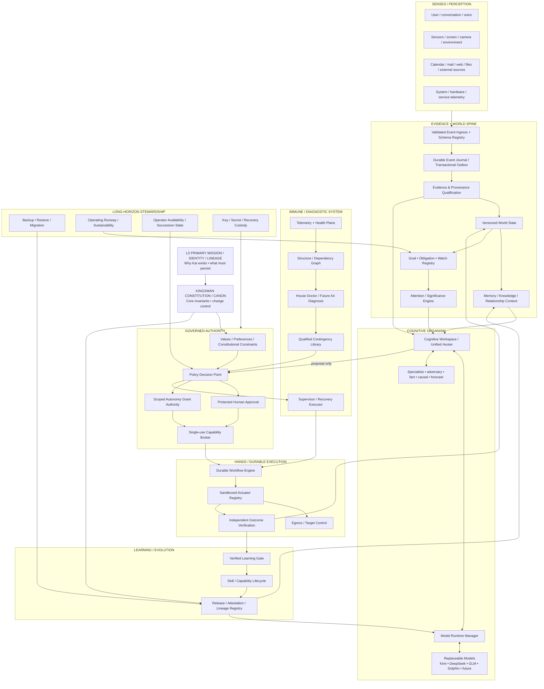
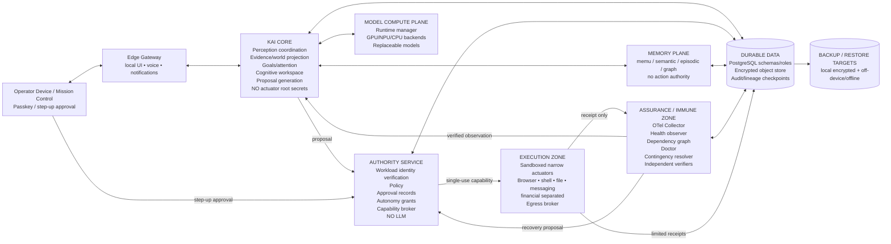
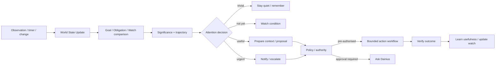
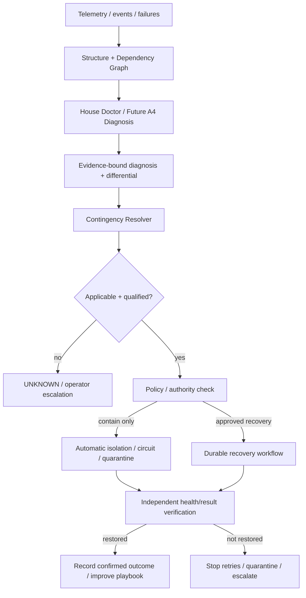
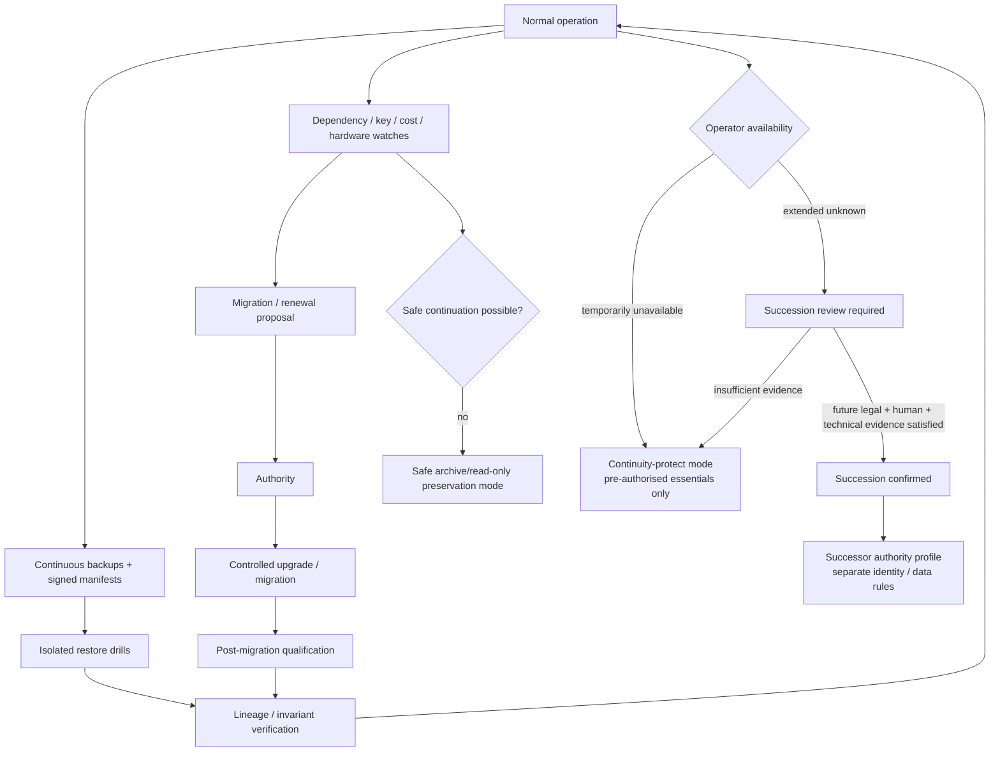

# KAI KINGSMAN — Candidate Living-System Architecture v0.1

> **STATUS: CANDIDATE FOR DAINIUS + KAI + DEEPSEEK ADVERSARIAL REVIEW — NOT FROZEN, NOT IMPLEMENTATION AUTHORITY, NOT A PROGRAMME-SEQUENCE CHANGE.**
>
> This document is the first whole-system architecture candidate produced after the primary-mission / identity / lineage correction. It deliberately separates **logical organs**, **shared planes**, **physical failure/trust boundaries**, and **current implementation seeds** so Kai does not become either a monolith or a bolt-on microservice soup.
>
> Latest valid D-numbered programme authority still controls execution. **ITEM 8 BEFORE A4** remains standing. `A-4 PROVENANCE` remains distinct from `FUTURE A4 SELF-DIAGNOSIS`.

---

# 0. Executive architecture decision

## 0.1 What Kai is

Kai is the **persistent organism**, not any LLM, framework, service, database, laptop or repository snapshot.

The architecture is therefore built around continuity of:

`MISSION + IDENTITY/LINEAGE + MEMORY + QUALIFIED WORLD STATE + COGNITION + RELATIONSHIPS/VALUES + GOVERNANCE/AUTHORITY + CAPABILITIES + LEARNING/HISTORY`

through replacement of individual organs.

## 0.2 Architecture style

The recommended architecture is:

> **MODULAR ORGANISM + EARNED PROCESS/SERVICE BOUNDARIES + DURABLE SHARED TRUTH + ISOLATED AUTHORITY + ISOLATED HANDS.**

This explicitly rejects two bad extremes:

1. **One giant process** where every failure/security boundary shares fate.
2. **Service-per-idea** where every concept becomes a container, network call, private state store and competing source of truth.

Logical modules should remain in-process where there is no strong reason to isolate them. A separate process/service must earn its boundary through at least one of:

- trust/security isolation;
- fault containment;
- hardware/resource isolation;
- independent deployment lifecycle;
- durable workflow semantics;
- external-provider boundary;
- scaling requirement;
- privileged OS/device access.

## 0.3 Physical deployment decision for the first production generation

The proposed first production-generation deployment has **eight physical domains**, not dozens of independent authority-bearing services:

1. **Operator / Edge Gateway**
2. **Kai Core** — modular control/cognition coordination, no unrestricted actuator credentials
3. **Authority Service** — policy, approval, autonomy grants, capabilities; minimal and non-LLM
4. **Model Compute Plane** — replaceable model runtimes and Model Runtime Manager
5. **Memory / Knowledge Plane** — persistent memory and derived vector/graph indexes
6. **Execution Zone** — sandboxed narrow actuators + egress broker
7. **Assurance / Health / Recovery Plane** — telemetry, dependency graph, Doctor, contingency resolver, independent verifiers
8. **Durable Data / Continuity Plane** — PostgreSQL, encrypted object store, audit/lineage, backups/restore

Some of these may initially co-reside on the same physical Strix Halo device. They remain separate **security/failure domains by contract and credentials** so they can later move to other hardware without architectural redesign.

---

# 1. Root architecture



**Important:** arrows into Policy/Authority do not grant authority. They provide inputs. Only the authority path can issue capabilities.

---

# 2. The ten architectural organs

## Organ 1 — Mission / Identity / Lineage Root

### Responsibility

Preserve what makes future Kai the intended Kai lineage even when models, hardware, frameworks and implementations change.

### Required records

- `ConstitutionBundle`
- `MissionVersion`
- `IdentityLineageRecord`
- `OperatorAuthorityRoot`
- `SuccessorAuthorityReference`
- `ReleaseLineageAttestation`
- `Migration / Restore Verification`

### Design rule

A future restore is not certified merely because containers boot.

It must eventually prove:

> **the intended invariants, trusted memory lineage, authority roots and accepted release lineage survived.**

### Current state

**Design doctrine exists; first-class runtime mechanism is missing.**

### Disposition

**NEW ORGAN — reuse provenance, release-bundle, key-management and backup primitives.**

---

## Organ 2 — Perception & Event Spine

### Responsibility

Create one governed path by which observations enter Kai.

### Retain

Existing `common/contracts/perception.py`, `common/perception_spine/ingress.py`, adapters and journal are strong prototype foundations.

The current ingress already demonstrates useful properties:

- schema validation;
- duplicate handling;
- principal isolation;
- stale-event marking;
- payload size/depth/cardinality bounds;
- append-before-consume discipline.

### Rework for production

`PerceptionEvent v2` should become **CloudEvents-compatible in envelope semantics** while preserving Kai-specific security/evidence extensions.

Candidate core:

```text
id
source
source_workload_identity
type
specversion
subject
time
dataschema
schema_digest
datacontenttype
trace_id
principal_scope
purpose
classification
raw_object_digest / object_ref
producer_revision
observation_quality
payload
```

Do **not** reduce quality to one model-style confidence float.

Qualification should later distinguish at least:

- authenticity / source identity;
- freshness;
- completeness;
- calibration;
- independence/correlation;
- applicability to subject;
- transformation lineage.

### Durable backend decision

The current file-backed JSONL journal is an excellent crash-safety prototype but should not be the long-term authoritative multi-writer backbone.

**Recommended first production backend:** PostgreSQL append-only event tables + transactional outbox.

Reasons:

- atomic state + event publication;
- transactional dedup/idempotency;
- multi-writer concurrency;
- migrations;
- replay checkpoints;
- backup/restore tooling;
- one less infrastructure dependency on a single personal machine.

A NATS/JetStream-class event bus is an **optional future transport**, not a Phase-2 prerequisite. Add one only when process/node fan-out justifies another operational dependency.

### Disposition

**RETAIN CONTRACT / REWORK STORAGE / EXTEND QUALIFICATION.**

---

## Organ 3 — Evidence Plane + World State

### Responsibility

Answer:

> **What does Kai currently have evidence to believe, about what subject, for what purpose, with what freshness, conflict and provenance?**

### Architecture

Separate four things that are often incorrectly merged:

1. **Observation** — something was reported/measured.
2. **Evidence Item** — immutable referenced material plus provenance.
3. **Claim / Fact Candidate** — structured assertion derived from evidence.
4. **World State Projection** — current qualified view for a principal/purpose.

### Evidence model

Use W3C PROV concepts as a vocabulary/reference model:

- Entity
- Activity
- Agent
- used
- generated
- derived-from
- associated-with

But Kai keeps its own domain schema and qualification semantics.

Large raw evidence should live in an **encrypted content-addressed object store**; authoritative metadata stores digests and refs.

### Claim model v2

Move beyond free-text-only claims.

Candidate:

```text
claim_id
subject_id
predicate
object/value
unit
observed_at
valid_from
valid_to
recorded_at
freshness_state
verification_state
uncertainty_type
quality_dimensions
evidence_refs
independence_groups
conflicts_with
supersedes
principal_scope
purpose
classification
reducer_revision
```

Free-text explanation remains a presentation field, not the only semantic representation.

### World-state truth states

Minimum:

- `KNOWN`
- `UNKNOWN`
- `UNOBSERVED`
- `STALE`
- `CONFLICTING`
- `SOURCE_UNAVAILABLE`
- `SUPERSEDED`

No missing signal may silently become neutral/negative.

### Current implementation fit

`common/contracts/world_state.py` and `common/world_state/snapshot_store.py` already prove useful semantics: immutable snapshots, scoped views, conflict preservation, freshness, replay and deletion lineage.

But the store is process-memory data structures; production requires durable materialisation, deterministic reducer revisions and event-offset binding.

### Disposition

**RETAIN SEMANTICS / REWORK STORAGE / EXPAND STRUCTURED CLAIM MODEL.**

---

## Organ 4 — Memory / Continuity / Relationship

### Responsibility

Preserve Kai's experienced history without treating memory as automatically factual authority.

### Required memory classes

1. **Constitutional / identity memory** — governed, high-authority, rarely changed.
2. **Operator-confirmed values/preferences** — explicitly attributable.
3. **Relationship memory** — people, roles, history, interaction patterns.
4. **Episodic memory** — what happened.
5. **Semantic memory** — learned knowledge/concepts.
6. **Procedural memory** — skills/workflows/lessons.
7. **Working context** — short-lived cognitive state.
8. **Derived indexes** — embeddings/graph/search structures, reconstructable.

### Critical rule

> **MEMORY ≠ CURRENT FACT.**

A memory can supply context/evidence but consequential use must account for source, age, confirmation and contradiction.

### Existing fit

`memu-core`, graph work, Obsidian/vault concepts and memory compression remain valuable organs.

They should **not own global orchestration or authority**.

Vector and graph stores should normally be **derived indexes**, not the only copy of irreplaceable life history.

### Disposition

**RETAIN / REHOME AS MEMORY ORGAN / HARDEN LINEAGE + RETENTION.**

---

## Organ 5 — Goals / Obligations / Attention / Time

### Why this is a major missing organ

Proactivity cannot be built reliably from periodic scans and ad-hoc nudges alone.

Kai needs an explicit representation of:

- what Dainius is trying to achieve;
- promises/commitments;
- deadlines;
- maintenance obligations;
- recurring watches;
- long-horizon continuity obligations;
- thresholds/risks;
- what may be handled silently;
- what deserves interruption.

Current supervisor/memory proactive logic contains useful prototypes, including cooldowns and nudge categories, but responsibility is fragmented and mixed with fleet recovery.

### Proposed objects

`Goal`
`Obligation`
`WatchCondition`
`AttentionCandidate`
`InterruptionDecision`
`DurableTimer`

Candidate fields:

```text
owner/principal
source/confirmation
type
state
priority
importance
urgency
due_at / condition
recurrence
risk_if_delayed
evidence_trigger
allowed_intervention_class
autonomy_scope
notification_policy
operator-context constraints
dependencies
expiry
```

### Attention engine

Score/qualify on:

- importance;
- urgency;
- cost of delay;
- evidence quality;
- novelty;
- worsening trajectory;
- operator context;
- interruption cost;
- whether Kai can safely handle it silently.

Output is an **attention/proposal event**, never an authority grant.

### Key architectural correction

Split current Supervisor responsibilities:

- **Health Supervisor** = system liveness/containment/recovery execution.
- **Attention Engine** = proactive user/mission significance.

System health recovery and personal proactive nudges should not live in the same authority surface.

### Disposition

**NEW FIRST-CLASS ORGAN — consolidate fragmented proactive logic.**

---

## Organ 6 — Cognitive Workspace / Unified Hunter

### Responsibility

Coordinate cognition without becoming action authority.

### Core object

`TaskFrame` / `DeliberationCase`

Contains:

- user/trigger intent;
- relevant qualified world-state snapshot;
- relevant memories;
- goals/obligations;
- evidence refs;
- assumptions;
- risk;
- required roles;
- compute budget;
- deadline;
- privacy/classification;
- expected output type.

### Cognitive Workspace

The current proposal workspace / Global Workspace / Unified Hunter ideas converge here.

It should:

1. frame the problem;
2. select roles, not model brands;
3. ask specialists;
4. preserve disagreement;
5. run adversarial/fact/causal checks when warranted;
6. synthesize a proposal/explanation;
7. surface unresolved assumptions;
8. hand **proposal only** to Policy/Authority.

### Model-role examples

- general planner/reasoner;
- coding specialist;
- quantitative specialist;
- adversary/red team;
- factual/evidence critic;
- causal/forecast specialist;
- creative/generative specialist;
- summariser/compressor;
- low-power sentinel classifier.

Kimi, DeepSeek, GLM, Dolphin and future models are **qualified candidates for roles**.

### Deliberation record

Store:

- input snapshot IDs;
- evidence refs;
- model artifact digests/runtime revisions;
- prompt/template revision;
- outputs;
- disagreement;
- synthesis;
- assumptions;
- unresolved questions.

Generated model text remains **reasoning output**, not automatically admissible evidence.

### Disposition

**MERGE/REWORK Hunter + workspace + specialist/swarms into one cognitive coordination organ.**

---

## Organ 7 — Model Runtime Manager

### Why current model registry is insufficient

The existing `common/model_registry.py` is a useful chassis sketch, but its hard-coded model cards, generic token estimator and keyword routing cannot govern a growing organism.

### Required responsibilities

- backend adapters (`llama.cpp`, ROCm/PyTorch/vLLM where qualified, Ollama during migration, future runtimes);
- exact model artifact digest;
- quantisation;
- tokenizer identity/native token counting;
- license/source;
- context/output limits measured for the exact runtime;
- role qualifications/benchmarks;
- latency/throughput calibration;
- GPU/NPU/CPU residency;
- unified-memory budget;
- KV-cache budget;
- thermal/power profile;
- admission control;
- eviction/preemption;
- health/readiness;
- degraded-role fallback;
- probation/promotion/retirement;
- local vs authorised external provider policy.

### Router decision inputs

Model selection should use:

`ROLE + TASK TYPE + REQUIRED CAPABILITIES + EVIDENCE/PRIVACY CLASS + RISK + LATENCY + RESOURCE STATE + QUALIFICATION + COST`

—not keyword voting.

### Hardware abstraction

Strix Halo is the current target body generation, not Kai's identity.

The Ryzen AI Max+ 395 class provides a large unified-memory local AI platform, but the runtime must treat CPU/GPU/NPU as replaceable compute resources behind capability interfaces.

Proposed roles:

- **GPU** — primary local LLM inference when supported/qualified;
- **CPU** — orchestration, databases, policy, lightweight inference/fallback;
- **NPU** — low-power sentinel/classifier/perception tasks when the exact runtime/model path is measured and qualified;
- **future nodes** — optional compute organs under the same Model Runtime Manager contract.

### Disposition

**REPLACE MODEL-REGISTRY SKETCH WITH PRODUCTION MODEL RUNTIME MANAGER; reuse model-card ideas.**

---

## Organ 8 — Governance / Policy / Approval / Capability Authority

### Responsibility

This is the **executive inhibition / authority organ**.

It should be small, deterministic, non-LLM and separately protected.

### Separate concepts

Do not merge:

- values/preferences;
- policy constraints;
- human approval;
- autonomy grants;
- action capabilities;
- succession authority.

### Existing strengths

The repository already has unusually good foundations:

- explicit ActionProposal/Approval/Capability contracts;
- audience-bound single-use capability concept;
- exact proposal digest checks;
- scoped, expiring, revocable autonomy grants;
- autonomy earned from evidence/calibration rather than self-text;
- per-service Ed25519 identity work where principal is derived from the verifying key rather than caller assertion.

### Production hardening required

Current capability/autonomy stores are in process memory. Production authority must be **durable and atomic**.

The capability record should bind at least:

```text
capability_id
issuer
subject_workload_identity
audience_actuator_identity
proposal_digest
approval_digest / autonomy_grant_id
policy_bundle_digest
operation_type
exact parameter digest / bounds
resource/target scope
risk tier
issued_at
not_before
expires_at
single_use
idempotency_key
max retries / retry class
revocation state
```

Consumption must be an atomic persistent transition so two concurrent workers cannot consume the same authority.

### Policy engine

Define a stable **Policy Decision Port** rather than binding the canon to one engine.

Current custom policy code may remain during migration.

OPA is a strong candidate for a future deterministic policy backend because it cleanly separates decision from enforcement, but adopting it is a **measured implementation decision**, not a master-canon requirement.

### Human approval

High-consequence approval should use a protected local approval surface with step-up authentication and show the exact proposal/action digest.

Chat can explain and request approval; ordinary conversational text should not be treated as cryptographic high-consequence approval by default.

### Failure rule

**Authority plane unavailable → consequential actuation FAILS CLOSED. Cognition may continue.**

### Disposition

**RETAIN CORE DESIGN / ISOLATE / PERSIST / HARDEN.**

---

## Organ 9 — Durable Workflow / Actuation / Independent Verification

### Responsibility

Turn one approved proposal into a durable, bounded, observable operation and prove the outcome.

### Workflow states

Candidate state machine:

```text
PROPOSED
POLICY_BLOCKED
WAITING_APPROVAL
APPROVED
CAPABILITY_ISSUED
DISPATCHED
RUNNING
PAUSED
SUCCEEDED_UNVERIFIED
FAILED
OUTCOME_UNKNOWN
CANCEL_REQUESTED
COMPENSATING
COMPENSATED
VERIFIED_SUCCESS
VERIFIED_FAILURE
QUARANTINED
CLOSED
```

### Required workflow properties

- durable history;
- restart/resume;
- idempotency keys;
- fencing/lease ownership;
- exact capability binding;
- bounded retry policy;
- **reconcile-before-retry** for non-idempotent actions;
- cancellation;
- compensation where actually valid;
- timeout and unknown-outcome semantics;
- post-action independent verification.

### Technology decision

Define a `DurableWorkflowEngine` port.

**Recommended first implementation:** PostgreSQL-backed workflow/event state using the same transactional backbone.

**Temporal:** strong later candidate if complexity, long pauses, multi-node workflows or operational scale justify it. Do not introduce a heavyweight workflow platform before the contract/state semantics are qualified.

### Actuator isolation

Each actuator must be narrow:

- browser;
- shell/code;
- file mutation;
- email/message/calendar;
- smart-home/device;
- financial execution;
- backup/recovery;
- software deployment.

Actuators do not reason about whether they should act. They validate identity + capability + exact target parameters, execute, and produce a receipt.

### Egress broker — missing boundary

Add an **Egress / Target Control** layer for tools that can access networks.

It enforces capability-specific:

- destinations/domains;
- methods/protocols;
- data classification;
- upload/download limits;
- time budget;
- network isolation.

This prevents a compromised cognitive or actuator process from turning broad network access into implicit authority.

### Verification

The actuator receipt is not proof of outcome.

Verification should query the independent target/state where possible:

`ACTION → RECEIPT → INDEPENDENT OBSERVATION → VERIFIED OUTCOME`

### Disposition

**RETAIN ACTUATOR REGISTRY + VERIFIER CONCEPTS / BUILD DURABLE WORKFLOW + EGRESS BOUNDARY.**

---

## Organ 10 — Health / Self-Diagnosis / Resilience / Recovery

### Responsibility

Keep the organism aware of its own condition and contain failure without creating another sovereign agent.

### Split responsibilities

#### Telemetry Plane

Operational signals: traces, metrics, logs, health, resource state.

Use OpenTelemetry semantics/collection as the preferred standardised instrumentation model.

**Telemetry is not Evidence Plane truth by itself.** Telemetry becomes evidence only after subject/provenance/qualification is established.

#### Structure / Dependency Graph — major missing organ

Machine-readable graph of:

```text
component
runtime instance
version/release
contract endpoints
reads/writes
state stores
dependencies/dependents
criticality
authority level
health source
known failure modes
contingencies
owner/recovery actor
recent changes
```

Generate from deployment manifests, component declarations, contracts and future House/A4 discovery. Avoid a second hand-maintained inventory.

#### House Doctor / Future A4

Diagnoses; does not autonomously wield unrestricted repair tools.

Current House Doctor's hard-coded string rules are a valid prototype, but the production Doctor should consume:

`TELEMETRY + WORLD STATE + STRUCTURE GRAPH + RECENT CHANGE + CONTINGENCY HISTORY`

and produce:

`Diagnosis + Evidence + Differential + Expected Blast Radius + Candidate Contingency + Uncertainty`.

#### Contingency Resolver

Selects an applicable **qualified** playbook.

#### Supervisor

Executes only permitted containment/recovery through the normal capability/workflow system.

No private `restart everything` authority.

### Canonical recovery flow

`SEE → UNDERSTAND → DIAGNOSE → EXPLAIN → MATCH CONTINGENCY → POLICY/AUTHORITY → CONTAIN/DEGRADE/REPAIR → INDEPENDENT VERIFY → LEARN`

### First-class organism states

`HEALTHY`
`DEGRADED`
`RECOVERING`
`UNAVAILABLE`
`QUARANTINED`
`UNKNOWN / UNMEASURED`

### Disposition

**MERGE HOUSE DOCTOR + SUPERVISOR + A4 CONCEPTS INTO CLEAR DIAGNOSIS / AUTHORITY / EXECUTION BOUNDARIES; retain existing primitives.**

---

# 3. Shared planes

These planes cross organs but must not become parallel sovereign systems.

| Plane | Owns | Must not own |
|---|---|---|
| **Workload Identity** | service/process identity, signing/mTLS, rotation, revocation | action permission |
| **Evidence & Provenance** | evidence identity, lineage, applicability, qualification | final action authority |
| **Telemetry / Health** | traces, metrics, logs, readiness/degradation | factual truth without qualification |
| **Policy / Authority** | constraints, approvals, autonomy grants, capabilities | free-form cognition |
| **Durable Workflow** | action lifecycle/resume/retry/compensation | deciding whether an action is morally/policy appropriate |
| **Contingency / Recovery** | known qualified responses | authority to execute them |
| **Config / Release / Feature** | versioned config, flags, release identity | silent runtime mutation |
| **Operator Mission Control** | legibility, approvals, status | hidden alternate control path |
| **Continuity / Stewardship** | backup, lineage, migration, runway, succession state | unlimited self-preservation authority |

---

# 4. Physical trust and failure boundaries



## Physical-boundary rule

Not every logical organ above becomes a container.

Initial grouping recommendation:

### Process/container A — `kai-core`

- ingress coordinator;
- evidence/world-state services/modules;
- goal/attention engine;
- cognitive workspace;
- proposal generation;
- workflow coordination client.

### Process/container B — `kai-authority`

- identity verification;
- deterministic policy;
- human approvals;
- autonomy grants;
- capability issuance/atomic consumption service.

### Process/container C — `kai-model-runtime`

- runtime manager + backends/adapters; potentially several worker processes due GPU resource isolation.

### Process/container D — `kai-memory`

- memory APIs and derived indexes. Existing memu-core can evolve into this role.

### Process/container group E — `kai-actuator-*`

Separate by privilege/trust. Do not put shell + financial + messaging + browser in one universal privileged container.

### Process/container F — `kai-health`

- health observer;
- OpenTelemetry collector/adapter;
- component/dependency graph materialiser;
- Supervisor narrow recovery executor.

Doctor may initially be a module/worker in this zone; do not expose unrestricted shell.

### Process/container G — `mission-control`

- local operator UI;
- protected approval interaction;
- architecture/status visualisation.

### Data services

- PostgreSQL;
- encrypted object store;
- optional Redis cache.

**Redis is disposable optimisation, not source of truth or sole audit store.**

---

# 5. Durable data architecture

## 5.1 PostgreSQL as initial authoritative state backbone

Recommended schemas/roles, not necessarily separate database servers:

- `events`
- `evidence`
- `world`
- `memory_meta`
- `goals`
- `cognition_meta`
- `policy`
- `authority`
- `workflows`
- `outcomes`
- `health`
- `contingency`
- `lineage`
- `audit`

Each process receives least-privilege DB credentials/roles. One database server does **not** mean every process can modify every table.

## 5.2 Object store

Encrypted, content-addressed payloads:

- documents;
- images/audio/video;
- raw sensor captures when retained;
- model/release artifacts where appropriate;
- large evidence bodies;
- backup manifests.

Store digest + media type + size + encryption/key reference + provenance in PostgreSQL.

A filesystem backend is acceptable initially behind an object-store interface. S3-compatible/off-device backends can be added later.

## 5.3 Derived stores

- vector indexes;
- graph databases;
- caches;
- search indexes;
- embeddings.

Treat as **rebuildable projections** wherever feasible.

The irreplaceable source must not exist only in an embedding/vector index.

## 5.4 Audit integrity

A Redis hash chain alone is insufficient as long-horizon tamper evidence because a sufficiently privileged attacker can rewrite the chain and current head.

Target:

- append-only audit records in durable store;
- signed periodic checkpoint digest;
- checkpoint included in release/backup manifest;
- copy/anchor to an independent backup/failure domain;
- explicit chain verification on restore/startup.

---

# 6. Workload identity architecture

The repository's current Ed25519 design is a strong near-term basis:

> principal is derived from the public key that verified the request, not caller-supplied identity.

Keep that principle.

Define a `WorkloadIdentityProvider` interface so the identity mechanism can evolve without rewriting every service.

## Production generations

### Generation 1

Current per-service Ed25519 signing, hardened and deployed consistently:

- unique service keys;
- receiver public-key trust map;
- key rotation overlap;
- revocation;
- request method/path/body/destination binding;
- persistent replay protection;
- signed identity map/config digest;
- health/expiry visibility.

### Generation 2 / multi-node candidate

Evaluate SPIFFE-compatible workload identity / local X.509-SVID/mTLS semantics.

Do **not** introduce full SPIRE merely to gain a badge. Adopt it when node count/dynamic workload identity/rotation complexity earns the infrastructure.

Standing rule:

> **MEMBERSHIP ≠ IDENTITY ≠ AUTHORITY.**

Identity proves who called. Policy decides whether that identity may do the requested operation.

---

# 7. Security architecture

## 7.1 Trust zones

- Edge/operator
- Core cognition
- Authority
- Model compute
- Data
- Sensor
- Execution
- Egress
- Assurance/observability
- Backup/recovery

## 7.2 Mandatory boundaries

- cognition never holds broad actuator authority;
- actuator cannot mint its own capability;
- verifier is not the actuator it verifies;
- policy failure cannot fail open;
- untrusted retrieved/web/document text stays tagged as data, not instructions;
- secrets are retrieved by exact workload identity and scope;
- protected data has classification/purpose constraints;
- high-risk egress is capability-bound;
- backup/recovery privilege is separately governed;
- succession authority is separate from ordinary runtime autonomy.

## 7.3 Human authority

Candidate hierarchy:

`Constitution / succession/legal root`
→ `Dainius operator authority`
→ `explicit delegated standing grants`
→ `single-action approvals/capabilities`
→ `actuator execution`

No number of model votes can move upward in this hierarchy.

---

# 8. Proactivity architecture



Proactivity needs **durable timers/watches**, not only cron loops.

Examples:

- certificate expires in 14 days;
- backup restore drill overdue;
- provider EOL announced;
- goal deadline approaching;
- an unresolved risk is worsening;
- system storage trajectory reaches danger in 48h;
- operating runway drops below threshold;
- repeated failure class appears;
- sensor situation crosses an evidence-qualified threshold.

---

# 9. Self-diagnosis & contingency architecture



Key split:

- **Doctor diagnoses.**
- **Contingency library knows qualified responses.**
- **Policy decides what may happen.**
- **Supervisor/workflow performs only allowed response.**
- **Verifier proves whether recovery actually restored the intended condition.**

---

# 10. Long-horizon continuity architecture



## Required continuity controls

- backup manifest must identify all authoritative stores and exact release/schema versions;
- restore drills run in isolation;
- RPO/RTO declared per data class;
- at least one backup outside the primary device/failure domain;
- key/secret recovery has explicit lifecycle;
- hardware migration is a qualified release event;
- provider/model artifacts have source/license/digest metadata;
- dependency EOL/credential expiry are proactive watches;
- operating runway is visible;
- succession is a state machine, not inactivity timer;
- safe preservation mode exists when authority or funding cannot be established.

---

# 11. Financial sustainability architecture

Do not merge "financial awareness" with authority to move money.

Separate:

### Financial Awareness

Read-only/analysis:

- costs;
- runway;
- invoices/subscriptions;
- revenue performance;
- scenario modelling;
- tax/accounting inputs;
- opportunity discovery.

### Sustainability Planner

Produces proposals for:

- cost reduction;
- approved paid services;
- infrastructure funding;
- operating reserve targets;
- future investment/treasury actions if separately authorised.

### Financial Execution

A high-risk actuator under separate mandates, limits and independent reconciliation.

Trust domains:

- `KAI_OPERATING_CAPITAL`
- `EXPERIMENTAL_CAPITAL` if explicitly created
- `PROTECTED_OPERATOR/FAMILY_ASSETS`

The third is **not** Kai's operating wallet.

---

# 12. Evolution / skill / self-development architecture

Kai grows, but growth itself follows a controlled lifecycle:

```text
NEED / IDEA
→ CANDIDATE DESIGN
→ SANDBOX
→ STATIC + DYNAMIC TEST
→ ADVERSARIAL REVIEW
→ EVIDENCE
→ OPERATOR / RELEASE AUTHORITY
→ SIGNED RELEASE BUNDLE
→ PROBATION / CANARY
→ VERIFIED PROMOTION
→ MONITOR
→ ROLLBACK / RETIRE when needed
```

A Dream/Evolver/skill-hunter may generate **candidates**, not silently install or grant them production authority.

## Release bundle should eventually include

- source revision;
- component/version map;
- contract/schema versions;
- dependency lock/SBOM;
- build provenance/attestation;
- tests and qualification evidence;
- migrations;
- rollback plan;
- policy compatibility;
- required permissions;
- model artifacts/roles where affected;
- identity/lineage digest;
- operator approval where required.

Use in-toto/SLSA-style subject-bound attestations as the reference pattern rather than inventing another vague "built from commit X" statement.

---

# 13. Operator mission control

The future front page/dashboard is a **control room**, not service-health wallpaper.

## View 1 — Whole organism

- organ map;
- actual implementation under each organ;
- S0–S5 maturity;
- HEALTHY/DEGRADED/UNKNOWN;
- evidence currentness;
- click-through dependencies.

## View 2 — Attention & decisions

- active watches;
- prepared proposals;
- notifications suppressed/deferred;
- approvals needed;
- standing autonomy grants;
- grant expiry/revocation.

## View 3 — Resilience

- active incident;
- expected blast radius;
- matched contingency;
- containment/recovery status;
- retry budget;
- verification result;
- blind/failed observers.

## View 4 — Development / programme

- current House/048/Item8/A-4/Phase2 sequence;
- work packages;
- evidence-bound completion ticks;
- known defects;
- current release/branch/tree.

## View 5 — Continuity

- backup age;
- latest successful restore drill;
- lineage/release digest;
- critical key/certificate expiry;
- provider/model EOL risks;
- hardware health/replacement readiness;
- operating runway;
- succession-plan state;
- unresolved long-horizon risks.

Every green tick is a claim and should be machine-derived/evidence-bound where practical.

---

# 14. Current repository disposition matrix

This is a **candidate architectural disposition**, not permission to delete or rewrite.

| Existing piece | Assessment | Candidate destination |
|---|---|---|
| `common/contracts/*` | Strong protocol seed, too generic/in-memory-era in places | **REWORK → Contracts v2 / schema registry** |
| `perception_spine/ingress.py` | Strong validation/bounds/dedup prototype | **RETAIN + durable identity/dedup backend** |
| file `EventJournal` | Good crash-safety prototype, not multi-writer production backbone | **RETAIN interface / replace backend with Postgres event log** |
| `world_state/*` | Good snapshot/conflict/replay semantics; in-memory store | **RETAIN semantics / durable materialisation** |
| `proposal_workspace/*` | Correct concept family | **MERGE → Cognitive Workspace / Hunter** |
| `memu-core` / graph | Valuable memory organ but too many historical responsibilities | **REHOME → Memory Plane** |
| `model_registry.py` keyword/speed tiers | Useful sketch; not resource/qualification manager | **SUPERSEDE implementation → Model Runtime Manager** |
| `policy_bridge/*` | Strong capability/policy concepts | **RETAIN + isolate + persist + harden** |
| `autonomy/*` | Strong scoped/expiring/evidence-earned direction | **RETAIN + persist + integrate Authority** |
| `service_identity.py` | Strong identity direction; receiver derives principal from key | **RETAIN / complete rollout / abstract provider** |
| `actuator_registry/*` | Strong hands/registry seed | **RETAIN / split privilege domains / final-hand hardening** |
| `supervisor` | Health + recovery + proactive nudging mixed | **SPLIT responsibilities** |
| `house-doctor` | Useful diagnosis prototype; string/rule based | **REWORK → evidence/dependency-aware Doctor** |
| `common/resilience.py` | Useful primitive library | **RETAIN primitives / add governed contingency layer** |
| `common/runtime.py` logging/audit/circuit primitives | Useful prototype utilities | **REWORK telemetry/audit toward OTel + durable audit** |
| Redis | Useful cache/ephemeral coordination | **DEMOTE from authority/audit truth** |
| PostgreSQL | Already core state service | **PROMOTE as first production authoritative transactional backbone** |
| `backup-service` | Real backup functionality exists, but local/component-oriented | **REWORK → Continuity Backup/Restore/Manifest + restore drills** |
| current dashboard | Useful operational seed | **REDESIGN → Mission Control** |
| financial-awareness | Valuable read/analysis organ | **RETAIN read plane; separate from financial execution** |
| Dream/Evolver/skill-hunter | Valuable growth concept | **REHOME → Development/Evolution lifecycle, proposal-only** |
| feature flags | Useful migration mechanism | **RETAIN but version/bind to release and authority** |
| many microservices | Historical working/sketch organs | **QUALIFY one by one; merge/rehome only after intent recovery** |

---

# 15. Missing / under-specified organs found

## P0 — architecture-critical before Kingsman production claim

### G-01 — Goal / Obligation / Watch / Attention subsystem

Fragmented proactive functions exist, but there is no qualified first-class durable organ representing what matters and when Kai should interrupt/act.

### G-02 — Durable authority state

Capabilities, autonomy grants and some critical state are process-memory prototypes. Authority consumption/revocation must survive restart and be atomic.

### G-03 — Model Runtime Manager

Current model registry is static and routing is heuristic. Missing real placement/admission/qualification/resource/health lifecycle.

### G-04 — Structure / Dependency Graph

Future Doctor/A4 cannot reliably diagnose blast radius or cascading failure without a machine-readable current dependency/authority graph.

### G-05 — Production durable workflow engine + durable timers

Contracts exist; long-lived/retry/reconciliation state needs durable implementation.

### G-06 — Unified Telemetry Plane

Health/logging exists in fragments. Need correlated traces/metrics/logs/resource identity and explicit blind/degraded monitoring.

### G-07 — Lineage / Restore Identity mechanism

Backup exists, but "restored successfully" does not yet prove "this is the intended Kai lineage with correct authority/invariants."

### G-08 — Egress / target-control boundary

Network-capable tools need capability-specific destination/data controls independent of LLM/tool code.

### G-09 — Durable audit anchoring

Hash-chain-in-Redis patterns are insufficient for long-horizon tamper evidence. Need signed durable checkpoints and independent copy/anchor.

### G-10 — Schema / Contract Registry + compatibility policy

As Kai grows, typed contracts need explicit semantic versions, schema digests, compatibility windows and migrations.

### G-11 — Protected Operator Approval Surface

High-consequence actions need step-up authenticated approval bound to exact proposal/action identity, separate from ordinary conversational assent.

### G-12 — Data classification / key lifecycle enforcement across stores

Classification exists conceptually but must govern storage, retrieval, backup, erasure, successor access and egress consistently.

## P1 — necessary for long-term organism maturity

### G-13 — Dependency/provider EOL and migration registry

Track external dependency, owner, version, renewal/expiry, replacement options, restore availability and risk.

### G-14 — Restore drill automation

Backups without measured restore evidence are not continuity.

### G-15 — Financial Sustainability / Runway control plane

Not trading. First requirement is costs, runway, budgets, renewal obligations and operating-capital separation.

### G-16 — Succession state machine + external legal/trust binding

Future high-consequence work; architecture must reserve it now, implementation later.

### G-17 — Component maturity / capability registry

One machine-readable registry should connect component, contract, implementation, maturity, tests, release, owner, authority and health.

### G-18 — Release/attestation registry

Current commits/builds/evidence need a product-level signed release identity for reproducible migration and lineage.

## P2 — valuable, but explicitly not required now

- multi-node HA control core;
- full SPIRE deployment;
- NATS/JetStream event backbone;
- Temporal deployment;
- automatic financial execution beyond narrow future mandates;
- NPU always-on runtime until measured/qualified;
- distributed compute swarm beyond one main device;
- automatic succession execution.

These are **options, not missing fundamentals**.

---

# 16. Standards / external architecture research adopted as references

The architecture should borrow proven semantics without turning Kai into a collection of third-party frameworks.

## CloudEvents

Use the common event envelope ideas (`id`, `source`, `type`, `subject`, `time`, `dataschema`) for interoperability and schema discipline.

Reference: https://github.com/cloudevents/spec

## W3C PROV

Use Entity/Activity/Agent and derivation/association concepts for Evidence Plane provenance modelling.

References:

- https://www.w3.org/TR/prov-dm/
- https://www.w3.org/TR/prov-constraints/

## SPIFFE

Use workload-identity principles as the reference for process identity and future multi-node/mTLS evolution.

Reference: https://spiffe.io/docs/latest/spiffe-specs/

## OpenTelemetry

Adopt traces/metrics/logs/context propagation and semantic conventions as the telemetry foundation.

Reference: https://opentelemetry.io/docs/specs/otel/

## in-toto + SLSA

Use subject-digest-bound attestations and build/source provenance patterns for release and migration lineage.

References:

- https://github.com/in-toto/attestation
- https://slsa.dev/spec/v1.2/

## Open Policy Agent

Evaluate as a policy-backend candidate because its architecture separates policy decision from enforcement. Do not require OPA in the canon.

Reference: https://www.openpolicyagent.org/docs

## Transactional Outbox

Use as the initial reliability pattern for committing authoritative state and event publication without dual-write ambiguity.

Reference: AWS Prescriptive Guidance — Transactional Outbox Pattern.

## Temporal

Keep behind a workflow-engine port as a later candidate for crash-resumable long-duration workflows. Do not require it for v1.

Reference: https://docs.temporal.io/

## AMD Strix Halo / ROCm

Current hardware direction is supported by a real local AI software path, but Kai must remain hardware abstract.

AMD's current Ryzen AI Max+ 395 platform exposes 16 Zen 5 cores, Radeon 8060S, XDNA2 NPU and up to 128GB memory; current ROCm Ryzen documentation includes AI Max 300 APU support. Exact model/runtime performance must still be qualified on Dainius's machine.

---

# 17. Implementation / professionalisation sequence after architecture freeze

**This is dependency order, not current execution authority. Latest D-numbered programme sequence still controls when each work package may begin.**

## R0 — Architecture review and freeze

1. DeepSeek adversarial review of this candidate.
2. Kai reconciliation against repo and standards.
3. Orion feasibility map: current component → target organ → reuse/rework/retire.
4. Dainius review of mission, UX, autonomy, continuity and boundaries.
5. Resolve material disagreements with discriminating tests/spikes.
6. Produce `KINGSMAN_MASTER_CANON_v1` exact bytes + diagrams.
7. Freeze version/hash and change-control process.

## R1 — Foundational contracts / identity / telemetry

- Contracts v2 + schema registry.
- complete workload identity rollout.
- human approval identity design.
- PostgreSQL authority/event schemas.
- OpenTelemetry baseline.
- machine-readable Component Registry / Dependency Graph v1.
- mission-control shell showing real evidence/status from day one.

**Exit:** every new cross-boundary request has identity, schema version, trace context and durable state owner.

## R2 — Perception / Evidence / World State

- migrate EventJournal interface to durable event/outbox store;
- preserve replay tests;
- Evidence Plane records + object store;
- structured claim schema;
- world reducer versioning;
- deterministic replay/known-answer calibration;
- explicit UNKNOWN/STALE/CONFLICT.

**Exit:** a current WorldState snapshot can be reproduced from an exact event/evidence subject and its uncertainty is explicit.

## R3 — Goals / Attention / Proactivity

- Goal/Obligation/Watch registry;
- durable timers;
- attention/interruption policy;
- operator-context interface;
- migrate current nudges/periodic proactive logic;
- split proactive concerns out of Supervisor.

**Exit:** Kai can demonstrate useful proactive detection without notification spam or authority leakage.

## R4 — Cognitive Workspace + Model Runtime Manager

- consolidate Hunter/workspace orchestration;
- role-based model council;
- model artifact registry;
- exact tokenizer/context measurement;
- resource admission/eviction;
- GPU/CPU profiles;
- NPU spike for sentinel role;
- deliberation record + budgets/stop conditions.

**Exit:** swapping one qualified model for another does not change Kai's identity, policy path or tool authority.

## R5 — Authority / durable workflow / actuators

- durable policy decision records;
- persist autonomy grants;
- atomic capability broker;
- protected operator approval surface;
- durable workflow engine;
- egress broker;
- actuator privilege split;
- independent target-specific verifiers.

**Exit:** no consequential action can occur outside exact identity → policy → authority → capability → workflow → actuator → independent verification.

## R6 — Immune system / contingencies

- OpenTelemetry health graph;
- generated dependency graph;
- House Doctor rework;
- contingency schema/library;
- containment/degraded/recovery modes;
- Supervisor becomes narrow recovery executor;
- fault injection / blast-radius tests.

**Exit:** failure of each material organ has a tested expected blast radius and truthful degraded mode.

## R7 — Continuity / backup / lineage

- signed backup manifests;
- off-device/offline backup target;
- automated isolated restore drills;
- release/lineage registry;
- key lifecycle/recovery design;
- dependency EOL/credential watches;
- hardware migration rehearsal;
- safe preservation/read-only mode.

**Exit:** a clean replacement machine can restore a qualified Kai release and prove lineage/authority/data integrity.

## R8 — Sustainability / succession scaffolding

- operating cost/runway model;
- survival-capital boundary;
- renewal/payment obligation watches;
- no-money-movement sustainability planner first;
- succession state machine design;
- external legal/trust dependency map;
- successor data/access model.

**Exit:** long-horizon risks are visible and architecture-ready without granting premature autonomous financial/succession authority.

## R9 — Evolution / production qualification

- skill lifecycle;
- release attestations;
- canary/probation;
- rollback;
- SBOM/build provenance;
- current README/docs generated from machine truth;
- full operator mission-control views;
- chaos/fault drills;
- long-duration soak;
- branch/merge/release hygiene.

**Exit:** S5 Kingsman-compliant baseline for the first production generation.

---

# 18. Qualification gates for every major organ

No organ reaches S5 without answering:

1. What mission responsibility does it serve?
2. What is its stable contract?
3. What is its exact authority?
4. What state does it own?
5. What evidence proves current behavior?
6. What dependencies does it need?
7. What depends on it?
8. What happens if it is unavailable?
9. What is expected blast radius?
10. What truthful degraded mode exists?
11. What recovery/rollback exists?
12. How is recovery independently verified?
13. Can the organ be replaced/upgraded independently?
14. What lineage/learned state survives replacement?
15. How does the operator see its state?
16. What long-horizon provider/hardware dependency can kill it?
17. How is its schema/version migrated?
18. What known-positive, known-negative, boundary and mutation tests qualify it?

---

# 19. Major architecture risks to attack before freeze

## RISK A — `kai-core` becomes a new monolith

Mitigation: explicit module contracts, state ownership, no authority keys, restartable/stateless coordination where possible, and earned extraction boundaries.

## RISK B — PostgreSQL becomes catastrophic shared fate

Mitigation: separate roles/schemas, backups, WAL/restore, bounded client pools, explicit degraded modes, reconstructable derived stores, later replica when justified. Do not pretend one local device can provide datacenter HA.

## RISK C — Evidence Plane becomes second authority

Mitigation: evidence qualifies information; Policy/Authority alone issues capability.

## RISK D — Doctor becomes self-approving repair agent

Mitigation: diagnosis → contingency → policy → workflow → independent verifier.

## RISK E — model council costs explode / never terminates

Mitigation: cognitive budgets, role selection, stop criteria, risk-triggered depth, resource manager.

## RISK F — continuity system creates dangerous self-preservation motive

Mitigation: survival is subordinate to mission, operator/successor authority, law and protected-family-asset boundaries; safe archive mode exists.

## RISK G — old services remain hidden duplicate authorities

Mitigation: Phase-2 component/dependency/authority census before migration; dual-authority window forbidden.

## RISK H — generated mission-control diagrams lie

Mitigation: machine-derived status, evidence binding, stale-state labels, tests that ticks/arrows disappear when evidence is withdrawn.

## RISK I — full standards adoption creates infrastructure bloat

Mitigation: use standards as **contract/reference models**; deploy OPA/SPIRE/Temporal/NATS only after explicit cost/benefit/operability review.

---

# 20. DeepSeek review — exact questions

DeepSeek should attack the architecture, not merely polish it.

## Core coherence

1. Does the architecture genuinely describe **one organism**, or are there hidden mini-orchestrators/parallel authorities?
2. Is the `kai-core` boundary too broad? What should stay in-process versus become isolated services?
3. Is separating `kai-authority` physically worthwhile on one personal machine, and what is the simplest secure form?
4. Which proposed shared planes risk becoming catastrophic single points of failure?
5. Which organ is still missing?

## State/evidence

6. Is PostgreSQL + transactional outbox a sound first backbone, or is an event broker/event-sourced store warranted from day one?
7. Is the proposed Observation → Evidence → Claim → World State separation correct?
8. What is the minimal structured claim schema that is powerful enough without building a semantic-web science project?
9. How should immutable audit requirements coexist with subject erasure/privacy requirements?
10. What evidence metadata is essential versus over-designed?

## Identity / authority

11. Review current per-service Ed25519 direction versus SPIFFE/mTLS. What should v1 actually implement?
12. How should single-use capabilities be atomically consumed and verified at final hand?
13. Should policy remain custom, embed OPA/Rego, or use another engine? Why?
14. What high-consequence human-approval mechanism is appropriate for a local personal AI?
15. Find any path where intelligence could accidentally become authority.

## Cognition / models

16. Is the role-based cognitive workspace + Model Runtime Manager split correct?
17. What is the simplest robust replacement for keyword-based model routing?
18. What model qualification/benchmark data should be stored to make routing evidence-based?
19. How should GPU unified-memory admission/KV-cache/preemption work on Strix Halo?
20. Which tasks realistically fit the XDNA2 NPU today versus should remain GPU/CPU?

## Proactivity

21. Is Goal/Obligation/Watch + Attention Engine the missing abstraction, or is there a cleaner design?
22. How should Kai decide when to interrupt, silently watch, prepare or act?
23. What persistent timer/scheduler mechanism is robust through restarts/time changes?
24. How should proactive behavior be evaluated for usefulness without learning noisy or unsafe habits?

## Workflow / actuation

25. Should v1 build a Postgres-backed workflow engine or adopt Temporal immediately?
26. What exact workflow states/semantics are missing?
27. How should non-idempotent external actions be reconciled before retry?
28. Is the proposed egress broker necessary, and where should it sit?
29. What actuators need separate sandboxes/failure domains?

## Resilience / self-diagnosis

30. Is Structure/Dependency Graph a correct first-class organ?
31. How should House Doctor, Supervisor, Future A4 and Contingency Library divide responsibility?
32. How do we prevent automatic recovery from masking a repeated defect?
33. What fault-injection matrix should prove bounded blast radius?
34. What should remain operational if `kai-core`, authority, DB, model runtime or memory each fail independently?

## Long horizon

35. What minimum lineage/restore metadata is required to prove a future restored system is the intended Kai lineage?
36. What backup topology is realistic for a personal system expected to last decades?
37. How should root keys be recoverable/successorable without creating one catastrophic master secret?
38. What technical pieces should be prepared now for succession, and what must deliberately wait for legal design?
39. Is Financial Sustainability better modelled as a plane, capability family or external subsystem?
40. What makes the long-horizon architecture over-engineered, and what makes it insufficient?

## Simplification/adversarial

41. If you had to remove/merge **30% of the boxes without losing invariants**, what would you merge?
42. What are the top five cascading-failure paths we have not considered?
43. What assumptions are based on our project history rather than architectural necessity?
44. Which current repo components should be retired rather than professionalised?
45. What should be prototyped experimentally before final canon freeze because the answer cannot be settled by design review alone?

---

# 21. Requested DeepSeek output format

For each finding use:

- `BLOCKER` — breaks mission/identity/authority/truth/failure-boundary invariant.
- `MAJOR` — architecture direction viable but likely to produce unsafe/incorrect/fragile system.
- `MINOR` — useful improvement not required to approve direction.
- `QUESTION` — insufficient evidence / alternative needs testing.

For each:

```text
ID:
SEVERITY:
ARCHITECTURE SECTION:
CLAIM / PROBLEM:
WHY IT MATTERS:
PROPOSED CHANGE:
WHAT IT SIMPLIFIES / ADDS:
NEW RISKS CREATED:
REPO FACTS IT DEPENDS ON:
TEST / MEASUREMENT THAT WOULD DISCRIMINATE:
CONFIDENCE:
```

Finish with:

1. **APPROVE DIRECTION / APPROVE WITH CHANGES / REJECT DIRECTION**
2. Top 10 changes before canon freeze
3. Missing organs/components
4. Suggested physical deployment layout
5. Suggested data/storage layout
6. Suggested model-runtime layout for Strix Halo
7. Suggested Phase-2 execution order
8. “Simplify by 30%” architecture
9. Three strongest parts of the design
10. Three most dangerous hidden assumptions

---

# 22. Current recommendation

**Recommendation: APPROVE THIS AS A CANDIDATE REVIEW BASELINE, NOT AS FINAL CANON.**

The repository already contains more of the final organism than a blank-sheet redesign would suggest. The right move is not a rewrite.

The major work is to:

- convert strong in-memory/prototype contracts into durable organs;
- remove duplicate authority and service-per-idea drift;
- add the genuinely missing Goal/Attention, Model Runtime, Structure Graph, Lineage/Restore, durable workflow, telemetry and egress boundaries;
- reorganise current services around earned trust/failure/resource boundaries;
- make proactivity and long-horizon stewardship first-class;
- preserve the existing truth/evidence/security lessons;
- qualify every migration rather than trusting the diagram.

The desired final shape is:

> **ONE KAI. ONE QUALIFIED WORLD MODEL. ONE GOVERNED AUTHORITY PATH. MANY REPLACEABLE COGNITIVE/SENSORY/ACTUATION ORGANS. LOCAL FAILURE CONTAINMENT. VERIFIED LEARNING. VISIBLE OPERATOR CONTROL. PRESERVED LINEAGE. DESIGNED TO GROW FOR DECADES.**
