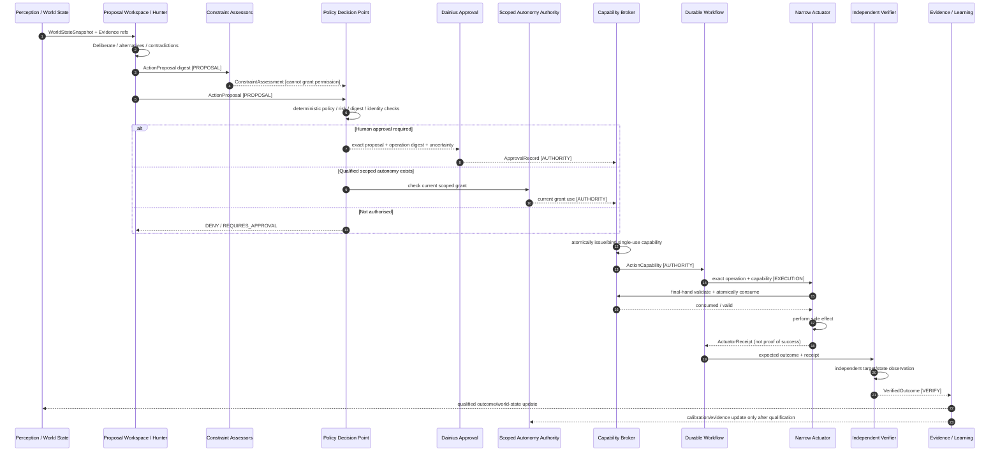
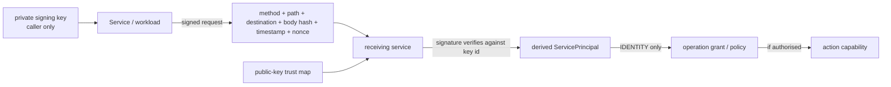
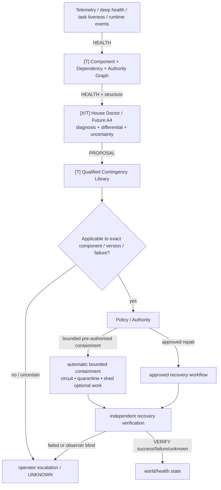
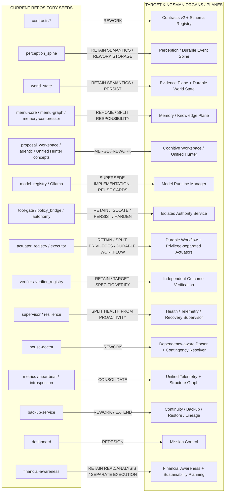

# Kingsman Engineering Architecture Drawing Set v0.1

> **STATUS: CANDIDATE ENGINEERING DRAWING SET FOR DAINIUS / KAI / DEEPSEEK REVIEW — NOT FINAL CANON, NOT IMPLEMENTATION AUTHORITY.**
>
> **Purpose:** replace the rejected presentation-style infographic with deterministic engineering views that preserve actual repository components, contract boundaries, authority semantics, state ownership and current-vs-target distinctions.

## Drawing-set subject

```text
Repository: dainius1234/kai-system
Branch: claude/project-rework-plan-pgvp35
Current deployment source: docker-compose.full.yml
Current deployment source blob: 3cba8f8586f33c0da1bb7862dea60e0b72cbdfda
Architecture candidate: kai-pm/KINGSMAN_CANDIDATE_ARCHITECTURE_V0_1_DEEPSEEK_REVIEW.md
Architecture candidate blob: b39d21b828373ee6c5893015788e8446eb8d9a6a
Visual standard: kai-pm/KINGSMAN_ENGINEERING_ARCHITECTURE_VISUAL_STANDARD.md
Status: MIXED — current repository + target candidate
```

### Legend

- `[C]` = current/present in exact repository subject; **not automatically proof of live runtime**.
- `[T]` = target candidate; not implemented merely because drawn.
- `[X]` = transitional/current seed expected to be reworked/re-homed.
- `[U]` = unresolved / requires qualification.
- `DATA` = ordinary data path.
- `EVIDENCE` = provenance/qualification-bearing path.
- `PROPOSAL` = non-authoritative cognitive output.
- `AUTHORITY` = approval/grant/capability path.
- `EXECUTION` = side-effect path.
- `VERIFY` = independent observation/outcome path.
- `HEALTH` = health/telemetry/degradation path.

---

# A. CURRENT REPOSITORY DEPLOYMENT — TRUST / NETWORK VIEW

This view is derived from the current `docker-compose.full.yml`. It shows declared presence and network placement, **not runtime liveness**.

```mermaid
flowchart TB
  subgraph EDGE["edge-net — externally reachable edge"]
    DASH["[C] dashboard\noperator UI / edge"]
  end

  subgraph SENSOR["sensor-net — internal sensor boundary"]
    CAM["[C] camera-service"]
    AUD["[C] audio-service"]
    WAKE["[C] wake-service"]
    SCR["[C] screen-capture"]
    PARA["[C/U] parakeet-server\noptional profile"]
  end

  subgraph AGENT["agent-net — internal cognition/service fabric"]
    AG["[C] agentic"]
    AGI["[C] agentic-introspect"]
    MEM["[C] memu-core"]
    MEMI["[C] memu-core-introspect"]
    GRAPH["[C] memu-graph"]
    LETTA["[C] letta-agent"]
    FUSION["[C] fusion-engine"]
    VER["[C] verifier"]
    COMP["[C] memory-compressor"]
    FIN["[C] financial-awareness"]
    ADVISOR["[C] kai-advisor"]
    TTS["[C] tts-service"]
    AVATAR["[C] avatar-service"]
    CAL["[C] calendar-sync"]
    WORK["[C] workspace-manager"]
    SKILL["[C] skill-hunter"]
    DOC["[C] house-doctor"]
    OLL["[C] ollama"]
    PULL["[C] ollama-pull"]
    TG["[C] telegram-bot"]
  end

  subgraph CONTROL["control-net — internal authority/control boundary"]
    TOOL["[C] tool-gate"]
    SUP["[C] supervisor"]
    LEDGER["[C] ledger-worker"]
  end

  subgraph EXECNET["execution-net — internal side-effect boundary"]
    EXEC["[C] executor"]
    HEART["[C] heartbeat"]
  end

  subgraph OBS["observability-net — internal observation boundary"]
    MET["[C] metrics-gateway"]
  end

  subgraph DATA["data-net — internal persistence boundary"]
    PG[("[C] PostgreSQL / pgvector")]
    REDIS[("[C] Redis")]
    BACK["[C] backup-service"]
  end

  subgraph EGRESS["egress-net — internet/external-provider boundary"]
    INTERNET[(External providers / internet)]
  end

  DASH --- AG
  DASH --- MEM
  DASH --- MEMI
  DASH --- HEART
  DASH --- TOOL

  AG -->|DATA| MEM
  AG -->|CONTROL| TOOL
  AG -->|DATA| OLL
  AG -->|DATA| LETTA
  AG -->|DATA| FIN
  AG -->|DATA| SKILL
  AG -->|DATA| DOC

  EXEC -->|CONTROL| TOOL
  EXEC -->|HEALTH| HEART
  SUP -->|HEALTH / CONTROL| MEM
  SUP -->|CONTROL| TOOL
  LEDGER -->|CONTROL| TOOL
  MET -->|HEALTH| MEM
  MET -->|HEALTH| TOOL

  MEM -->|DATA| PG
  MEM -->|DATA| REDIS
  TOOL -->|DATA / LEDGER| REDIS
  BACK -->|DATA| PG
  BACK -->|DATA| REDIS
  BACK -->|DATA| MEM
  BACK -->|CONTROL| TOOL

  CAM -->|CONTROL| TOOL
  AUD -->|DATA| MEM
  WAKE -->|DATA| OLL
  WAKE -->|DATA| MEM
  SCR -->|DATA| MEM

  OLL -->|EGRESS model retrieval| INTERNET
  TG -->|EGRESS Telegram| INTERNET
  TTS -->|EGRESS voice provider when configured| INTERNET
```



### Current deployment engineering notes

1. Network segmentation is already a first-class architectural fact; it must survive/strengthen in the target architecture rather than disappear behind one generic `Infrastructure` box.
2. Current services often span multiple concerns; that is a migration input, not proof those boundaries are final.
3. Compose presence is `PRESENT`, not automatically `VERIFIED LIVE`.
4. Some current authentication is transitional: shared tokens/HMAC remain in current services while the Ed25519 per-service identity direction exists in code and still requires rollout qualification.

---

# B. TARGET PHYSICAL ARCHITECTURE — EARNED FAILURE / TRUST DOMAINS

```mermaid
flowchart LR
  OP["DAINIUS / OPERATOR\nprotected local mission control"]

  subgraph EDGE2["EDGE / OPERATOR DOMAIN"]
    MC["[T] mission-control\nUI • voice • notifications • approvals"]
    EDGEGW["[T] edge gateway\nexternal ingress / presentation only"]
  end

  subgraph CORE2["KAI CORE DOMAIN — no broad actuator credentials"]
    ING["[T/X] Perception Ingress"]
    EVID["[T/X] Evidence Qualification"]
    WORLD["[T/X] World State"]
    GOAL["[T] Goal / Obligation / Watch"]
    ATTN["[T] Attention Engine"]
    COG["[T/X] Cognitive Workspace / Unified Hunter"]
  end

  subgraph AUTH2["AUTHORITY DOMAIN — deterministic / non-LLM"]
    ID["[X/T] Workload Identity Provider"]
    POLICY["[X/T] Policy Decision Point"]
    APPROVAL["[X/T] Protected Approval Gate"]
    AUTO["[X/T] Scoped Autonomy Authority"]
    CAP["[X/T] Atomic Capability Broker"]
  end

  subgraph MODEL2["MODEL COMPUTE DOMAIN"]
    MRM["[T] Model Runtime Manager"]
    MODELS["[X/T] local models / specialists\nGPU • CPU • future qualified NPU"]
  end

  subgraph MEMORY2["MEMORY / KNOWLEDGE DOMAIN"]
    MEMORY["[X/T] memory service\nepisodic • semantic • relationship • procedural"]
    DERIVED["[X/T] derived vector / graph indexes"]
  end

  subgraph EXEC2["EXECUTION DOMAIN — privilege-separated hands"]
    WF["[T] Durable Workflow Engine"]
    EGRESSCTL["[T] Egress / Target Control"]
    ACTR["[X/T] kai-actuator-*\nfile • browser • message • admin • finance separated"]
  end

  subgraph ASSURE2["ASSURANCE / IMMUNE DOMAIN"]
    OTEL["[T] Telemetry Collector"]
    GRAPH2["[T] Component / Dependency / Authority Graph"]
    DOCTOR["[X/T] House Doctor / Future A4 diagnosis"]
    CONT["[T] Qualified Contingency Resolver"]
    SUP2["[X/T] Narrow Recovery Supervisor"]
    VERIFY["[X/T] Independent Verifiers"]
  end

  subgraph DATA2["DURABLE DATA / CONTINUITY DOMAIN"]
    PG2[("[T/X] PostgreSQL\nrole/schema separated authoritative metadata/state")]
    OBJ[("[T] encrypted content-addressed object store")]
    CACHE[("[X] Redis\ncache / ephemeral coordination")]
    LINEAGE["[T] Release / Attestation / Lineage Registry"]
    BK[("[T/X] isolated backup / restore targets")]
  end

  OP -->|AUTHORITY| MC
  MC -->|DATA / operator intent| EDGEGW
  EDGEGW -->|DATA| ING

  ING -->|EVIDENCE candidate| EVID -->|EVIDENCE| WORLD
  WORLD -->|DATA| GOAL -->|DATA| ATTN -->|DATA| COG
  MEMORY -->|DATA / context| COG
  COG -->|DATA| MRM -->|DATA| MODELS
  MODELS -->|reasoning output| COG

  COG -->|PROPOSAL only| POLICY
  ID -->|identity| POLICY
  POLICY -->|AUTHORITY requirement| APPROVAL
  POLICY -->|AUTHORITY evaluation| AUTO
  OP -->|AUTHORITY approval| APPROVAL
  APPROVAL -->|AUTHORITY| CAP
  AUTO -->|AUTHORITY scoped grant| CAP
  CAP -->|AUTHORITY single-use capability| WF
  WF -->|EXECUTION| ACTR
  ACTR -->|CONTROL / egress request| EGRESSCTL

  ACTR -->|receipt| VERIFY
  VERIFY -->|VERIFY / evidence| WORLD
  VERIFY -->|VERIFY| PG2

  OTEL -->|HEALTH| GRAPH2 -->|HEALTH + structure| DOCTOR
  DOCTOR -->|PROPOSAL diagnosis| CONT
  CONT -->|PROPOSAL recovery candidate| POLICY
  POLICY -->|AUTHORITY| SUP2
  SUP2 -->|EXECUTION via workflow| WF

  WORLD <--> PG2
  GOAL <--> PG2
  POLICY <--> PG2
  AUTO <--> PG2
  CAP <--> PG2
  WF <--> PG2
  MEMORY <--> PG2
  MEMORY <--> OBJ
  DERIVED <--> MEMORY
  PG2 --> LINEAGE
  OBJ --> LINEAGE
  LINEAGE --> BK
```



### Target boundary law

- `kai-core` may reason/propose but cannot carry unrestricted actuator root credentials.
- authority is separately isolated so model/cognition failure cannot mint permission.
- execution is privilege-separated by action class.
- verifier cannot be the same independence group as the actuator it verifies.
- policy/authority unavailable => consequential actuation fails closed; cognition may remain available.

---

# C. CONSEQUENTIAL-ACTION AUTHORITY SEQUENCE

This is the architecture the rejected poster oversimplified most severely.



## Existing repo seeds represented here

- `ActionProposal`, `ConstraintAssessment`, `PolicyDecision`, `ApprovalRecord`, `ActionCapability`, `ActionWorkflow`, `ActuatorReceipt`, `VerifiedOutcome`, `LearningUpdate` already exist as distinct contracts.
- proposal workspace explicitly cannot issue capabilities or execute.
- policy engine is fail-closed.
- approval is digest-bound/replay-protected/expiring.
- capability is audience-bound/single-use/revocable.
- autonomy is scoped/expiring/bounded/evidence-earned.
- verifier registry rejects self-verification and same-independence-group verification.

Production gaps remain durability, atomic cross-process consumption, final-hand enforcement across all real actuators and complete migration of legacy paths.

---

# D. EVIDENCE / WORLD-STATE / MEMORY FLOW

```mermaid
flowchart LR
  SRC["External/source observation\nuser • sensor • service • web • file"]
  PE["[C/X] PerceptionEvent\nprincipal • purpose • provenance • digest"]
  IN["[C/X] PerceptionIngress\nvalidate • dedup • staleness • bounds"]
  J["[C→T] Event Journal\ncurrent fsync JSONL → target durable event/outbox"]
  RAW["[T] Raw Evidence Object\ncontent-addressed encrypted object"]
  ER["[C/X] EvidenceRecord / GradedEvidence"]
  CL["[C/X] Claim\nverification • freshness • conflicts"]
  WS["[C/X] WorldStateSnapshot\nscoped • immutable • reproducible"]
  MEM["[C/X] Memory Context\nepisodic • semantic • relationship"]
  COG["Cognitive Workspace"]
  PROP["ActionProposal / answer / recommendation"]

  SRC -->|DATA| PE -->|DATA| IN -->|EVIDENCE candidate| J
  J -->|EVIDENCE| ER
  SRC -. large retained body .-> RAW
  RAW -->|digest/ref| ER
  ER -->|EVIDENCE| CL -->|EVIDENCE| WS
  MEM -->|DATA / context, not automatic fact| COG
  WS -->|EVIDENCE-qualified state| COG
  COG -->|PROPOSAL| PROP
```



### Truth distinctions that must remain visible

- observation ≠ evidence qualification;
- evidence ≠ current fact;
- memory ≠ current fact;
- model text ≠ qualifying evidence merely because confident;
- stale ≠ false;
- unavailable observer ≠ negative result;
- conflict is preserved, not silently averaged away;
- UNKNOWN remains first-class.

---

# E. WORKLOAD IDENTITY / AUTHORITY BOUNDARY



Standing law:

`NETWORK MEMBERSHIP ≠ AUTHENTICATED IDENTITY ≠ ACTION AUTHORITY`

Current Ed25519 design direction correctly derives the principal from the key that verified the signature instead of trusting a caller-supplied service name. Full deployment/image feasibility remains a qualification obligation.

---

# F. RESILIENCE / SELF-DIAGNOSIS / CONTINGENCY FLOW



## Expected major-failure behaviour

| Failed organ | Required organism response |
|---|---|
| one specialist model | remove viewpoint, expose degraded council; do not fabricate its result |
| memory | reduced-context mode; no invented continuity |
| external sensor/provider | dependent claims `UNAVAILABLE/UNKNOWN`; unrelated cognition continues |
| House Doctor | diagnosis visibility degraded; absence is not `HEALTHY` |
| authority plane | consequential actuation fails closed; reasoning can continue |
| optional skill | quarantine skill; core continues |
| actuator | operation fails/unknown; verify/reconcile before retry |
| verifier | outcome remains unverified/UNKNOWN; no learning-as-success |
| PostgreSQL authoritative store | transition to explicitly designed degraded/read-only mode where safe; no invented durable authority |

---

# G. CURRENT → TARGET MIGRATION / DISPOSITION



### No-delete rule

This drawing is a **disposition hypothesis**, not authorisation to merge/delete code. Phase 2 must recover intent and prove current dependencies/consumers before any destructive consolidation.

---

# H. PROFESSIONAL REVIEW MATRIX — WHAT DEEPSEEK SHOULD ATTACK

DeepSeek should review the drawing set for the following architectural failure classes:

| Dimension | Review question |
|---|---|
| Single authority | Is there any path from cognition/model/sensor/Doctor directly to side effect without policy/capability? |
| State ownership | Is any durable state ambiguously owned by two organs? |
| Shared fate | Which synchronous/storage dependencies can crash or stall unrelated capabilities? |
| Final-hand control | Can an actuator execute after a gateway check without consuming exact capability itself? |
| Evidence | Can model/memory/telemetry content become current fact without qualification? |
| Identity | Can caller identity still be asserted rather than derived? |
| Verification | Can executor or correlated verifier certify its own success? |
| Retry | Can non-idempotent operations be repeated after unknown outcome? |
| Proactivity | Can attention/watches silently become action authority? |
| Recovery | Can Doctor/Supervisor repair outside the normal authority path? |
| Migration | Can current legacy paths remain callable after replacement, creating dual authority? |
| Continuity | Can backup boot without proving exact lineage/authority/schema compatibility? |
| Operator | Can diagram/status claim CURRENT when underlying evidence is stale/withdrawn? |
| Simplicity | Which proposed process boundaries can remain modules without losing isolation/invariants? |

---

# I. WHAT THIS DRAWING SET DELIBERATELY DOES NOT CLAIM

1. It does **not** claim every Compose service is running now.
2. It does **not** claim the target eight-domain architecture has been implemented.
3. It does **not** claim PostgreSQL/OTel/OPA/Temporal/SPIFFE choices are frozen.
4. It does **not** claim the current Ed25519 path is fully rolled out or image-qualified.
5. It does **not** authorise service deletion/consolidation.
6. It does **not** reorder House / 048 / Item 8 / A-4 / Phase-2 programme authority.
7. It does **not** replace the detailed candidate architecture specification.

Its purpose is to expose the real engineering puzzle at the right level for review.

---

# J. REVIEW / FREEZE PATH

`CURRENT REPO TOPOLOGY`
→ `KAI CANDIDATE ARCHITECTURE`
→ `ENGINEERING DRAWING SET`
→ `DEEPSEEK ADVERSARIAL REVIEW`
→ `KAI REPO-FACT RECONCILIATION`
→ `ORION CURRENT→TARGET FEASIBILITY / DEPENDENCY MAP`
→ `DISCRIMINATING SPIKES WHERE NEEDED`
→ `DAINIUS REVIEW`
→ `MASTER CANON v1 EXACT-BYTE FREEZE`
→ only then `PHASE-2 PROFESSIONALISATION TOWARD THE FROZEN TARGET`.
