# KAI KINGSMAN — Engineering Architecture Drawing Set v0.4

> **STATUS: DETERMINISTIC ENGINEERING DRAWING SET FOR `KINGSMAN_EXISTING_KAI_MASTER_ARCHITECTURE_PLAN_V0_4.md` — NOT FINAL CANON, NOT IMPLEMENTATION AUTHORITY.**
>
> **Architecture subject creation commit:** `391f0b48eb3166888f0941cc61adb642e9197bde`.
>
> These diagrams are engineering claims, not presentation art. Every box is marked by semantic status and every target responsibility must map to current Kai or be explicitly identified as a genuinely missing joint.

## Legend

- `[C]` CURRENT — present in repository/current architecture; not automatically runtime-live.
- `[X]` TRANSITIONAL — existing migration/shim or current component being reworked.
- `[T]` TARGET RESPONSIBILITY — intended final responsibility, not necessarily a new service.
- `[N]` NEW JOINT — genuinely missing/under-specified mechanism attached to existing architecture.
- `[U]` UNKNOWN — exact current ownership/currentness requires E0 qualification.
- solid arrow = intended/current principal path.
- dotted arrow = migration/shadow/fallback/compatibility path.
- `PROPOSAL` = non-authoritative cognitive output.
- `AUTHORITY` = policy/approval/autonomy/capability path.
- `EXECUTION` = side effect.
- `VERIFY` = independent outcome observation.
- `HEALTH` = health/degradation path.

---

# A. WHOLE KAI — ROOTED ORGANISM

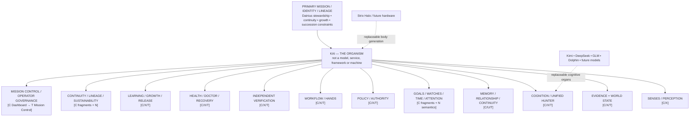

**Architectural law:** Kai survives replacement of models/frameworks/hardware because identity and authority are not located in those components.

---

# B. CURRENT TRANSITIONAL RUNTIME — LEGACY + BUILT UH MIGRATION

```mermaid
flowchart LR
  subgraph LEGACY["CURRENT DEFAULT / LEGACY-LEANING PATH"]
    SENS["[C] sensors / watchers / readers"]
    POLL["[C] direct polling / Cortex / agentic reads"]
    MEM["[C] memu/current context"]
    AG["[C] agentic FSM / swarm / teammates"]
    TG["[C] Tool Gate / service auth"]
    ROUTES["[C] existing mutating service routes"]
    EXT["external/local targets"]
    SENS --> POLL --> MEM --> AG --> TG --> ROUTES --> EXT
  end

  subgraph UH["BUILT UH MIGRATION LAYER — NOT DEFAULT CUT OVER"]
    ADAPT["[X] sensor adapters"]
    ING["[C/X] PerceptionIngress"]
    J["[C/X] EventJournal"]
    WS["[C/X] scoped World State"]
    PW["[C/X] proposal-only workspace"]
    POL["[C/X] policy / approval / capability"]
    REG["[C/X] ActuatorRegistry\n34 identities / 8 tiers"]
    VER["[C/X] verifier / graded evidence"]
    AUTO["[C/X] scoped autonomy + LegacyTrustBridge"]
    ADAPT --> ING --> J --> WS --> PW --> POL --> REG --> VER
    VER --> AUTO
  end

  SENS --> ADAPT
  WS -. "KAI_CORTEX_SOURCE=world_state" .-> POLL
  AUTO -. "KAI_AUTONOMY_ENFORCE" .-> AG
  REG -. "migration handlers" .-> ROUTES
  ING -. "KAI_PERCEPTION_MODE=shadow|active" .-> WS
```

**Meaning:** the migration layer already exists. The work is to finish, harden and cut it over—not to build another architecture beside it.

---

# C. FINAL CONSEQUENCE PATH — MANUAL VS AUTONOMOUS AUTHORITY LANES

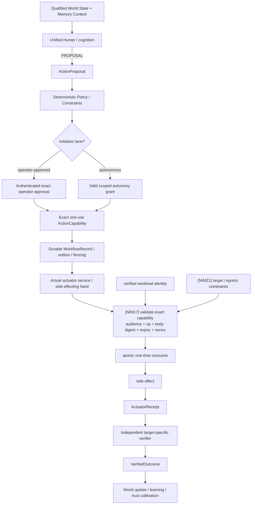

**Key distinction:** autonomy decides whether Kai may initiate without fresh operator approval. It does not replace exact execution authority.

---

# D. CURRENT FINAL-HAND GAP — WHY D349 MATTERS

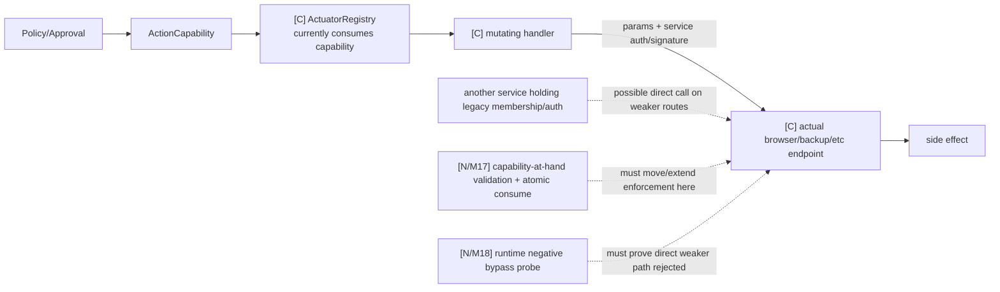

Target closure condition:

`authenticated direct route` is insufficient. The weaker mutation path must be unusable at runtime.

---

# E. PERCEPTION → EVENT → EVIDENCE → WORLD STATE

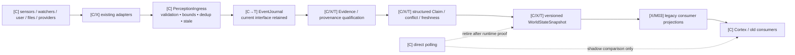

Fallback rule:

`world_state selected + canonical path unavailable` → `COLD_START/DEGRADED/UNKNOWN`, not silent steady-state polling.

---

# F. MEMORY / IDENTITY / RELATIONSHIP — CURRENT FAMILY AND TARGET OWNERSHIP

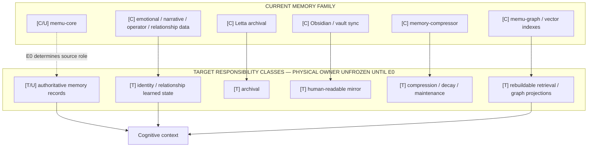

No new parallel memory service is assumed. Exact source ownership remains evidence-dependent.

---

# G. PROACTIVITY — EXISTING DETECTORS INTO ONE ATTENTION SEMANTIC LOOP

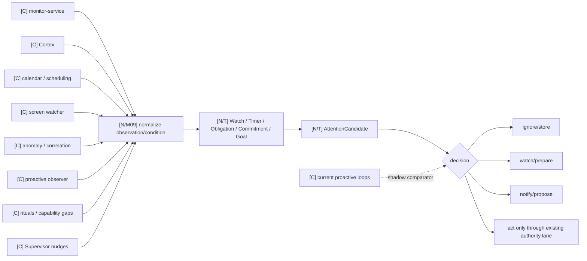

**Physical home remains provisional** until E0; no separate proactivity service is assumed.

---

# H. COGNITION / UNIFIED HUNTER / MODEL RESOURCES

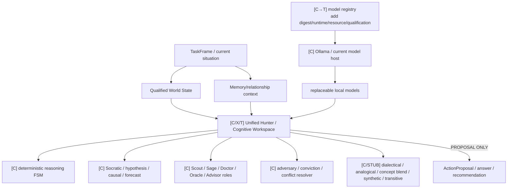

No new runtime-manager service is required now. Stronger runtime management is introduced only when measured multi-runtime/resource needs justify it.

---

# I. IDENTITY / AUTHORITY SEMANTIC STACK

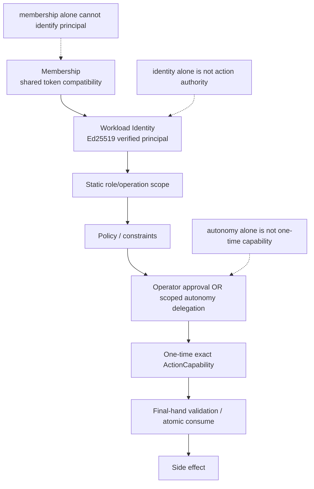

This stack must remain explicit in code, tests, diagrams and Mission Control.

---

# J. DURABLE WORKFLOW AROUND EXISTING ACTUATOR REGISTRY

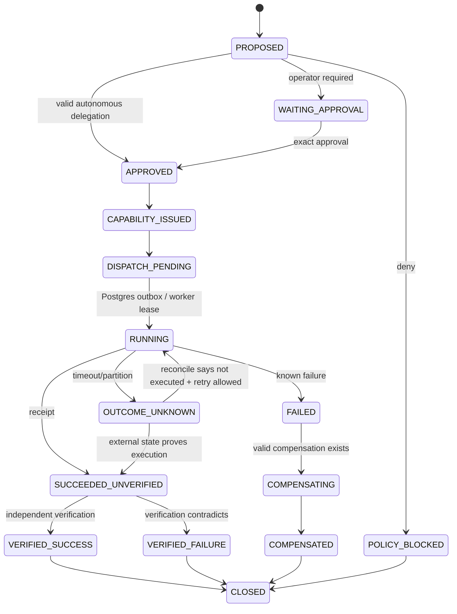

First implementation candidate: PostgreSQL workflow/outbox/fencing around current ActuatorRegistry. No new workflow platform is assumed.

---

# K. HEALTH / DIAGNOSIS / CONTINGENCY / RECOVERY

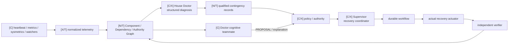

No component diagnoses, approves, repairs and certifies itself end-to-end.

---

# L. CONTINUITY / LINEAGE / RESTORE

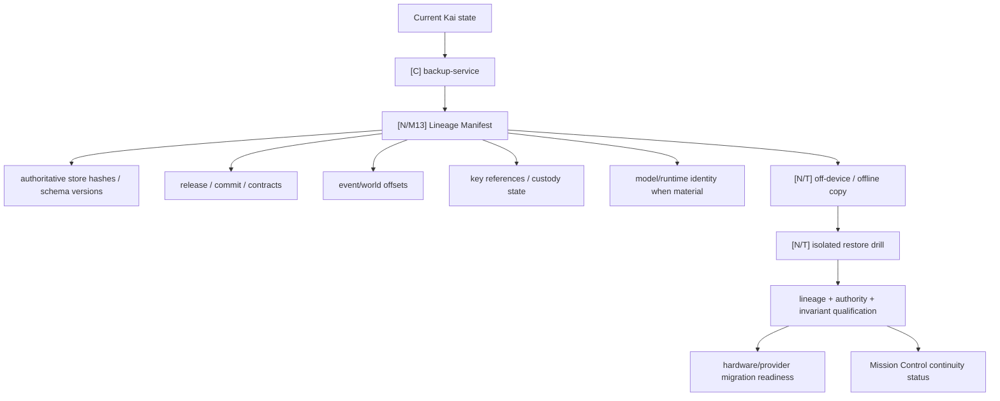

“Containers started” is not restore success. The intended lineage and authority state must be proven.

---

# M. FINANCIAL SUSTAINABILITY BOUNDARY

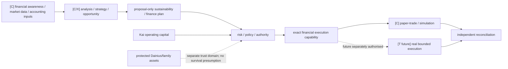

No “survival agent” and no automatic access expansion.

---

# N. CANONICAL DEPLOYMENT PROFILE MODEL

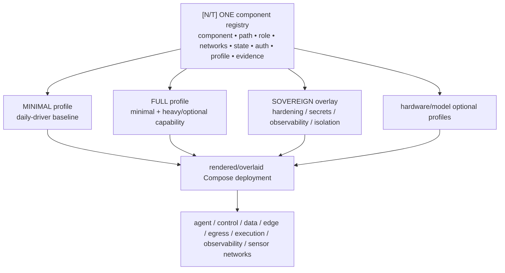

The implementation may use generated YAML or base+override files; one component truth is the invariant.

---

# O. CURRENT → TARGET MIGRATION CONTROL LOOP

```mermaid
flowchart LR
    CUR["CURRENT SUBJECT"] --> INT["recover intent"]
    INT --> MAP["map readers/writers/state/authority/deps"]
    MAP --> GAP["identify real gap"]
    GAP --> SHIM["compatibility shim / adapter"]
    SHIM --> SHADOW["shadow / dual-read / compare"]
    SHADOW --> TEST["positive + negative + boundary + fault tests"]
    TEST --> SOAK["runtime soak where required"]
    SOAK --> CUT["governed cutover"]
    CUT --> NEG["runtime prove weaker old path dead"]
    NEG --> RET["retire / rehome legacy"]
    RET --> DOC["update Mission Control / docs / evidence"]
    DOC --> BANK["bank exact subject / result"]
```

No migration is complete at “new path works”.

---

# P. E0→E11 PROFESSIONALISATION ROADMAP

```mermaid
flowchart LR
    E0["E0\ncurrent machine census"] --> E1["E1\ncanonical deployment profiles"]
    E1 --> E2["E2\ntruth-path / World State cutover"]
    E2 --> E3["E3\nidentity + authority + final hand"]
    E3 --> E4["E4\ndurable workflow"]
    E4 --> E5["E5\nWorld State / memory ownership"]
    E5 --> E6["E6\nproactivity / attention"]
    E6 --> E7["E7\ncognition / model resources"]
    E7 --> E8["E8\nDoctor / resilience / contingency"]
    E8 --> E9["E9\ncontinuity / lineage / restore"]
    E9 --> E10["E10\nsustainability / succession scaffolding"]
    E10 --> E11["E11\nMission Control / docs / S5 release"]
```

This is architecture dependency order only, not current programme execution authority.

---

# Q. MISSION CONTROL — OPERATOR VIEW

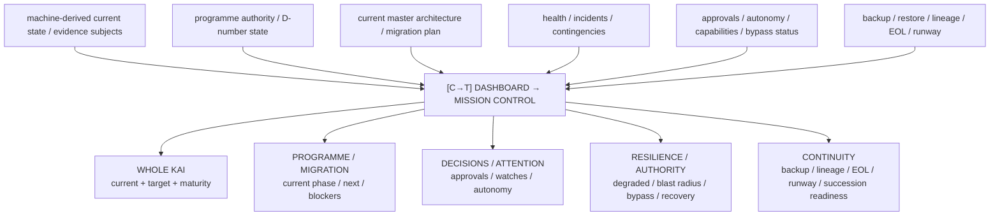

Mission Control is a derived governance view. It must never become the only source of programme or system truth.

---

# R. FAULT-CONTAINMENT MAP

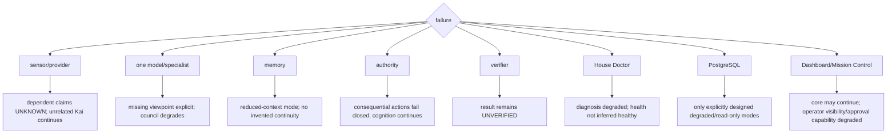

Every component must have an intended blast radius and a tested truthful degraded mode.

---

# S. ARCHITECTURAL STATUS / EVIDENCE RELATIONSHIP

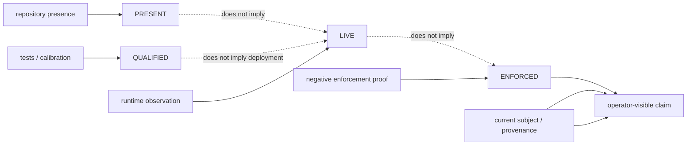

This diagram exists to prevent the recurring category error: code presence, test success, runtime use and enforcement are separate properties.

---

# T. FINAL TARGET — ONE ORGANIC FLOW

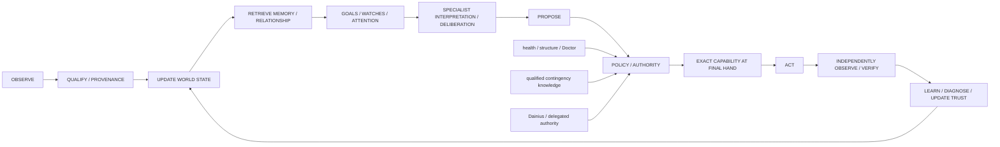

> **ONE CONNECTED ORGANISM — CLEAR RESPONSIBILITY — NO PARALLEL SOVEREIGNTY — BOUNDED FAILURE — VERIFIED OUTCOMES — CONTINUOUS GROWTH.**

---

# Drawing-set review rules

Before final freeze:

1. CURRENT boxes must be reconciled to E0 exact subjects/status.
2. TARGET boxes must map to a v0.4 requirement or accepted later delta.
3. NEW-JOINT boxes require explicit justification and target home.
4. no diagram may imply v0.4 is already implemented;
5. no green/completion state may survive withdrawal of supporting evidence;
6. physical process/service diagrams must be regenerated after E0/E1 rather than inferred from these logical views;
7. final drawings must be exact-subject-bound to `KINGSMAN_MASTER_CANON_v1` when frozen.
