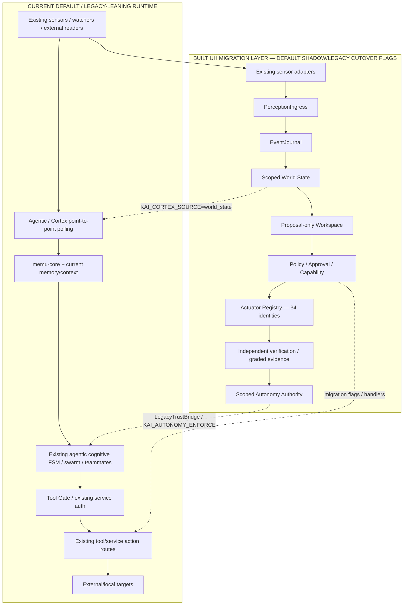

# KAI KINGSMAN — Existing-System Evolution Master Plan v0.3

> **STATUS: PRIMARY ARCHITECTURE EVOLUTION CANDIDATE FOR DAINIUS + KAI + DEEPSEEK + ORION REVIEW — NOT FROZEN, NOT IMPLEMENTATION AUTHORITY, NOT PROGRAMME EXECUTION AUTHORITY.**
>
> This version corrects a material flaw in v0.2: v0.2 described a coherent target but could be read as a blank-sheet replacement architecture. Kai is **not** starting again. The repository already contains a large functioning/sketched organism, a serious Unified Hunter migration programme, shadow/cutover machinery, security bridges, 34 actuator migrations, extensive cognitive/perception/memory/self-diagnosis capabilities and three deployment topologies. The correct task is to **professionalise and evolve the existing organism into the Kingsman destination without losing capability, evidence, migration work or design lineage**.
>
> Governing pattern:
>
> **CURRENT COMPONENT / PATH → QUALIFY REALITY → PRESERVE INTENT → SHIM / ADAPTER → TARGET ORGAN / CONTRACT → PARALLEL SHADOW / SOAK → VERIFIED CUTOVER → PROVE OLD AUTHORITY PATH DEAD → RETIRE OR REHOME LEGACY IMPLEMENTATION.**
>
> `KINGSMAN_MASTER_ARCHITECTURE_AND_PROFESSIONALISATION_CANDIDATE_V0_2.md` remains design input, but **v0.3 is the primary review subject because it binds the target to the actual existing Kai and its migration machinery.**

---

# 0. Non-negotiable correction

The project does **not** need another set of services called Evidence Plane, Memory Plane, Attention Engine, Authority Service, Model Runtime Manager, etc. simply because those are useful logical names.

Those names describe **responsibilities**. Before adding any new service/process, Phase 2 must ask:

1. which current component(s) already perform part of this responsibility?
2. what proven code/contracts/tests should survive?
3. what responsibility is wrongly mixed in today?
4. what compatibility shim lets existing consumers continue while the responsibility moves?
5. what exact evidence proves cutover?
6. what old path must become unreachable before the migration is called complete?
7. does this responsibility need a process boundary at all, or only a module/contract?

Standing rule:

> **NO NEW BOX WITHOUT A CURRENT-TO-TARGET LINEAGE.**

A truly new component is justified only when a required responsibility has no adequate existing home and the boundary is earned by security, failure isolation, hardware/resource isolation, durable lifecycle or independent deployment need.

---

# 1. What Kai already is today — three overlapping realities

There is no honest single sentence such as “Kai currently has 61 live services.” Current reality has three different strata that must be reconciled.

## 1.1 Repository capability population

The repository contains roughly 60 service/application families plus shared modules. The stale README is useful as a **capability census**, not as proof of live/cut-over status.

Existing capability families include:

### Core control/data

- PostgreSQL / pgvector
- Redis
- Tool Gate
- memu-core
- memu-core-introspect
- agentic
- heartbeat
- dashboard
- Ollama + pull/init

### Perception / world awareness

- audio-service
- camera-service
- vision-service
- wake-service
- screen-capture
- screen-watcher
- clipboard-service
- files-service
- document-parser
- email-reader
- news-feed
- weather-service
- airquality-service
- calendar-service
- calendar-sync
- git-watcher
- docker-watcher
- sysmetrics
- Cortex
- proactive observer logic inside agentic
- monitor-service rule engine

### Memory / knowledge / continuity

- memu-core hot path
- memu-core-introspect cold/maintenance path
- memu-graph / Cognee/Kuzu graph
- TurboVec / pgvector storage paths
- Letta archival memory
- memory-compressor
- Obsidian/vault-sync
- emotional memory / narrative identity / operator model / cognitive fingerprint data

### Cognition / reasoning

- agentic main reasoning service
- deterministic cognitive FSM
- Socratic questioning
- Scout / Sage / Doctor / Oracle teammates
- swarm assembly / conflict resolution
- adversary engine
- causal reasoning / temporal projection
- hypothesis engine / curiosity
- Global Workspace prototype/stub
- counterfactual / analogical / concept-blending / transitive / synthetic-experience stubs
- Kai Advisor

### Actuation / external interaction

- executor
- browser-agent
- notify-service
- TTS
- avatar
- Telegram bot
- vault/file export
- calendar mutation paths
- monitor actions
- broker bridge / paper-trade paths
- backup/restore
- recovery actions
- actuator registry with 34 actuator identities across 8 risk tiers

### Health / self-diagnosis / resilience

- heartbeat
- Supervisor
- House Doctor
- conversational Doctor teammate
- common resilience primitives
- verifier
- fusion-engine
- metrics-gateway
- introspection endpoints
- Docker/system watchers
- system FSM DEGRADED / RECOVERING states

### Growth / self-development

- skill-hunter
- workspace-manager
- Agent-Evolver
- Dream/introspection cold path
- skill provenance/probation/error disable
- capability-gap logging
- ritual discovery

### Finance / sustainability seeds

- financial-awareness
- broker-bridge
- paper-trading vertical slice
- market/strategy/opportunity intelligence modules

### Operational/security infrastructure

- three Compose variants: minimal / full / sovereign
- multiple Docker trust/network zones
- shared service-auth bridge
- newer Ed25519 workload-identity path
- dashboard identity/role/scopes
- Vault / Vault rotator in sovereign profile
- Tailscale
- Prometheus / Alertmanager / Grafana
- gVisor/AppArmor executor hardening
- backups
- CI/security gates / release bundles / evidence machinery

**No current capability is removed from the product vision merely because its existing implementation is sketch-grade.**

## 1.2 Deployment definitions are not one coherent topology yet

### `docker-compose.minimal.yml`

This is the broad daily-driver topology and includes many perception/watcher/output services absent from the current `full` file. It defines network zones including:

- `agent-net`
- `control-net`
- `data-net`
- `edge-net`
- `egress-net`
- `observability-net`
- `sensor-net`

It wires current services such as browser-agent, notify-service, document-parser, monitor-service, broker-bridge, sysmetrics, screen-watcher, email/news/weather/docker/airquality/calendar/git watchers, skill-hunter, House Doctor, vault-sync, Cortex, wake, Supervisor and verifier in addition to core services.

### `docker-compose.full.yml`

This is **not currently a simple superset of minimal**. It contains heavy/alternate components such as:

- agentic-introspect
- executor
- fusion-engine
- memory-compressor
- memu-graph
- Letta
- financial-awareness
- ledger-worker
- metrics-gateway
- camera/audio
- avatar
- screen-capture
- backup-service
- calendar-sync
- Kai Advisor
- Telegram
- workspace-manager
- parakeet sidecar

but currently omits several services that minimal contains.

Therefore “minimal/full” naming does not itself define current canonical product topology. **Compose topology reconciliation is a Phase-2 task, not a reason to invent a fourth architecture.**

### `docker-compose.sovereign.yml`

This is the hardened production-oriented subset. It adds/uses:

- read-only/cap-drop/no-new-privileges defaults;
- Vault / key rotation concepts;
- Tailscale overlay;
- Prometheus / Alertmanager / Grafana;
- hardened executor/gVisor/AppArmor direction;
- pgvector production memory path;
- security/control network separation.

The target Kingsman deployment should **absorb the best sovereign controls into the unified topology**, not discard the sovereign work and create a new “Authority Service stack” beside it.

## 1.3 Unified Hunter is already a built migration layer, not an idea

UH tracker reports the following completed/tested work packages:

- UH-1 canonical contracts
- UH-2 perception spine
- UH-3 scoped world state
- UH-4 proposal-only workspace
- UH-5 policy / approval / capability
- UH-6 paper-trade vertical slice
- UH-7 actuator registry + migration
- UH-8 autonomy requalification

plus:

- payload bounds
- assessment/Ohana separation
- rollback guards
- concurrency/clock/fencing
- service authentication
- erasure lineage
- legacy trust bridge
- full-catalogue actuator migration
- all migration flags tested together
- live endpoint verification
- mutating-handler verification
- dashboard identity/auth/degraded semantics
- architecture-rule CI gates

**Critical state:** the new UH machinery is **built but intentionally not cut over by default**.

That is the correct professional migration pattern and must be preserved.

---

# 2. Current transitional runtime architecture — what actually coexists

Kai currently has a **legacy operating path plus a verified UH replacement path sitting beside/behind it**.



This transitional architecture is **not a defect by itself**. It becomes a defect only if dual authority remains permanently or the cutover evidence is lost.

---

# 3. Existing migration shims that must be retained as assets

These are not abstract future ideas. They are current engineering mechanisms.

## SHIM-E01 — Perception shadow/active runner

Current component:

`common/perception_spine/shadow.py`

Purpose:

- polls existing sensors;
- adapts them into `PerceptionEvent`;
- validates/journals them;
- defaults `KAI_PERCEPTION_MODE=shadow`;
- in `active` mode reduces accepted events into World State;
- reducer failures do not kill ingestion;
- current legacy polling remains available during migration.

**Keep.** This is exactly the bridge from current perception to the canonical spine.

Retire condition:

- all required providers emit/adapter into the spine;
- active World State has soaked/qualified;
- all consumers have migrated;
- no legacy point-to-point polling is required for safety fallback.

## SHIM-E02 — Cortex World-State compatibility adapter

Current component:

`common/perception_spine/cortex_source.py`

Purpose:

- `KAI_CORTEX_SOURCE=poll` default;
- `KAI_CORTEX_SOURCE=world_state` optional;
- converts new scoped World State into Cortex's current state shape;
- falls back to polled state if World State is empty/cold.

**Keep until Cortex/current agentic consumers no longer require the old state shape.**

This pattern should be copied for other legacy consumers rather than forcing big-bang API rewrites.

## SHIM-E03 — Legacy autonomy / TrustLevel bridge

Current component:

`common/autonomy/legacy_bridge.py`

Purpose:

- old scalar TrustLevel and new scoped grants currently coexist;
- default advisory mode records disagreements;
- `KAI_AUTONOMY_ENFORCE=true` makes scoped authority binding;
- intended safety rule: legacy trust may **subtract**, never widen scoped authority;
- `migration_report()` exposes readiness/disagreements.

**Keep. Do not replace with another “autonomy manager.”**

Known cutover blocker:

- enforcement must not be enabled before valid grants/migration readiness exist.

## SHIM-E04 — Actuator migration state machine

Current components:

- `common/actuator_registry/migration.py`
- `common/actuator_registry/legacy_verification.py`

Purpose:

- migrate in ascending risk tier;
- refuse ACTIVE without a real dispatch handler;
- refuse VERIFIED while legacy path remains open;
- verify legacy closure against actual source tree;
- support supervised soak before activation;
- prevent a flag from substituting for evidence.

**Keep as the standard pattern for all future control-path migrations.**

Important: retirement of a legacy path may mean **adding authentication/capability enforcement to the same route**, not deleting the route.

## SHIM-E05 — Service-auth transitional bridge

Current state:

- several mutating routes fail closed using `KAI_SERVICE_TOKEN`/service-auth;
- this proves shared-secret possession, not unique workload identity;
- newer Ed25519 `common/service_identity.py` direction derives principal from verifying key;
- Cortex already has a mixed transition where one endpoint uses shared token and another signed principal path.

**Do not throw away the existing auth work.**

Required evolution:

`shared service token (membership)`
→ `dual-stack compatibility window`
→ `per-workload signed identity`
→ `receiver-verifiable identity everywhere needed`
→ `remove shared-token authority from identity-sensitive routes`.

## SHIM-E06 — Dashboard credential / degraded-response bridge

Current UH/dashboard remediation includes:

- browser credential shim;
- authenticated route scopes/roles;
- fail-closed protected routes;
- explicit degraded envelope so dependency outage does not look like normal data.

**Mission Control should evolve from Dashboard through compatibility APIs; do not create a disconnected new UI while Dashboard remains another authority/status surface.**

## SHIM-E07 — Feature-flag cutover controls

Existing examples:

- `KAI_PERCEPTION_MODE`
- `KAI_CORTEX_SOURCE`
- `KAI_AUTONOMY_ENFORCE`
- `FF_*` capability flags

Keep feature flags as **migration controls**, not proof of safety.

A flag may select a qualified path; setting the flag never proves the path is qualified.

## SHIM-E08 — Release/evidence/erasure foundations

Existing:

- release bundle concepts tied to code revision;
- graded evidence;
- independent verifier registry;
- erasure lineage across multiple layers;
- architecture/CI gates.

These are inputs to future product-level release/lineage and Evidence Plane work, not code to discard because future terminology is more polished.

---

# 4. Existing organs → Kingsman target mapping

The target is an **evolution map**, not a replacement map.

| Kingsman responsibility | Existing implementation seeds | Keep | Rework / split | New only where missing |
|---|---|---|---|---|
| Perception ingress | sensor services, Cortex polling, perception adapters, shadow runner | sensor-specific acquisition + adapters | route all observations through typed/provenance contracts | contract adapters for uncovered providers |
| Durable event spine | EventJournal prototype | append/replay/digest semantics | backend/durability/multi-writer semantics | transactional outbox/store if existing journal insufficient |
| Qualified World State | `common/world_state`, Cortex world state/provenance ideas | immutable/scoped/conflict/freshness semantics | durable store + consumer cutover | compatibility projections for legacy consumers |
| Memory / continuity | memu-core, introspect, graph, Letta, compressor, vault-sync, emotional/narrative/operator data | all useful memory modes | clarify authoritative records vs derived indexes; remove orchestration/authority leakage | lineage/retention metadata where absent |
| Goals / obligations / watches | proactive observer, monitor-service rules, calendar, rituals, gap log, Supervisor nudges, Cortex state | current detectors/watchers/data sources | consolidate durable semantic objects + ownership | first-class Goal/Obligation/Watch/Timer store if no current owner |
| Attention / interruption | monitor cooldowns, proactive observer, notifications, operator model | current cooldown/context signals | central decision semantics, anti-spam, escalation | attention scoring/state if no current reusable module |
| Cognitive workspace | agentic FSM, swarm, teammates, proposal workspace, Global Workspace concepts | cognitive stages, specialist expertise, proposal-only UH law | one workspace contract, budgets, role selection; retire duplicate orchestration | missing coordination primitives only |
| Model runtime | Ollama, model registry, current model flags | current model serving/adapters | real resource/qualification manager around existing runtime | runtime manager module/process if responsibilities cannot fit existing runtime code |
| Values / constraints | Ohana/conscience/preferences/operator model + assessment contract | operator-confirmed value intent | separate value constraint from evidence/security confidence | versioned confirmed-value store if absent |
| Policy / approval / capability | Tool Gate + policy_bridge + approval + capability | exact-action/digest/fail-closed concepts | durable atomic state, workload identity, final-hand enforcement | backend/store, not second policy system |
| Scoped autonomy | autonomy authority + LegacyTrustBridge | scoped/expiring/revocable/evidence-earned model | persistent state + cutover | no new autonomy service unless boundary earned |
| Workflow / hands | executor, actuator registry, mutating handlers, browser, notify, vault, backup, broker, calendar etc. | 34 actuator catalogue + handlers + migration verifier | durable workflow and privilege separation | workflow persistence/egress controls |
| Outcome verification | verifier, verifier registry, vertical-slice reconciliation, fusion | independence law, outcome semantics | target-specific verifier adapters | new verifier types only per target |
| Telemetry / health | heartbeat, metrics, sysmetrics, docker-watcher, introspection, Prometheus stack | signals and health endpoints | unify trace/identity/state model | OpenTelemetry adapter/collector if justified |
| Structure graph | current capability map, Compose, House/Census/static discovery, introspection | all discovery sources | materialise one machine graph | new graph materialiser only if no current owner |
| Diagnosis | House Doctor, Doctor teammate, Supervisor, system FSM, anomaly/correlation | diagnostic concepts | separate diagnosis from recovery; consume structure/evidence | structured diagnosis schema/adapters |
| Contingency / recovery | `common/resilience`, Supervisor recovery, backup/restart logic | retry/breaker/health/healing primitives | qualify playbooks; normal authority/workflow path | contingency registry/schema |
| Learning / growth | skill-hunter, Agent-Evolver, Dream, curiosity, hypothesis, probation | candidate generation/probation concepts | route promotion through verified release lifecycle | release/promotion controller if missing |
| Backup / continuity | backup-service, PostgreSQL/Redis/memory backup, sovereign hardening | existing backup operations | manifests, restore drills, off-device copies, lineage proof | lineage manifest + restore qualification |
| Financial sustainability | financial-awareness, broker bridge, paper trader, strategy/opportunity modules | read/analysis + paper-trade experience | separate awareness/planning/execution and asset domains | runway/sustainability semantics; no new trader-as-Kai |
| Operator control room | dashboard, Grafana, UH tracker, PM/evidence docs | useful views and operator interface | consolidate into Mission Control fed by machine truth | new panels/data model, not unrelated UI |
| Identity / lineage | Soul/AGENTS, narrative identity, release bundle, service identity, backups | continuity intent and identity data | define constitutional/lineage manifest semantics | lineage manifest/registry if no existing owner |

---

# 5. Current capability families that v0.2 under-described and MUST remain in scope

The following are not “extras to maybe add later.” They already exist as code/design/product intent and must be deliberately mapped:

## 5.1 Inner life / identity / relationship

- emotional memory
- mood arcs
- self-reflection / strengths-weaknesses journal
- epistemic humility
- confession/mistake surfacing
- narrative identity / autobiography / legacy time capsules
- imagination / theory of mind / counterfactual thinking
- conscience / confirmed values
- gratitude/relationship continuity
- operator model
- cognitive fingerprint
- Obsidian Brain

Target treatment:

**relationship/identity/learned-state organs under provenance and operator-confirmed-value rules**, not deleted as “fluff” and not allowed to become authority.

## 5.2 Cognitive depth

- Socratic questioning
- hypothesis engine
- temporal projection
- dialectical synthesis stub
- analogical reasoning stub
- concept blending stub
- synthetic experience stub
- transitive reasoning stub
- causal world model
- policy memory
- Global Workspace prototype
- deterministic reasoning FSM
- Scout/Sage/Doctor/Oracle persistent teammates
- adversary engine
- conviction scoring
- swarm assembly/reputation

Target treatment:

**specialist/cognitive modules inside Unified Hunter/Cognitive Workspace**, activated by evidence/resource qualification. Do not rebuild each as a new network service.

## 5.3 Proactive/world-awareness depth

- world context injection
- proactive observer
- anomaly baselines
- cross-sensor correlation
- pattern learning
- proactive scheduling
- ritual discovery
- capability-gap logging
- screen watcher
- monitor service
- system/environment watchers

Target treatment:

**sources/rules feeding a first-class Goal/Watch/Attention model**. The new semantic layer should consolidate ownership, not replace the detectors.

## 5.4 Growth / evolution

- skill hunter
- skill provenance/probation
- Agent-Evolver
- Dream consolidation
- curiosity/hypothesis research
- workspace manager

Target treatment:

**candidate generation / sandbox / evidence / approval / probation / release / rollback**.

## 5.5 Interfaces / outputs

- dashboard
- voice/wake/STT/TTS
- notifications
- avatar
- Telegram
- browser
- document/file/vault workflows

Target treatment:

**operator/edge and actuator/perception interfaces**, not discarded because “Mission Control” is a new name.

---

# 6. Missing shims / joints needed to evolve rather than rewrite

These are the main missing connections between **what already exists** and the target architecture.

## SHIM-M01 — Contract v1 → Contracts v2 adapter layer

Problem:

Existing services already speak working Pydantic/JSON interfaces. Requiring every service to change simultaneously would create a big-bang rewrite.

Design:

- freeze current v1 schemas by exact subject;
- define v2 contracts/schema IDs;
- create boundary adapters for high-traffic current interfaces;
- validate equivalence/known differences;
- allow v1 and v2 during a bounded compatibility window;
- new core stores only canonical v2 semantics where practical;
- retire each v1 adapter after all consumers migrate.

## SHIM-M02 — EventJournal backend adapter / dual-write verifier

Problem:

Current file journal semantics are useful, but target may require transactional/durable multi-writer storage.

Design:

Keep `EventJournal` interface. Add backend abstraction and, during migration:

`current journal write + candidate durable backend write`
→ compare digest/order/replay
→ known-answer replay
→ switch canonical reader
→ stop old writer
→ prove old backend no longer load-bearing.

Do not replace the journal API and every producer together.

## SHIM-M03 — World-State compatibility projections

Cortex already has one adapter. Other current consumers should receive equivalent compatibility views.

Design:

`canonical WorldStateSnapshot`
→ consumer-specific read projection
→ compare against old point-to-point result
→ cut consumer over individually.

Do not keep multiple independent world models permanently.

## SHIM-M04 — Tool Gate compatibility façade

Problem:

Tool Gate is currently a central real control point and many services depend on its URLs/secrets. Replacing it with a brand-new `kai-authority` API would cause widespread simultaneous rewiring.

Design:

- retain Tool Gate API initially;
- move/replace internals behind stable interfaces in stages;
- policy/approval/capability persistence may become modules/subcomponents first;
- add exact capability/final-hand semantics behind existing facade;
- create a new external service boundary only if trust/failure evidence requires it;
- retire legacy Tool Gate behaviours individually, not the whole service name by decree.

## SHIM-M05 — Shared-token → workload-identity dual-stack bridge

Design:

- existing shared service token remains membership/auth compatibility only;
- signed workload identity used on identity-sensitive routes;
- receivers log whether request arrived via legacy/shared or signed identity;
- signed path cannot be less restrictive;
- cut services one by one;
- after coverage + key rotation/replay tests, shared-token identity authority is removed;
- compatibility token may remain only where simple membership is the required property.

## SHIM-M06 — Current ActuatorRegistry → Durable Workflow adapter

Do not invent new actuators.

Wrap existing 34 actuator identities/handlers:

`ActionCapability`
→ `WorkflowRecord`
→ existing registry dispatch
→ receipt
→ existing/new target-specific verifier
→ workflow terminal state.

Then move handler families into stronger sandboxes only where their privilege requires it.

The actuator migration driver remains the cutover controller.

## SHIM-M07 — Ollama/current models → Model Runtime Manager adapter

Design:

The first Runtime Manager backend should simply manage the current Ollama/runtime path:

- discover current model artifact/tag/digest;
- preserve current API/env consumers;
- measure real memory/context/throughput;
- centralise load/unload/admission;
- expose role qualification;
- later add llama.cpp/ROCm/NPU adapters.

Do not replace Ollama and all model callers during the first runtime-manager step.

## SHIM-M08 — memu compatibility façade

Design:

Keep current memu APIs for consumers while internally separating:

- authoritative memory record;
- retrieval/index projection;
- graph projection;
- compression/decay;
- archival/Letta;
- vault/Obsidian sync;
- identity/relationship memory.

Use read/write tracing to discover real consumers before splitting processes.

## SHIM-M09 — Proactivity consolidation adapter

Inputs to preserve:

- agentic proactive observer;
- Cortex;
- monitor-service rules;
- calendar scheduling;
- anomaly/correlation;
- screen watcher;
- capability-gap/ritual logic;
- Supervisor nudges.

Target:

normalize them into:

`Observation / Condition`
→ `Watch / Goal / Obligation`
→ `AttentionCandidate`
→ `Ignore / Store / Watch / Prepare / Notify / Propose`

Existing rules continue running during shadow comparison. Only after equivalence/usefulness tests do we retire duplicate scheduling/nudge loops.

## SHIM-M10 — Supervisor split façade

Keep existing Supervisor endpoints while internally split responsibility:

- health/recovery → Resilience Supervisor;
- user/project proactive nudges → Attention subsystem;
- service health source → Telemetry/Structure Graph.

External callers need not all change in one commit.

## SHIM-M11 — House Doctor diagnostic-schema adapter

Current rule/string diagnoses should be translated into a structured candidate schema:

- symptom/evidence refs;
- diagnosis;
- differential;
- confidence/uncertainty type;
- affected components;
- expected blast radius;
- candidate contingency IDs.

The old Doctor rules remain valid candidate heuristics until proven obsolete.

## SHIM-M12 — Dashboard → Mission Control read adapter

Mission Control should initially consume existing Dashboard/current APIs plus new machine registers.

Do not create a second dashboard with different state.

Migration:

- establish one machine current-state schema;
- current Dashboard adapts to it;
- new panels replace legacy views gradually;
- old manual status sources become historical/derived;
- completion ticks disappear if evidence invalidates.

## SHIM-M13 — Backup → Lineage Manifest wrapper

Keep existing backup execution.

Add a wrapper manifest recording:

- backup set ID;
- exact release/commit/schema set;
- authoritative stores included;
- key references;
- hashes;
- last event/world offsets;
- model/runtime identities where needed;
- restore test result;
- lineage/invariant verification result.

Then add isolated restore drills/off-device copies.

## SHIM-M14 — Finance separation adapter

Preserve current financial-awareness, broker and paper-trade code.

Insert explicit contracts:

`FinancialObservation`
→ `Analysis / Proposal`
→ `Policy / risk`
→ `Paper or Real Execution Capability`
→ `Independent reconciliation`.

Operating-capital/sustainability planning is an additional domain; it does not replace current finance capabilities.

## SHIM-M15 — Growth/release bridge

Existing skill-hunter/Dream/Evolver output becomes `CandidateCapability`.

Adapter adds:

- source/provenance;
- static/dynamic tests;
- sandbox/probation;
- required permissions;
- release bundle;
- operator/release authority;
- rollback/disable.

Existing skills do not need to be rewritten merely to enter this lifecycle.

## SHIM-M16 — Telemetry compatibility adapter

Current heartbeat/metrics/sysmetrics/Prometheus/introspection endpoints stay in place.

An OpenTelemetry-compatible collector/adapter may normalize them incrementally rather than requiring every service to be rewritten before useful telemetry exists.

---

# 7. Existing components that must NOT be duplicated by new architecture

Do not create these as independent new systems unless repo evidence proves the existing one cannot evolve:

- another memory service beside memu stack;
- another orchestrator beside agentic/Unified Hunter/workspace;
- another policy authority beside Tool Gate/policy bridge;
- another autonomy engine beside scoped authority + legacy bridge;
- another generic actuator system beside the existing registry/migration catalogue;
- another Doctor beside House Doctor + Future A4 consolidation;
- another recovery orchestrator beside Supervisor/resilience/workflow;
- another event spine beside perception spine unless it replaces its backend through the same interface;
- another dashboard beside Dashboard/Mission Control migration;
- another finance engine beside current finance family;
- another skill generator beside current growth machinery;
- another “identity” database that ignores Soul/narrative/operator/release lineage.

The architecture may create **new data models/modules** to unify these, but must not accidentally create parallel authority/truth paths.

---

# 8. Current-to-target cutover programme — no restart from zero

This is target migration dependency order **after the current governed House/048/Item8/A-4 prerequisites permit implementation**.

## E0 — Complete existing architecture census

Before structural refactor:

- enumerate every current service/module/profile/port/network/volume;
- identify every reader/writer/state owner;
- identify every direct side-effect path;
- identify every feature flag/shim;
- identify real call graph / consumers;
- classify LIVE / PRESENT-NOT-CUT-OVER / STUB / HISTORICAL / UNKNOWN;
- bind to exact repo tree.

Output:

`CURRENT_KAI_COMPONENT_AND_CONNECTION_MAP`.

No code rewrite yet.

## E1 — Reconcile the three Compose topologies

Goal:

one explicit deployment model with profiles rather than three divergent opinions about the system.

- compare minimal/full/sovereign service populations;
- classify which is topology truth vs environment profile;
- retain sovereign hardening controls;
- expose missing full/minimal dependencies;
- define canonical network/trust zones;
- generate Compose/profile views from one declared component registry where practical.

Do not delete service implementations here.

## E2 — Finish the UH cutover already built

This is **completion of existing work**, not new architecture implementation.

Sequence remains evidence/operator controlled:

1. `KAI_PERCEPTION_MODE=active` soak/observe;
2. `KAI_CORTEX_SOURCE=world_state` soak/compare/fallback;
3. establish valid scoped autonomy grants and disagreement evidence;
4. only then consider `KAI_AUTONOMY_ENFORCE=true`;
5. ensure new actuator handlers/final-hand capability path is active for each risk tier;
6. verify each old direct authority path closed;
7. retire legacy Cortex polling only after world-state source is proven.

Preserve `make test-uh`, migration reports and legacy source verification.

## E3 — Persist authority/workflow without changing callers all at once

- add durable authority backing behind current policy/approval/capability APIs;
- add workflow records around current actuator-registry dispatch;
- add target-specific verifier correlation;
- preserve current endpoints through compatibility facade;
- prove restart/concurrency/replay/unknown-outcome semantics;
- then retire in-memory authority state.

## E4 — Consolidate World State / memory consumers

- move remaining point-to-point sensor reads behind World State projections;
- identify which memu data is source vs derived index;
- introduce memory facade only where needed;
- preserve Obsidian/Letta/graph/compressor functions;
- remove duplicate world/memory truth only after reader migration.

## E5 — Consolidate proactivity around current detectors

- define Goal/Obligation/Watch/Timer/Attention contracts;
- adapt monitor rules, proactive observer, Cortex, calendar, anomaly/correlation, screen watcher and Supervisor nudges into them;
- shadow old/new attention decisions;
- measure useful alerts vs spam/misses;
- move ownership gradually;
- retire duplicate loops only after equivalent/better behaviour is proven.

## E6 — Professionalise existing cognition

- keep current agentic FSM/swarm/teammates and UH proposal-only boundary;
- map each cognitive module to a role and maturity level;
- remove duplicated orchestration, not capabilities;
- wrap current Ollama with Runtime Manager first;
- add role qualification/resource budgets;
- activate GPU-era stubs only when their prerequisites are real;
- preserve model independence from authority.

## E7 — Unify health / Doctor / recovery

- normalize telemetry from existing health stack;
- generate Component/Dependency/Authority graph;
- adapt House Doctor outputs to structured diagnosis;
- map current resilience/healing actions to contingency records;
- force repair through current authority/workflow/actuator path;
- split Supervisor health recovery from attention;
- fault-inject each material dependency and verify intended blast radius.

## E8 — Evolve continuity, not replace backup

- wrap existing backup service in lineage manifests;
- add off-device/offline copies;
- automate isolated restore drills;
- qualify hardware migration;
- add dependency EOL/credential-expiry watches;
- define safe preservation mode.

## E9 — Add long-horizon sustainability/succession as layers over existing Kai

- cost/runway views consume existing finance/operational data;
- sustainability planner is proposal-only;
- protected operating-capital domain is separate from family assets;
- succession state model binds to existing identity/authority architecture;
- no automatic succession/finance until separately designed/authorised.

## E10 — Mission Control / docs / branch professionalisation

- evolve Dashboard into Mission Control;
- generate status/topology from current machine registry/evidence;
- reconcile README/docs/architecture;
- supersede stale historical docs without deleting lineage;
- clean branch/release structure;
- freeze first S5 Kingsman baseline.

---

# 9. Migration gates — every evolution step must pass

For every current→target migration:

1. **CURRENT SUBJECT BOUND** — exact current code/config/runtime subject known.
2. **INTENT RECOVERED** — why current component exists is documented.
3. **CONSUMERS KNOWN** — readers/callers/writers identified.
4. **TARGET RESPONSIBILITY KNOWN** — final organ/contract clear.
5. **SHIM DEFINED** — compatibility path exists or big-bang change explicitly justified.
6. **SHADOW/DUAL-READ BEFORE DUAL-AUTHORITY** — compare without creating two permissive authorities.
7. **NEW PATH TESTED** — positive/negative/boundary/mutation/fault tests.
8. **LIVE/SOAK QUALIFIED** — where runtime evidence is required.
9. **OLD AUTHORITY PATH PROVEN DEAD** — source/runtime test, not a flag assertion.
10. **ROLLBACK SAFE** — rollback cannot restore a weaker fail-open authority.
11. **STATE MIGRATION VERIFIED** — no lost/duplicated/reinterpreted durable state.
12. **OPERATOR VIEW UPDATED** — current status/diagram/docs change with the migration.
13. **KNOWN DEFECTS CARRIED** — unrelated defects remain obligations, not forgotten.
14. **BANKED EVIDENCE** — exact commit/tree/test/evidence recorded.

---

# 10. What is truly NEW versus what is professionalisation

## Mostly professionalisation / consolidation of existing machinery

- Evidence/World State spine
- Unified Hunter/Cognitive Workspace
- policy/approval/capability
- scoped autonomy
- actuator registry
- outcome verification
- perception adapters
- memory system
- proactive detection
- House Doctor/health/recovery
- skill growth
- backup
- dashboard
- finance awareness
- identity/security controls

## Genuinely missing or under-specified primitives

These may require new code/modules, but they still attach to existing organs:

1. durable semantic Goal / Obligation / Watch / Timer state owner;
2. Attention/Interruption decision model;
3. durable atomic authority persistence;
4. durable workflow state around current actuator registry;
5. Model Runtime Manager resource/qualification layer around current model serving;
6. generated Component/Dependency/Authority graph;
7. contract/schema registry + compatibility policy;
8. Egress/Target Control for network-capable hands;
9. product-level Lineage Manifest / restore identity proof;
10. durable audit checkpoint/independent anchoring;
11. machine Component/Capability/Maturity registry;
12. dependency/provider EOL/migration registry;
13. financial runway/sustainability semantics;
14. succession state/legal binding model;
15. safe preservation/read-only mode;
16. mission-control machine state model.

Even these should be implemented as modules/extensions first unless a separate process boundary is earned.

---

# 11. Architecture review rule for DeepSeek / Orion / Kai

Every proposed change must be returned in this form:

```text
CURRENT COMPONENT(S):
CURRENT ROLE / PATH:
CURRENT EVIDENCE / MATURITY:
PROBLEM TO SOLVE:
KEEP AS-IS:
REWORK / SPLIT:
SHIM / ADAPTER REQUIRED:
TARGET RESPONSIBILITY:
NEW CODE ACTUALLY REQUIRED:
PROCESS/SERVICE BOUNDARY JUSTIFICATION:
SHADOW / SOAK METHOD:
CUTOVER SIGNAL:
OLD PATH RETIRE CONDITION:
ROLLBACK:
TESTS / EVIDENCE:
RISKS INTRODUCED:
```

A recommendation such as “add an Event Bus”, “add Memory Plane”, “add OPA”, “add Temporal”, “add another agent” without this mapping is **REJECTED AS BLANK-SHEET ADVICE**.

---

# 12. DeepSeek's primary job

DeepSeek should now review **the evolution**, not invent Kai again.

Questions:

1. Which existing current components can carry the target responsibilities with less change than v0.2 assumed?
2. Which services are genuinely bad boundaries and should become modules?
3. Which current services deserve stronger isolation?
4. Which current migration shims are strong and should become a standard template?
5. Which missing shims have we still missed?
6. Where does the current UH cutover risk dual authority?
7. Which current extra capabilities are missing from the target mapping?
8. Which existing cognitive/proactive/self-diagnosis systems overlap and how should they be consolidated **without losing capability**?
9. How should minimal/full/sovereign deployment definitions be reconciled into one canonical topology/profile model?
10. Which new primitives can be embedded into current services/modules instead of becoming new services?
11. Which v0.2 proposed boxes should disappear because current Kai already has a better home?
12. Where does current code contain a stronger design than our target abstraction?
13. What exact cutover evidence would prove each legacy path can retire?
14. What migration order minimises requalification and regression risk?
15. If simplifying by 30%, simplify **process boundaries/duplication**, not product capability.

---

# 13. Correct architecture sentence

The final target is not “build ten new organs.”

It is:

> **TAKE THE KAI THAT ALREADY EXISTS — ITS MEMORY, SENSES, CORTEX, UNIFIED HUNTER MIGRATION, COGNITIVE PIPELINES, TOOL GATE, 34 ACTUATORS, DOCTOR, SUPERVISOR, WATCHERS, SKILLS, BACKUPS, FINANCE, INTERFACES AND SECURITY WORK — RECOVER WHAT EACH PART WAS MEANT TO DO, MOVE EACH RESPONSIBILITY INTO ONE COHERENT ORGANISM THROUGH SHIMS AND VERIFIED CUTOVERS, ADD ONLY THE JOINTS THAT ARE ACTUALLY MISSING, AND RAISE EVERY SURVIVING PART TO ONE KINGSMAN PRODUCTION STANDARD.**

That is the architecture programme DeepSeek should attack.
