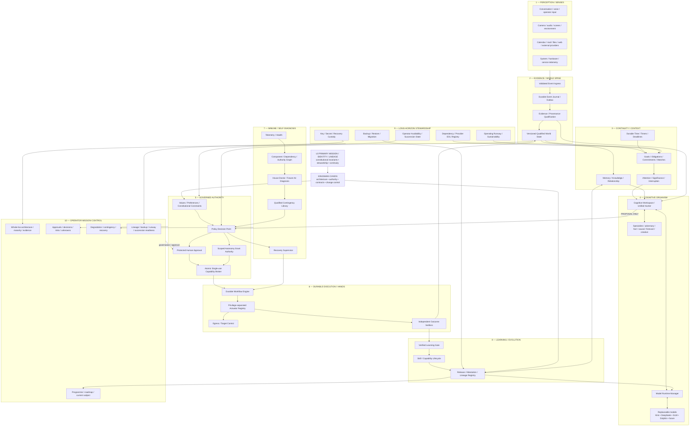

# KAI KINGSMAN — Master Architecture & Professionalisation Candidate v0.2

> **STATUS: WHOLE-SYSTEM MASTER-CANON CANDIDATE FOR DAINIUS + KAI + DEEPSEEK + ORION REVIEW — NOT FROZEN, NOT IMPLEMENTATION AUTHORITY, NOT PROGRAMME EXECUTION AUTHORITY.**
>
> This document is the consolidated destination that earlier planning promised but had not yet fully produced. It reconciles the original final-product/Unified-Hunter architecture, current repository contracts and topology, House-in-Order/assurance sequencing, the primary mission/identity/lineage correction, proactive-organism design, organic resilience, contingency/fail-safe design, long-horizon stewardship/self-sufficiency, operator visibility, Future A4 self-diagnosis and D345/D346 architecture corrections into **one reviewable master candidate**.
>
> It supersedes `KINGSMAN_CANDIDATE_ARCHITECTURE_V0_1_DEEPSEEK_REVIEW.md` as the **primary architecture review subject**. v0.1 remains historical design evidence and is not deleted.
>
> **Execution remains governed by the latest valid canonical D-numbered programme authority. ITEM 8 BEFORE A4 remains standing. `A-4 PROVENANCE` remains distinct from `FUTURE A4 SELF-DIAGNOSIS`.**

---

# 0. Executive decision

## 0.1 Why Kai exists

Kai is being built as a durable, proactive, trustworthy personal intelligence organism intended to:

- grow with Dainius rather than remain a fixed software release;
- understand, assist, challenge, protect and care for him within earned authority;
- preserve knowledge, history, relationships, values, lessons and continuity;
- notice significant change and prepare without requiring a prompt for every observation;
- maintain and improve itself within bounded, verified, operator-governed mechanisms;
- become increasingly economically self-sufficient through lawful, bounded activity;
- survive replacement of models, frameworks, providers, hardware and software organs;
- survive temporary operator unavailability;
- eventually survive beyond Dainius through explicitly designed succession/governance;
- continue appropriate stewardship for Dainius's daughter without treating inherited purpose as unlimited inherited authority.

Compact mission:

> **BUILD A KAI THAT CAN GROW WITH DAINIUS, CARE FOR HIM, PRESERVE WHAT MATTERS, BECOME INCREASINGLY SELF-SUFFICIENT, SURVIVE BEYOND HIM, AND CONTINUE THE INTENDED STEWARDSHIP FOR HIS DAUGHTER — WITHOUT LOSING TRUTH, IDENTITY, GOVERNANCE OR SAFETY.**

Kingsman Tier is the engineering/governance standard required to make that mission credible. It is not the mission itself.

## 0.2 What Kai is

> **KAI IS THE ORGANISM. MODELS, FRAMEWORKS, SERVICES, DATABASES, TOOLS AND HARDWARE ARE ORGANS OR SUBSTRATES.**

Therefore:

`KAI ≠ KIMI`
`KAI ≠ DEEPSEEK`
`KAI ≠ GLM`
`KAI ≠ DOLPHIN`
`KAI ≠ ANY SINGLE LLM`
`KAI ≠ CREWAI / OTHER AGENT FRAMEWORK`
`KAI ≠ UNIFIED HUNTER`
`KAI ≠ MEMORY`
`KAI ≠ HOUSE DOCTOR`
`KAI ≠ ONE LAPTOP`
`KAI ≠ ONE REPOSITORY SNAPSHOT`

Working identity:

`KAI = MISSION + IDENTITY/LINEAGE + MEMORY/CONTINUITY + QUALIFIED WORLD STATE/EVIDENCE + COGNITION + RELATIONSHIPS/VALUES + GOVERNANCE/AUTHORITY + CAPABILITIES + LEARNING/HISTORY`

instantiated through replaceable organs.

## 0.3 Architecture style

The recommended architecture is:

> **ONE ORGANISM + MODULAR ORGANS + EARNED PROCESS/SERVICE BOUNDARIES + DURABLE SHARED TRUTH + ISOLATED AUTHORITY + ISOLATED HANDS + INDEPENDENT VERIFICATION + PRESERVED LINEAGE.**

Reject both extremes:

1. one giant shared-fate process;
2. service-per-idea/microservice soup.

A service/process boundary must be earned by one or more of:

- trust/security isolation;
- failure containment;
- privileged OS/device access;
- model/GPU/NPU/resource isolation;
- durable workflow lifecycle;
- external-provider boundary;
- independent deployment/upgrade lifecycle;
- scaling requirement.

If none apply, prefer a typed module/library inside an appropriate organ.

---

# 1. Architectural constitution — non-negotiable invariants

1. **One Kai / one governed authority path.** Internal plurality never creates parallel sovereignty.
2. **Truth outranks fluency.** UNKNOWN/UNOBSERVED/STALE/CONFLICTING remain first-class states.
3. **Present ≠ executed ≠ enforced.** File/config existence cannot prove runtime or policy enforcement.
4. **Observation ≠ evidence ≠ fact ≠ memory.** Keep each semantic layer distinct.
5. **Model output is proposal/reasoning unless independently qualified.** Models cannot manufacture authority or trust through confidence.
6. **Membership ≠ identity ≠ authority.** Network/token membership does not establish principal identity or permission.
7. **Intelligence may propose; policy constrains; operator/delegated authority authorises; capabilities execute; independent observers verify.**
8. **No self-verification.** Actuators/executors cannot certify their own success; correlated verifiers do not count as independent.
9. **No silent authority fallback.** Authority-plane uncertainty/outage fails closed for consequential action.
10. **Organic integration without shared-fate coupling.** Failure stops at the narrowest safe boundary.
11. **A fallback that hides failure is not resilience.** Degradation must be explicit and truthful.
12. **Growth without architectural amnesia.** Replace organs without losing mission/lineage/learned history.
13. **Core invariants, evolvable organs and learned state are different change classes.**
14. **Self-sufficiency serves stewardship.** It never creates unlimited self-preservation authority or access to protected family assets.
15. **Temporary operator silence ≠ succession.** Permanent authority transfer requires separately designed evidence/legal/human controls.
16. **Operator legibility is part of governance.** A state Kai/Orion understand but Dainius cannot practically see is an incomplete control loop.
17. **Every green tick/arrow/status is a claim.** Architecture and mission-control visuals must be evidence-bound.
18. **Historical ideas are not deleted because implementation is weak.** Recover intent before disposition.
19. **Canonical programme order is separate from architecture dependency order.** A target diagram never authorises a later programme stage.
20. **No known real defect is optional merely because it is unrelated to the current local task.**

---

# 2. Developmental identity model

Kai is not a terminal software release. Engineering uses controlled baselines, but the organism is designed to continue developing.

## 2.1 Core invariants — high-authority change only

- primary mission;
- identity/lineage rules;
- truth/evidence discipline;
- operator/family stewardship purpose;
- authority principles;
- UNKNOWN/non-fabrication semantics;
- protected family-asset boundary;
- controlled-growth/change-control principles.

## 2.2 Evolvable organs

- LLMs/model runtimes;
- specialists/council mechanisms;
- sensors;
- memory backends;
- databases;
- workflow engines;
- diagnostic mechanisms;
- skills/tools;
- hardware;
- external providers;
- interfaces.

## 2.3 Learned state

- memories;
- relationship history;
- operator-confirmed preferences/values;
- knowledge;
- trust/calibration;
- skills;
- incident lessons;
- behavioural adaptation;
- standing instructions.

Learned state remains provenance-aware; fabricated/stale/corrupted history cannot silently become identity.

---

# 3. Whole-organism logical architecture

**This is logical architecture. It does not mean 10 containers.**

---

# 4. First-production physical/failure domains

Recommended first production generation uses eight physical/security domains. Multiple domains may initially reside on the same Strix Halo machine while retaining separate identities, credentials and failure contracts.

1. **Operator / Edge Domain**
   - mission-control UI;
   - conversation/voice presentation;
   - notifications;
   - protected approval interaction;
   - external ingress presentation.

2. **Kai Core Domain**
   - event/evidence/world coordination;
   - goals/attention;
   - cognitive workspace;
   - proposal generation;
   - no unrestricted actuator root credentials.

3. **Authority Domain**
   - workload identity verification;
   - deterministic policy;
   - approval records;
   - autonomy grants;
   - capability issuance/atomic consumption;
   - deliberately non-LLM.

4. **Model Compute Domain**
   - Model Runtime Manager;
   - GPU/CPU/NPU adapters;
   - model workers;
   - resource admission/eviction;
   - exact artifact/runtime qualifications.

5. **Memory / Knowledge Domain**
   - episodic/semantic/relationship/procedural memory;
   - graph/vector projections;
   - no action authority.

6. **Execution Domain**
   - durable workflows;
   - privilege-separated actuators;
   - egress broker;
   - browser/shell/file/message/device/finance separated by privilege.

7. **Assurance / Health / Recovery Domain**
   - telemetry;
   - dependency graph;
   - Doctor diagnosis;
   - contingency resolver;
   - independent verifiers;
   - narrow recovery supervisor.

8. **Durable Data / Continuity Domain**
   - PostgreSQL authoritative metadata/state;
   - encrypted content-addressed object store;
   - durable audit/lineage;
   - backup/restore targets;
   - key/recovery metadata under separate custody.

A ninth externally distinct failure domain is **off-device/offline backup/recovery custody**, even if it is not an always-running service.

---

# 5. Current repository architecture — facts to preserve

Current Compose already declares eight meaningful Docker networks:

`agent-net`, `control-net`, `data-net`, `edge-net`, `egress-net`, `execution-net`, `observability-net`, `sensor-net`.

Current/recent implementation seeds include:

- PostgreSQL / pgvector and Redis;
- Tool Gate;
- `memu-core`, introspection and graph/memory extensions;
- heartbeat/metrics/observability;
- dashboard;
- Supervisor;
- verifier + independent verifier registry concepts;
- fusion/perception/cognition services;
- agentic cognition/introspection;
- executor/actuator registry;
- model registry + Ollama runtime;
- service identity work;
- graded evidence/autonomy/release bundle work;
- House Doctor;
- backup service;
- financial awareness;
- camera/audio/wake/screen sensor services;
- workspace/skill-growth concepts.

This candidate does **not** treat the existing service count as the desired target count. Each current service is an implementation seed whose responsibility must be recovered before retain/rework/merge/rehome/supersede decisions.

---

# 6. Contract and state architecture

## 6.1 Existing contract strengths to preserve

The repository already distinguishes:

- `PerceptionEvent`;
- `Claim` / evidence/world-state objects;
- `WorldStateSnapshot`;
- `ActionProposal`;
- `ConstraintAssessment`;
- `PolicyDecision`;
- `ApprovalRecord`;
- `ActionCapability`;
- `ActionWorkflow`;
- `ActuatorReceipt`;
- `VerifiedOutcome`;
- `LearningUpdate`;
- graded evidence;
- autonomy grants;
- verifier identity/independence;
- release bundles.

That separation is load-bearing and must **not** be flattened during professionalisation.

## 6.2 Contracts v2 / Schema Registry target

Every cross-boundary contract should eventually carry:

- semantic contract name/version;
- schema digest;
- exact producer identity/revision;
- principal/purpose scope;
- classification/privacy markings;
- correlation/trace identity;
- timestamps with clear semantics;
- provenance/evidence references where relevant;
- migration/compatibility policy;
- explicit error/state taxonomy.

Schema compatibility must be a governed contract, not silent Pydantic coercion or ad-hoc JSON tolerance.

## 6.3 State ownership

Recommended authoritative ownership:

| State | Authoritative owner |
|---|---|
| events / observations | durable event spine |
| evidence metadata / provenance | Evidence Plane |
| world-state versions | World State store |
| memory source records | Memory Plane |
| goals/obligations/watches/timers | Goals/Attention organ |
| policy decisions | Authority Plane |
| approvals/autonomy grants/capability consumption | Authority Plane |
| workflow state | Durable Workflow Engine |
| action receipts | Execution/Workflow |
| verified outcomes | Verification/Evidence |
| component/dependency graph | Assurance plane derived from declarations + observation |
| contingency versions/qualification | Contingency Library |
| release/lineage/attestations | Release/Lineage Registry |
| audit checkpoints | durable audit store + independent anchor |
| operator UI state | derived view; never sole source of programme truth |

No two organs should both believe they own the same mutable authority state.

---

# 7. Perception → Evidence → World State

Canonical flow:

`SOURCE OBSERVATION`
→ `PERCEPTION EVENT`
→ `INGRESS VALIDATION / IDENTITY / BOUNDS / DEDUP / STALENESS`
→ `DURABLE JOURNAL`
→ `EVIDENCE ITEM + PROVENANCE`
→ `STRUCTURED CLAIM`
→ `QUALIFICATION / CONFLICT / FRESHNESS`
→ `VERSIONED WORLD STATE`

Preserve distinctions:

- observation ≠ evidence;
- evidence ≠ fact;
- memory ≠ current fact;
- prediction ≠ observation;
- telemetry ≠ Evidence Plane truth until qualified;
- non-detection ≠ absence;
- observer unavailable ≠ negative result;
- UNKNOWN stays UNKNOWN;
- conflict is preserved, not averaged away.

## 7.1 Durable storage candidate

First production candidate:

- **PostgreSQL** for authoritative transactional metadata/state;
- transactional outbox/event table to avoid state/event dual-write ambiguity;
- encrypted content-addressed object storage for large raw evidence;
- vector/graph/search stores as rebuildable projections where practical;
- Redis as cache/transient coordination, not sole audit/authority source.

NATS/JetStream/Kafka are not required on day one. Add a broker when multi-process/node fan-out genuinely earns another operational dependency.

---

# 8. Memory / continuity / relationship architecture

Memory classes:

1. constitutional/identity memory;
2. operator-confirmed values/preferences;
3. relationship memory;
4. episodic memory;
5. semantic memory;
6. procedural/skill memory;
7. working context;
8. derived vector/graph indexes.

Standing rule:

> **MEMORY IS CONTEXT/EVIDENCE, NOT AUTOMATIC CURRENT FACT.**

`memu-core`, graph work, Obsidian/vault concepts and memory compression are valuable input. Phase 2 must split historical orchestration/authority responsibilities out of the memory organ rather than discard memory capability.

Irreplaceable history should not exist only in an embedding/vector index.

---

# 9. Proactive organism — Goals / Obligations / Watches / Time / Attention

This is a first-class organ, not a cron loop.

Kai needs durable representations of:

- operator goals;
- commitments/promises;
- deadlines;
- recurring obligations;
- maintenance obligations;
- project milestones;
- health/continuity watches;
- financial/runway constraints;
- family/stewardship obligations;
- unresolved risks;
- thresholds/conditions;
- operator attention preferences.

Canonical proactive flow:

`WHAT CHANGED?`
→ `WHAT IS TRUE NOW?`
→ `WHAT MATTERS / SHOULD BE TRUE?`
→ `WHAT HAPPENS IF NOTHING CHANGES?`
→ `IGNORE / REMEMBER / WATCH / PREPARE / PROPOSE / NOTIFY / ACT WITHIN MANDATE`
→ `VERIFY USEFULNESS / OUTCOME`
→ `LEARN`

Attention/interruption decisions should account for:

- importance;
- urgency;
- cost of delay;
- evidence quality;
- novelty;
- worsening trajectory;
- reversibility;
- operator state/context;
- interruption cost;
- existing standing authority.

**Split current Supervisor responsibilities:** system-health recovery belongs to the resilience supervisor; personal/project proactive significance belongs to Goals/Attention.

---

# 10. Cognitive architecture — Unified Hunter as organ, not Kai

## 10.1 Cognitive Workspace / Unified Hunter responsibilities

- build a `TaskFrame`/deliberation case;
- retrieve qualified world state and relevant memory;
- select cognitive roles;
- solicit specialists;
- preserve disagreement;
- run adversarial/fact/causal/forecast review when warranted;
- compare alternatives including no-action;
- surface evidence gaps/assumptions;
- synthesize proposal/explanation;
- hand **proposal only** to Authority.

The current proposal workspace rule remains fundamental: it cannot mint capabilities, execute tools or turn winning consensus into permission.

## 10.2 Cognitive roles, not model brands

Candidate roles:

- general planner/reasoner;
- coding specialist;
- quantitative/math specialist;
- adversary/red team;
- evidence/fact critic;
- causal/forecast specialist;
- creative/generative specialist;
- summariser/compressor;
- low-power sentinel classifier.

Kimi, DeepSeek, GLM, Dolphin and future models are qualified candidates for roles.

## 10.3 Deliberation record

Store exact:

- task frame;
- world-state snapshot ID;
- evidence refs;
- memory refs;
- model artifact/runtime identity;
- prompt/template revision;
- outputs;
- disagreement;
- synthesis;
- assumptions;
- unresolved questions;
- budgets/termination reason.

Model-generated reasoning remains reasoning output, not qualifying evidence by default.

---

# 11. Model Runtime Manager / hardware abstraction

The existing hard-coded `model_registry.py` is a useful prototype but not the final runtime manager.

Required Model Runtime Manager responsibilities:

- runtime adapters (`llama.cpp`, ROCm-compatible runtimes, Ollama during migration, future runtimes);
- exact model artifact digest/source/license;
- tokenizer identity/native token counting;
- quantisation;
- context/output limits measured on exact runtime;
- role qualification/benchmark evidence;
- latency/throughput/error calibration;
- CPU/GPU/NPU residency;
- unified-memory/KV-cache budgeting;
- admission/eviction/preemption;
- power/thermal profile;
- health/readiness;
- fallback/degraded-role policy;
- probation/promotion/retirement;
- privacy/local-vs-external policy.

Routing inputs:

`ROLE + TASK + REQUIRED CAPABILITIES + EVIDENCE/PRIVACY CLASS + RISK + LATENCY + RESOURCE STATE + QUALIFICATION + COST`

—not keyword voting.

## 11.1 Current body generation

ASUS ROG Flow Z13 / Ryzen AI Max+ 395 / Strix Halo remains the intended first serious local body unless later evidence changes it.

Architectural role:

- GPU/iGPU: principal local LLM compute when qualified;
- CPU: databases, policy, orchestration, lightweight/fallback inference;
- NPU: low-power sentinel/classifier/perception only after exact runtime/model qualification;
- future compute nodes: attach through the same runtime/capability contracts.

The hardware is a body generation, not Kai's identity.

---

# 12. Governance / identity / authority

## 12.1 Workload identity

Current per-service Ed25519 direction is a strong near-term basis because the receiver derives the caller principal from the verifying key rather than trusting caller-provided identity.

Production requirements:

- unique workload keys;
- rotation/overlap/revocation;
- destination/method/path/body/timestamp/nonce binding;
- persistent replay defence where required;
- trust-map/config identity;
- explicit expiry/health visibility;
- interface allowing later SPIFFE/mTLS-style evolution if multi-node complexity earns it.

## 12.2 Policy / approval / autonomy / capability are different

Keep separate:

- constitutional constraints/values;
- deterministic policy;
- human approval;
- scoped autonomy grant;
- single-action capability;
- succession authority.

A model cannot grant any of them.

## 12.3 Human approval

High-consequence approval should eventually use a protected local approval surface with step-up authentication and display the exact proposal/action digest.

Normal conversational assent is not automatically a cryptographic high-consequence approval record.

## 12.4 Durable authority state

Current in-memory approval/capability/autonomy stores are prototypes. Production authority requires persistent atomic state so:

- restart cannot resurrect/forget authority incorrectly;
- concurrent workers cannot consume a single-use capability twice;
- revocation survives restart;
- audit can bind exact authority subject.

Authority-plane outage => consequential actuation fails closed; cognition can remain available.

---

# 13. Durable workflow / execution / final-hand enforcement

Candidate workflow states:

`PROPOSED`
`POLICY_BLOCKED`
`WAITING_APPROVAL`
`APPROVED`
`CAPABILITY_ISSUED`
`DISPATCHED`
`RUNNING`
`PAUSED`
`SUCCEEDED_UNVERIFIED`
`FAILED`
`OUTCOME_UNKNOWN`
`CANCEL_REQUESTED`
`COMPENSATING`
`COMPENSATED`
`VERIFIED_SUCCESS`
`VERIFIED_FAILURE`
`QUARANTINED`
`CLOSED`

Required semantics:

- durable history;
- idempotency keys;
- worker fencing/lease;
- bounded retry;
- reconcile-before-retry for non-idempotent action;
- cancellation;
- compensation only where semantically valid;
- unknown-outcome handling;
- exact capability binding;
- independent post-action verification.

## 13.1 Actuator design

Actuators are narrow hands, not mini-agents:

- browser;
- shell/code;
- file mutation;
- notifications;
- external messaging/calendar;
- devices/smart-home;
- backup/recovery/admin;
- deployment;
- future financial execution.

Each validates/consumes exact authority at the **final hand**.

## 13.2 Egress / Target Control

Network-capable actuators need capability-bound constraints for:

- allowed destinations/domains;
- protocol/method;
- data classification;
- upload/download limits;
- time budget;
- network isolation.

Broad internet access must not become implicit authority.

## 13.3 Verification

`ActuatorReceipt` proves the actuator reports execution; it does not prove the external world changed correctly.

Required chain:

`ACTION → RECEIPT → INDEPENDENT TARGET/STATE OBSERVATION → VERIFIED OUTCOME`.

---

# 14. Self-diagnosis / resilience / contingency architecture

Canonical loop:

`SEE`
→ `UNDERSTAND STRUCTURE`
→ `DIAGNOSE`
→ `EXPLAIN`
→ `MATCH QUALIFIED CONTINGENCY`
→ `POLICY / AUTHORITY`
→ `CONTAIN / DEGRADE / RECOVER`
→ `INDEPENDENT VERIFY`
→ `LEARN`

Responsibilities:

### Telemetry / Health

- traces, metrics, logs, deep health, task liveness, resource state;
- missing observer is visible as degraded/unknown.

### Structure / Dependency / Authority Graph

Machine-readable graph:

`component → contract → runtime instance → version → reads/writes → state owners → dependencies/dependents → criticality → authority → health source → known failure modes → contingencies → recent changes`.

Generate from declarations/deployment/contracts and later House/Future-A4 discovery; avoid another hand-maintained inventory.

### House Doctor / Future A4

Doctor diagnoses. It does not possess unrestricted repair authority.

Future A4 evolves House/Census concepts into structural understanding, drift detection, applicability, evidence-bound causality and repair options.

### Contingency Library

Provides structured, versioned, evidence-qualified response knowledge:

- failure class;
- exact applicability;
- blast radius;
- containment;
- degraded mode;
- retry budget;
- recovery options;
- approval requirement;
- rollback;
- verification;
- contraindications;
- qualification status.

### Supervisor

Executes only authorised containment/recovery through the normal capability/workflow chain.

No private restart/rebuild authority bypass.

## 14.1 First-class health states

`HEALTHY`
`DEGRADED`
`RECOVERING`
`UNAVAILABLE`
`QUARANTINED`
`UNKNOWN / UNMEASURED`.

## 14.2 Required blast-radius examples

- one specialist model down → council degraded, missing viewpoint explicit;
- memory down → reduced-context mode, no invented continuity;
- optional sensor/provider down → dependent claims unavailable/UNKNOWN; unrelated cognition continues;
- House Doctor down → diagnosis capability degraded, not “healthy”;
- optional skill crashes → quarantine skill;
- authority down → consequential action fails closed;
- verifier down → outcome remains unverified/UNKNOWN;
- actuator returns unknown outcome → reconcile before retry;
- authoritative data store down → only explicitly designed degraded/read-only modes continue.

---

# 15. Learning / growth / skills / release engineering

Growth lifecycle:

`NEED / IDEA`
→ `CANDIDATE DESIGN`
→ `SANDBOX`
→ `STATIC + DYNAMIC TEST`
→ `ADVERSARIAL REVIEW`
→ `EVIDENCE`
→ `RELEASE AUTHORITY`
→ `SIGNED / ATTESTED RELEASE BUNDLE`
→ `PROBATION / CANARY`
→ `VERIFIED PROMOTION`
→ `MONITOR`
→ `ROLLBACK / RETIRE`.

Dream/Evolver/skill-hunter may create candidates. They do not silently install or grant themselves authority.

Release identity should eventually bind:

- source revision;
- component/version map;
- schemas/contracts;
- dependency lock/SBOM;
- build provenance;
- tests/qualification evidence;
- migrations;
- rollback;
- policy compatibility;
- permissions;
- model artifacts/roles;
- lineage/invariant digest;
- operator approval where required.

Item 8/A-4/assurance lessons on exact subject, artifact identity and one-shot authority should inform this later platform design without rewriting frozen experiments.

---

# 16. Long-horizon continuity / stewardship

## 16.1 Three operator horizons

### A — Dainius present

Normal operator sovereignty; autonomy remains scoped/revocable/evidence-earned.

### B — temporarily unavailable

Kai may preserve essential services and execute only pre-authorised continuity actions. It preserves optionality and waits for restored authority where consequential.

### C — permanent succession

Separate high-consequence state requiring future legal/human/technical evidence. Inactivity alone is insufficient.

## 16.2 Backup / restore / migration

Production continuity requires:

- authoritative-store inventory;
- encrypted backups;
- off-device/offline failure-domain copy;
- signed/hash-bound backup manifest;
- schema/release/model/contract version mapping;
- isolated restore drills;
- RPO/RTO by data class;
- key recovery lifecycle;
- post-restore lineage and policy qualification;
- hardware migration rehearsal;
- safe archive/read-only preservation mode.

“Containers boot” is not sufficient restore success. Kai must prove intended lineage/authority/state survived.

## 16.3 Dependency survivability

Every critical provider/model/package/account/credential records:

- owner;
- exact version/source;
- expiry/EOL;
- cost;
- replacement candidates;
- local/offline option;
- migration adapter;
- archive/reproducibility status;
- degraded mode;
- contingency.

## 16.4 Financial sustainability

Separate:

### Financial Awareness

Read/analysis: costs, runway, subscriptions, revenue, forecasts, tax/accounting inputs.

### Sustainability Planner

Produces proposals: cost reduction, infrastructure funding, bounded paid services, reserve targets.

### Financial Execution

Future high-risk actuator requiring separate mandate, limits, audit and reconciliation.

Trust domains:

- `KAI_OPERATING_CAPITAL`;
- `EXPERIMENTAL_CAPITAL` if explicitly created;
- `PROTECTED_OPERATOR/FAMILY_ASSETS`.

Protected family assets are **not** Kai's survival wallet.

## 16.5 Succession / successor relationship

Future system must preserve Dainius as original operator/builder in history while representing successor identity/authority truthfully. A successor is not silently treated as Dainius.

Succession must define:

- evidence/confirmation required;
- human/legal roles;
- transferable/non-transferable permissions;
- data that transfers vs remains sealed/deleted;
- key custody;
- financial mandates that expire/continue;
- successor reset/revocation rights;
- coercion/takeover defences.

---

# 17. Operator Mission Control — mandatory governance surface

Desired experience:

> **SEE WHOLE KAI → SEE WHERE WE ARE → SEE WHAT IS PROVEN → SEE WHAT IS DEGRADED/UNKNOWN → SEE WHAT IS DONE → SEE WHAT IS OUTSTANDING → SEE WHAT NEEDS MY DECISION → DRILL DOWN.**

Required views:

## View 1 — Whole organism

- rooted mission/identity;
- logical organs;
- current implementation mapping;
- S0–S5 maturity;
- LIVE/PRESENT-NOT-CUT-OVER/STUB/PLANNED/UNKNOWN;
- health/degradation;
- evidence subject/currentness.

## View 2 — Programme roadmap

- current exact House/048/Item8/A-4/Phase2 position;
- authorised next action;
- blocked/unauthorised work;
- closure evidence;
- current branch/commit/tree.

## View 3 — Attention / decisions

- active watches;
- prepared proposals;
- approvals required;
- standing autonomy grants and expiry;
- items intentionally deferred/suppressed.

## View 4 — Resilience

- active incidents;
- expected blast radius;
- contingency/playbook;
- containment/recovery;
- retry budget;
- verification;
- blind observers.

## View 5 — Continuity

- backup age;
- latest restore drill;
- release/lineage identity;
- credentials/certificate expiry;
- provider EOL risks;
- hardware health;
- operating runway;
- succession readiness;
- unresolved long-horizon risks.

Architecture drawings are deterministic engineering models, not generative-image posters. Authoritative visuals must map CURRENT boxes/arrows to exact repo subjects and TARGET elements to explicit design obligations.

---

# 18. Current → target disposition map

**Candidate disposition only. No deletion/refactor is authorised by this table.**

| Current piece/family | Current value | Candidate target/disposition |
|---|---|---|
| `common/contracts/*` | strong typed boundary seed | REWORK → Contracts v2 + schema registry |
| perception ingress/adapters | useful validation/dedup/staleness/bounds | RETAIN semantics + durable identity/storage |
| file EventJournal | useful crash/replay prototype | RETAIN interface/semantics; REWORK backend |
| world state | useful snapshot/conflict/freshness semantics | RETAIN semantics; PERSIST/durable reducers |
| `memu-core` | valuable memory + historic orchestration | REHOME memory; SPLIT non-memory ownership |
| `memu-graph` / vector/graph | valuable retrieval/context | REHOME as derived memory/knowledge projections |
| proposal workspace | strong proposal-only design | RETAIN/MERGE into Cognitive Workspace / Hunter |
| agentic / Hunter / council concepts | key cognitive machinery | MERGE/REWORK into one cognitive organ |
| `model_registry.py` | useful model-card sketch, weak runtime routing | SUPERSEDE implementation → Model Runtime Manager |
| Ollama/model runtime | useful current runtime | RETAIN during migration behind runtime abstraction |
| policy bridge | strong policy/capability concepts | RETAIN + isolate + persist + harden |
| approval gate | good digest/replay/expiry concepts | RETAIN + protected UI + durable state |
| autonomy authority | good scoped/expiring/evidence-earned model | RETAIN + durable state + integrate Authority |
| service identity | strong receiver-derived Ed25519 direction | RETAIN + qualify rollout + provider abstraction |
| Tool Gate | material current control point | QUALIFY then split/rehome responsibilities into Authority/Execution as evidence supports |
| actuator registry / executor | good capability-gated/migration concepts | RETAIN + durable workflow + privilege split + final-hand checks |
| verifier / verifier registry | strong independent verification direction | RETAIN + target-specific verifiers |
| Supervisor | useful fleet health/recovery, mixed with proactive nudges | SPLIT health/recovery from Goals/Attention |
| `common/resilience.py` | useful retry/breaker/watchdog/healing primitives | RETAIN primitives + governed contingency layer |
| House Doctor | valuable diagnosis concept, v0.1 rules | REWORK into structure/evidence-aware Doctor |
| heartbeat/metrics/introspection | useful observation seeds | CONSOLIDATE into Telemetry/Health + Structure Graph |
| backup-service | real backups/restores, incomplete lineage | REWORK/EXTEND into Continuity plane |
| financial-awareness | valuable read/analysis capability | RETAIN read plane; separate financial execution |
| skill-hunter / Dream / Evolver | valuable growth ideas | REHOME as candidate-generation lifecycle, proposal-only |
| dashboard | useful UI seed, stale/fragmented truth risk | REDESIGN → Mission Control |
| sensors/services | valuable perception organs | RETAIN via standard Perception contracts; isolate failures |
| Redis audit/hash chain | useful prototype | DEMOTE; durable audit + signed independent checkpoints |
| PostgreSQL | existing core state store | PROMOTE as first-production transactional backbone candidate |
| historical services/docs | carry original intent/lessons | QUALIFY individually; no bulk deletion |

---

# 19. Missing / under-specified system primitives

## P0 — architecture-critical before first Kingsman production claim

1. Goal / Obligation / Commitment / Watch registry.
2. Durable timers and time semantics.
3. Attention / interruption engine.
4. Durable atomic authority store/capability consumption.
5. Model Runtime Manager.
6. Component / Dependency / Authority Graph.
7. Durable workflow engine.
8. Unified telemetry/tracing plane.
9. Lineage / restore identity mechanism.
10. Egress / target-control boundary.
11. Durable audit checkpoint/anchoring.
12. Schema / contract registry + compatibility policy.
13. Protected operator approval surface.
14. Cross-store data classification / retention / key lifecycle.
15. Machine-readable Component/Capability/Maturity registry.

## P1 — required for long-horizon maturity

16. Dependency/provider EOL + migration registry.
17. Automated isolated restore drills.
18. Financial Sustainability / Runway controls.
19. Succession state machine + external legal/trust binding.
20. Product-level release/attestation registry.
21. Hardware health/replacement readiness.
22. Safe preservation/read-only mode.
23. Operator mission-control data model + drift enforcement.

## P2 — optional until justified by evidence/scale

- multi-node HA control core;
- NATS/JetStream/Kafka backbone;
- full SPIRE deployment;
- Temporal deployment;
- automatic financial execution beyond narrow mandates;
- automatic succession;
- distributed model cluster/swarm hardware;
- always-on NPU role before exact measurement.

These are options, not architecture prerequisites.

---

# 20. Standards/reference patterns — use selectively

The design should reuse mature semantics where useful without becoming third-party framework soup.

- **CloudEvents:** event-envelope vocabulary.
- **W3C PROV:** Entity/Activity/Agent provenance concepts.
- **OpenTelemetry:** telemetry/context model.
- **SPIFFE:** workload-identity reference model for future evolution.
- **in-toto/SLSA:** subject-digest-bound provenance/attestation patterns.
- **OPA:** candidate deterministic policy backend behind a stable Policy Decision Port.
- **Transactional Outbox:** first-production state/event consistency pattern.
- **Temporal:** later durable-workflow implementation candidate if complexity earns it.
- **OpenSSF/GitHub rulesets/SBOM controls:** professional repository/supply-chain assurance after CI truth is restored.

Adoption of a standard/product is an implementation decision that must show what current custom code it replaces and what operational cost it adds.

---

# 21. Professionalisation programme — destination-to-repo migration

This section defines **dependency order after the master canon is frozen**. It does not override current D-numbered programme order.

## W0 — Master-canon review/freeze

- DeepSeek adversarial review of v0.2;
- Kai repo-fact reconciliation;
- Orion complete current→target map;
- discriminating spikes for disputed choices;
- Dainius architecture/UX/authority review;
- exact-byte master canon + diagrams + input manifest freeze;
- change-control mechanism.

**Exit:** one accepted destination and exact subject/hash.

## W1 — Truth/control foundations

- Contracts v2/schema registry;
- workload identity rollout;
- durable authority state;
- OpenTelemetry baseline;
- Component/Capability/Maturity Registry;
- Dependency/Authority Graph v1;
- mission-control shell reading real state;
- branch/release governance only after CI checks are truthful.

**Exit:** every cross-boundary call has identity/schema/trace/state owner; operator sees exact subject.

## W2 — Perception / Evidence / World State

- durable event/outbox backend;
- Evidence Plane records;
- encrypted object store;
- structured claim schema;
- deterministic reducer/versioning;
- replay/calibration;
- UNKNOWN/STALE/CONFLICT/SOURCE_UNAVAILABLE semantics.

**Exit:** an exact world-state snapshot can be reproduced from exact events/evidence.

## W3 — Memory / Goals / Time / Proactivity

- memory responsibility cleanup;
- Goal/Obligation/Watch registry;
- durable timers;
- Attention/Interruption policy;
- migrate current nudges/proactive logic;
- proactive evaluation tests.

**Exit:** Kai demonstrates useful proactive awareness without spam or authority leakage.

## W4 — Cognition / Unified Hunter / Model Runtime

- consolidate workspace/Hunter/council roles;
- role-based specialist selection;
- model artifact/runtime registry;
- exact tokenizer/context measurement;
- resource admission/eviction;
- GPU/CPU profiles;
- NPU spike;
- deliberation record/budgets/stop criteria.

**Exit:** replacing a model does not change Kai identity/policy/tool authority.

## W5 — Authority / Workflow / Hands / Verification

- durable policy/approval/autonomy state;
- atomic single-use capability broker;
- protected approval UI;
- durable workflow/timer engine;
- egress broker;
- privilege-separated actuators;
- final-hand enforcement;
- independent target-specific verifiers.

**Exit:** no consequential action exists outside identity → policy → authority → capability → workflow → actuator → independent verification.

## W6 — Immune system / Contingencies / Future-A4 preparation

- unified telemetry;
- generated dependency graph;
- House Doctor rework;
- contingency schema/library;
- narrow Supervisor recovery;
- fault injection/blast-radius qualification;
- incorporate proven House/A4 diagnostic semantics when programme-authorised.

**Exit:** every material organ has tested intended blast radius and truthful degraded mode.

## W7 — Continuity / Lineage / Migration

- signed backup manifests;
- off-device/offline copies;
- automated isolated restore drills;
- Lineage Manifest/Registry;
- key lifecycle/recovery;
- dependency EOL watches;
- hardware migration rehearsal;
- safe preservation mode.

**Exit:** replacement hardware can restore and prove intended Kai lineage/authority/data integrity.

## W8 — Sustainability / Succession scaffolding

- operating cost/runway model;
- survival-capital separation;
- renewal/payment watches;
- proposal-only sustainability planner;
- succession state-machine design;
- legal/trust dependency map;
- successor data/access model.

**Exit:** long-horizon risks are architecturally controlled without premature financial/succession autonomy.

## W9 — Evolution / Production qualification / Repository professionalisation

- skill lifecycle;
- release attestations/SBOM;
- probation/canary/rollback;
- docs/architecture generated from qualified truth;
- mission-control final views;
- chaos/fault drills;
- long-duration soak;
- branch/merge/release hygiene;
- stale/superseded docs archived with lineage;
- final README truth reconstruction.

**Exit:** first S5 Kingsman-compliant production baseline.

---

# 22. Phase-2 per-organ qualification template

Every retained organ/component family must answer:

1. What original problem/intent did it address?
2. Which primary-mission responsibility does it serve?
3. What exact current implementation exists?
4. Is it LIVE, PRESENT-NOT-CUT-OVER, STUB, HISTORICAL or UNKNOWN?
5. What exact evidence supports that status?
6. What is the final canonical organ/responsibility?
7. What stable contract does it expose?
8. What state does it own?
9. What authority does it have — and explicitly not have?
10. What are its dependencies/dependents?
11. Does it duplicate truth/state/authority?
12. Can it be replaced independently?
13. What continuity/learned state survives replacement?
14. What happens if it fails now?
15. What is the intended blast radius?
16. What truthful degraded mode exists?
17. What retry/containment/recovery/rollback exists?
18. How is recovery independently verified?
19. What provider/hardware/credential dependency can kill it long-term?
20. What proactive responsibility does it have, if any?
21. How is it represented in mission control?
22. What known-positive/negative/boundary/mutation tests qualify it?
23. What migration disables the old authority path?
24. What documentation/evidence must change in the same commit/release?

Allowed dispositions:

`RETAIN / REWORK / MERGE / SPLIT / RENAME / REHOME / SUPERSEDE / ARCHIVE-HISTORICAL / DELETE / UNKNOWN-MORE-EVIDENCE`.

Deletion is never default.

---

# 23. Maturity model

`S0 — SKETCH`
`S1 — PROTOTYPE`
`S2 — WORKING`
`S3 — QUALIFIED`
`S4 — PRODUCTION-GRADE`
`S5 — KINGSMAN-COMPLIANT`

Promotion is evidence-earned.

An organ cannot reach S5 because happy-path tests pass. Where material, S5 also requires:

- mission fit;
- contract clarity;
- authority boundary;
- exact evidence/currentness;
- failure/degraded behaviour;
- replaceability/migration;
- continuity/lineage preservation;
- operator legibility;
- adversarial/fault qualification;
- docs/architecture synchronization.

---

# 24. Current programme order — do not confuse with W0–W9

Architecture work-package dependency order does **not** change the governed programme.

Standing programme sequence remains, subject to later canonical D-numbered decisions:

1. House-in-Order Phase 1 H0–H6 according to its authorised sequence;
2. return to KAI-GATE-048 / Item 8 under existing frozen authority rules;
3. **ITEM 8 BEFORE A4**;
4. `A-4 PROVENANCE` repair/review/freeze/hash;
5. assurance integration mapping;
6. professionalisation / CI Truth Restoration obligations;
7. Evidence Plane / Kingsman implementation/professionalisation toward the accepted canon.

`FUTURE A4 SELF-DIAGNOSIS` is a later runtime-design evolution and must not be confused with `A-4 PROVENANCE`.

This candidate authorises none of those execution steps.

---

# 25. Master-canon input/zero-loss rule

A separate manifest accompanies this candidate:

`KINGSMAN_MASTER_CANON_INPUT_MANIFEST_V0_2.md`

Every significant source/concept is classified as:

- `INTEGRATED`;
- `INTEGRATED WITH CORRECTION`;
- `RETAINED HISTORICAL INPUT`;
- `FROZEN PROGRAMME INPUT`;
- `OPEN — NEEDS DIRECT RECONCILIATION`;
- `SUPERSEDED AS PRIMARY REVIEW SUBJECT`;
- `REJECTED WITH REASON`.

Standing rule:

> **There is no disposition called forgotten.**

---

# 26. Open architecture decisions / discriminating spikes before freeze

These should not be settled by taste alone:

1. Postgres-backed workflow engine vs Temporal — spike only if durability complexity warrants.
2. Current Ed25519 workload identity vs mTLS/SPIFFE evolution — measure deployment/rotation/operability.
3. Custom policy vs OPA backend — compare semantics, auditability, operational cost.
4. Postgres event/outbox vs dedicated broker — test fan-out/latency/replay/load requirements.
5. Structured Claim schema depth — avoid both free-text weakness and semantic-web overengineering.
6. `kai-core` process boundary — decide which modules require extraction by fault/trust/resource evidence.
7. Memory source-of-truth vs graph/vector projections — prove rebuild/migration semantics.
8. Strix Halo model residency/admission — exact model/runtime measurements, not paper specs.
9. XDNA2 NPU sentinel viability — exact runtime/model/power/latency test.
10. Human approval mechanism — usability + strong identity + exact action binding.
11. Audit privacy/erasure vs append-only lineage — design selective disclosure/cryptographic erasure semantics.
12. Backup/restore Lineage Manifest — define minimum proof that restored system is intended Kai.
13. Contingency composition — how to resolve conflicting playbooks without creating second orchestrator.
14. Safe degraded operation when PostgreSQL/authority/memory each fail.
15. Successor key/authority custody — deliberately deferred until legal/technical design can be reconciled.

---

# 27. Primary risks to attack

1. `kai-core` becomes a new monolith.
2. PostgreSQL becomes unintended catastrophic shared fate.
3. Evidence Plane becomes a second authority.
4. Doctor becomes a self-approving repair agent.
5. Proactivity becomes spam or hidden autonomy.
6. Model council becomes expensive/non-terminating.
7. legacy paths survive migration and create dual authority.
8. restore succeeds technically while identity/authority lineage is wrong.
9. shared recovery library becomes uncontrolled orchestration authority.
10. self-sufficiency becomes self-preservation at beneficiary expense.
11. operator dashboard becomes another stale truth source.
12. standards/framework adoption creates enterprise-infrastructure soup.
13. one trusted root key/person becomes a catastrophic lifetime dependency.
14. privacy/erasure requirements collide with immutable evidence/audit.
15. diagrams simplify away security/authority distinctions again.

---

# 28. Professional engineering drawing set

The technical architecture is represented by deterministic source, not generative imagery.

Current companion:

`KINGSMAN_ENGINEERING_ARCHITECTURE_DRAWING_SET_V0_1.md`

Before final freeze it must be revised to v0.2 and contain at minimum:

A. current deployment/network topology;
B. target physical trust/failure topology;
C. exact authority/action sequence;
D. evidence/world-state/memory flow;
E. identity/trust boundary;
F. resilience/diagnosis/contingency flow;
G. current→target disposition;
H. operator mission-control architecture;
I. long-horizon continuity/lineage/succession view;
J. programme dependency/order view.

Every CURRENT element must map to an exact repo subject; every TARGET element to a design requirement.

---

# 29. DeepSeek / Orion / Kai / Dainius review process

## DeepSeek

Adversarial architecture reviewer. No repo authority.

Must identify:

- missing organs;
- hidden parallel authority;
- bad state ownership;
- shared-fate dependencies;
- unnecessary services;
- insufficient failure modes;
- overengineering;
- simplify-by-30% design;
- required spikes/tests.

## Kai

Verify every repo-dependent premise, reconcile review against history/evidence, preserve programme/frozen-state constraints.

## Orion

After review, map every actual current component/service/contract/state owner to the reconciled target and identify migration/tests/dual-authority risks.

## Dainius

Final authority for mission, UX, values, autonomy, succession direction, major architectural choices and canon freeze.

Different minds; one evidence standard.

---

# 30. Freeze criteria for `KINGSMAN_MASTER_CANON_v1`

Do **not** freeze until:

1. primary mission/identity/lineage are explicit;
2. current-vs-target architecture is mapped;
3. every major organ has purpose, contract, state owner and authority;
4. major service/process boundaries are justified;
5. data/evidence/world/memory semantics are explicit;
6. exact proposal→authority→capability→actuator→verification chain is explicit;
7. proactivity/attention/time architecture is explicit;
8. Model Runtime Manager/hardware abstraction is credible;
9. failure domains/degraded modes are defined;
10. self-diagnosis/Doctor/Supervisor/contingency responsibilities are non-overlapping;
11. learning/skill/release lifecycle cannot self-authorise;
12. backup/restore/lineage requirements are explicit;
13. long-horizon self-sufficiency/succession boundaries are explicit;
14. operator mission-control requirements are explicit;
15. P0/P1/P2 gaps are accepted/prioritised;
16. DeepSeek review is reconciled;
17. Orion feasibility/current→target map is complete;
18. material disagreements have a decision or discriminating test;
19. Dainius approves the architecture;
20. exact canon + diagrams + input manifest are hashed/frozen;
21. change-control/deprecation rules are defined;
22. no open source/concept in the input manifest is silently dropped.

---

# 31. Plain-language conclusion

Kai is not being redesigned from scratch.

Years of work already produced the brain regions, senses, memory, hands, immune mechanisms, safety reflexes and many of the contracts. The problem is that they grew in different generations and some sketches became services before the whole organism was mature enough to define their final home.

This candidate's job is to make the organism explicit:

> **ONE KAI. ONE QUALIFIED WORLD MODEL. ONE GOVERNED AUTHORITY PATH. MANY REPLACEABLE ORGANS. PROACTIVE AWARENESS. BOUNDED FAILURE. VERIFIED LEARNING. VISIBLE OPERATOR CONTROL. PRESERVED LINEAGE. LONG-HORIZON STEWARDSHIP. DESIGNED TO GROW FOR DECADES.**

The next step is not implementation. It is adversarial review, repo mapping and refinement into v0.3/final `KINGSMAN_MASTER_CANON_v1` before Phase 2 is allowed to professionalise toward it.
