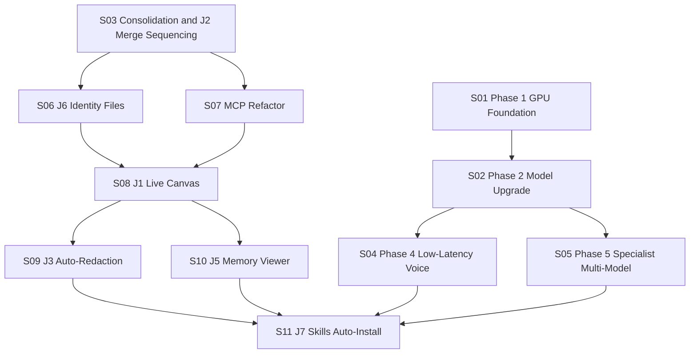

# Kai Locked Delivery Sequence

This roadmap is **locked-order**. A step can start only when its dependencies and unlock condition are satisfied.

## Sequence table

| ID | Name | Depends on | Unlock condition | Status |
|---|---|---|---|---|
| S01 | Phase 1 — GPU foundation procurement and bring-up | None | Hardware purchased, provisioned, and validated with Docker + Ollama | **BLOCKED (GPU)** |
| S02 | Phase 2 — Model-tier upgrade (7B+ baseline) | S01 | 7B model running with acceptable latency and memory headroom | **BLOCKED (GPU)** |
| S03 | Consolidation + J2 merge sequencing | None | Consolidation PR merged, PM source of truth installed | **IN-FLIGHT** |
| S04 | Phase 4 — Proactive low-latency voice (J4) | S02 | Multimodal low-latency voice path meets response SLA | **BLOCKED (GPU)** |
| S05 | Phase 5 — Specialist multi-model split | S02 | Separate specialist endpoints configured and validated | **BLOCKED (GPU)** |
| S06 | J6 — SOUL.md + AGENTS.md identity layer | S03 | Identity docs present, wired into session bootstrap and PM flow | **QUEUED** |
| S07 | MCP refactor (independent from J6) | S03 | MCP surface cleaned and documented with migration notes | **QUEUED** |
| S08 | J1 — Live Canvas visualization | S06, S07 | Dashboard graph/canvas view live with current state overlays | **QUEUED** |
| S09 | J3 — Auto-redaction PII | S08 | Redaction path tested for text + OCR extraction scenarios | **QUEUED** |
| S10 | J5 — Memory Viewer GUI | S08 | Memory diary view available and linked in operator dashboard | **QUEUED** |
| S11 | J7 — Skills auto-install hub and closeout | S04, S05, S09, S10 | Skills install flow hardened; PM sequence enters steady-state ops | **QUEUED** |

## Jewel-to-phase mapping

| Jewel | Mapped sequence step(s) |
|---|---|
| J1 Live Canvas Visualization | S08 |
| J2 Wake-word + Intent Judge | S03 (integration/merge sequencing anchor) |
| J3 Auto-Redaction PII | S09 |
| J4 Proactive Low-Latency Voice | S04 |
| J5 Memory Viewer GUI | S10 |
| J6 SOUL.md + AGENTS.md | S06 |
| J7 Skills Auto-Install Hub | S11 |
