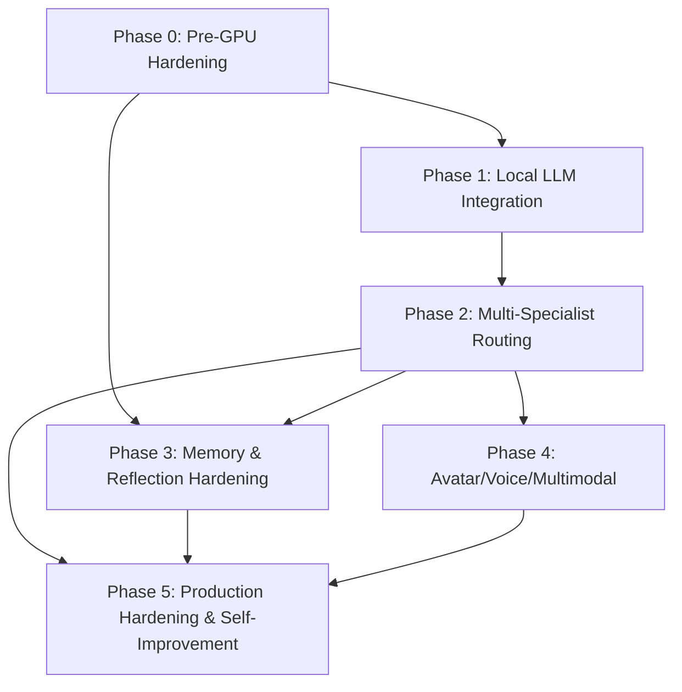

# Sovereign AI Delivery Sequence (5-Phase Model)

This sequence follows the canonical roadmap in [STRATEGIC_PLAN.md](STRATEGIC_PLAN.md).

## Phase table

| ID | Name | Status | Depends on | Unlock condition |
|---|---|---|---|---|
| Phase 0 | Pre-GPU Hardening | **COMPLETE** | None | All Phase 0 + Phase 0.5 CPU-safe items shipped (PRs #77–#85, D37–D59). Awaiting GPU hardware for Phase 1. |
| Phase 1 | Local LLM Integration | **BLOCKED (GPU)** | Phase 0 | RTX 5080 procured/provisioned and local model runtime validated on target hardware |
| Phase 2 | Multi-Specialist Routing | **BLOCKED (GPU)** | Phase 1 | Local multi-model routing performance validated on GPU host |
| Phase 3 | Memory & Reflection Hardening | **PARTIAL (ACTIVE + BLOCKED)** | Phase 0 (active), Phase 2 (blocked parts) | CPU-safe memory/reliability tasks proceed now; GPU-coupled portions unlock after Phase 2 |
| Phase 4 | Avatar / Voice / Multimodal | **BLOCKED (GPU)** | Phase 2 | GPU throughput and multimodal latency budget validated |
| Phase 5 | Production Hardening & Self-Improvement | **BLOCKED (GPU)** | Phase 2, Phase 3, Phase 4 | Core runtime and multimodal stack stable on GPU-capable baseline |

## J-Series status correction

J1–J7 are **DONE** (see `CHANGELOG.md` [0.28.0] + commit `97a3a61`) and are not part of a queued 11-step sequence.

P29 (Financial Awareness) is **DONE** — shipped as a standalone `financial-awareness/` service in PR #83 (D57), with dashboard Finance tab and agentic context injection in PRs #84–#85 (D58–D59).
