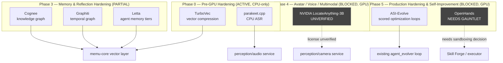
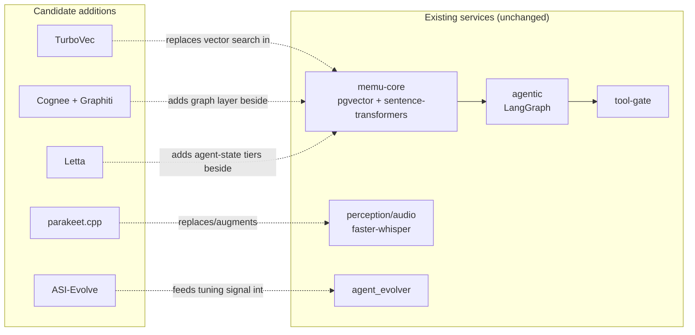

# External Tool Integration Plan (Shopping List → Phases)

> Companion to [STRATEGIC_PLAN.md](STRATEGIC_PLAN.md) and [TECH_WATCH.md](TECH_WATCH.md).
> This plan only includes tools that were independently verified (repo exists, license
> confirmed, integration path checked against actual code/docs) during the 2026-06-18
> tool-evaluation pass. It does not include the full v2.1 aspirational architecture —
> only the slice of it that is real, scoped, and maps onto a phase in `STRATEGIC_PLAN.md`.

## Why this document exists

An external "v2.1 architecture" document proposed ~20 third-party tools as a complete
rebuild. Cross-checking each tool against its actual repo/docs (not its marketing) found:
real tools with wrong integration assumptions (TurboVec, Nemotron/Ollama, DeerFlow's role,
OpenHands' sandboxing default), one dead link later corrected (ASI-Evolve), and a few tools
that would just duplicate what's already load-bearing in this repo (LangGraph already runs
`agentic`; CrewAI/AutoGen were evaluated once before and never adopted). This document is
the corrected, scoped result — what's actually worth building, and when.

## Verified tool → phase map

**Explicitly not on this map** (see `TECH_WATCH.md` Hold section, with reasons):
DeerFlow, CrewAI, AutoGen, ASI-Arch. All three orchestration tools would duplicate
LangGraph, which `agentic` already imports and runs (`agentic/app.py`, `adversary.py`,
`priority_queue.py`). ASI-Arch is architecture-search for novel neural nets — KAI only
consumes pretrained models via Ollama, so it has no job to do here.

## Where each verified tool actually plugs in

## Phase-by-phase notes

### Phase 0 (now, CPU-only) — real time savers, no GPU dependency
- **TurboVec**: `memu-core/app.py` currently does raw pgvector cosine search
  (`<=>` operator, manual `str(embedding)` formatting, no compression). TurboVec is a
  standalone in-process index (own `.tv`/`.tvim` format) — adopting it means an
  architectural choice, not a thin add-on: either (a) keep Postgres for relational
  metadata only and move similarity search to TurboVec's index, or (b) store
  TurboVec-compressed blobs as Postgres `bytea` + run TurboVec in-process for search.
  Path (a) is cleaner and avoids running two vector stores. CPU-only, no GPU gate —
  can start now.
- **parakeet.cpp**: `perception/audio/app.py` already has a GPU/no-GPU fallback pattern
  built around `faster-whisper`. parakeet.cpp's `parakeet-server` exposes an
  OpenAI-compatible HTTP transcription API and runs on CPU — slots into the exact same
  fallback slot `WHISPER_BACKEND` already abstracts. Low-risk, no new architecture needed.

### Phase 3 (partial — CPU-safe portions can start now)
- **Cognee / Graphiti**: both verified solid and self-hostable. These would sit beside
  `memu-core`'s existing pgvector store as a graph layer, not replace it — `memu-core`
  already does entity/session tracking by hand; Cognee/Graphiti are mature, tested
  implementations of the same problem. Worth a spike before committing — adding a second
  graph DB (Kuzu/FalkorDB) is new infrastructure, not config.
- **Letta**: now confirmed Ollama-compatible (official provider, `OLLAMA_BASE_URL`), but
  with a real history of provider regressions (GitHub #2388, #2668, broken across
  0.7.21–0.7.29). Pin the exact version and smoke-test it against the exact Ollama model
  tag before treating it as a dependency, not just before "adopting" it in the abstract.

### Phase 4/5 (still GPU-blocked, per STRATEGIC_PLAN's existing gate)
- **ASI-Evolve**: real, Ollama-compatible (verified via cloned `utils/llm.py` — plain
  `openai` SDK wrapper), but only useful once a real (non-stub) local model is running —
  which is the same GPU gate Phase 1 already enforces. Scope: bounded, scored optimization
  problems only (e.g. tuning `conviction.py`'s scoring weights against logged outcomes),
  feeding the existing `agent_evolver` loop — not a replacement for it. Must set
  `wandb.enabled: false` in its config before any run; defaults to true (telemetry-on).
- **OpenHands**: real and mature, but ships with full host filesystem access by default —
  Docker sandboxing is opt-in, confirmed against its own docs. If adopted for Skill Forge
  code-gen, sandboxing must be a hard requirement in the integration, not an assumption.
  Treat as the heaviest, highest-risk item on this list — full skill-security-gauntlet
  treatment before any wiring.
- **NVIDIA LocateAnything-3B**: still unverified after 5 fetch attempts across three
  sessions (HF page returns 403 every time). Do not plan around it — no confirmed license,
  size, or runtime requirements. Revisit only once someone can get a primary source to load.

## Open items before any of this is implemented

1. TurboVec architecture choice (replace vs. bytea-wrap pgvector) — needs an explicit
   decision before any code is written, since it changes `memu-core`'s storage model.
2. Letta version pin + Ollama smoke test, once Phase 3 work resumes.
3. LocateAnything-3B — get a working fetch or a pasted primary source before it appears
   in any build order with a checkmark next to it.
4. OpenHands sandboxing requirement — write into whatever future Skill Forge design doc
   covers code-gen, not assumed default-safe.
5. ASI-Evolve wandb-disable — one-line config fix, but must happen before first run, not
   after.

None of the above blocks current Phase 0 work. TurboVec and parakeet.cpp are the only two
items that could start immediately without waiting on GPU procurement or further
verification.

## Implementation readiness assessment (current system, code-level)

Checked the actual integration points before estimating effort — not the plan's
assumptions about them.

### What's already in our favor

Both target services already use the exact extension pattern this plan needs — adding a
new backend means following an established idiom, not inventing one:

- `memu-core/app.py:602` — `VECTOR_STORE` env var (`"memory"` | `"postgres"`) selects the
  storage backend at import time. `PGVectorStore` (`app.py:227`) is a self-contained class
  behind that switch — `generate_embedding()` (`app.py:609`) is a separate concern (real
  sentence-transformers vs. hash fallback), already decoupled from which store holds the
  vectors. This means TurboVec slots in as a `VECTOR_STORE=turbovec` branch and a
  `TurboVecStore` class implementing the same interface (`store`/`query`/`delete`/
  `get_state`) — a genuine swap point, confirmed by reading the code, not assumed.
- `perception/audio/app.py:35` — `WHISPER_BACKEND` env var (`"stub"` | `"local"` | `"api"`)
  with a lazy `try/except ImportError` guard (`_whisper_available`, `app.py:52-61`) around
  `faster_whisper`. parakeet.cpp adds as `WHISPER_BACKEND=parakeet` using the identical
  lazy-import-with-stub-fallback pattern — no new architecture needed.

### What's NOT yet known and must be resolved before estimating real effort

Neither of these was checked during the tool-evaluation pass — that pass verified the
projects exist, are licensed permissively, and are technically compatible. It did not
verify how they're *packaged*, which is what actually determines Docker integration cost:

1. **TurboVec packaging** — it's described as Rust with Python bindings. Need to confirm:
   is there a published `pip install turbovec` wheel, or does it require a Rust toolchain
   + build step inside `memu-core`'s Dockerfile (currently just `pip install -r
   requirements.txt`, no Rust/cargo present)? This changes the Dockerfile diff from
   one line to a multi-stage build.
2. **parakeet.cpp packaging** — it's a C++17/ggml binary, not a Python package.
   `perception/audio/Dockerfile` currently only does `apt-get install` (ffmpeg,
   libportaudio2) + `pip install`. Need to confirm: does it publish prebuilt binaries/a
   Python wrapper, or does the Dockerfile need a `cmake`/build-from-source stage? This is
   the single biggest unknown standing between "Trial" and "Adopt" for this item.

**Recommendation: spike both packaging questions first, before writing any integration
code.** This is a few hours of reading each project's own install docs/Dockerfile, and it
determines whether each item is a half-day change or a multi-day one.

### Sequencing — best-practice order, matching this repo's existing conventions

1. **Don't let this compete with the already-flagged, higher-priority open item.**
   `SESSION_BOOTSTRAP.md` already identifies live Docker verification of Phase 0.5/Phase B
   as the most urgent unclosed loop. TurboVec/parakeet.cpp work doesn't touch
   `agentic`/`ollama` wiring, so it's legitimately parallelizable — but say so explicitly
   in whatever PR does this work, don't let it read as if it superseded that priority.
2. **Packaging spike first** (above) — no code commitment, just answers.
3. **Implement behind the existing env-var idiom**, default unchanged (`postgres`/`local`)
   until the new backend is validated — matches how `"stub"` vs `"local"` vs `"api"` is
   already handled, and matches the repo's general bias toward conservative defaults in
   `docker-compose.minimal.yml` vs `full.yml`.
4. **Tests before merge, following the existing per-feature test-target convention**
   (`test_memu_pgvector.py` exists today per `DECISIONS.md` D12) — add
   `test_memu_turbovec.py` / extend the audio test suite the same way, wire new targets
   into `make test-core`, not as a side script.
5. **Write isolated, not tangled** — `SESSION_BOOTSTRAP.md` already flags `memu-core`
   (~6,100 lines) as the next candidate for the same hot/cold-path audit `agentic`
   already went through (D9). A new `TurboVecStore` class should be self-contained and
   easy to extract, not wired into request-handler internals — don't add to the debt that
   audit will need to clean up later.
6. **`make go_no_go` + `make merge-gate` before any PR** — already a stated repo guideline,
   not a new requirement being introduced here.
7. **Close the loop in docs**: `TECH_WATCH.md` verdict moves Trial → Adopt only once
   actually implemented and tested (not on verification alone), `make sync-docs` updates
   README's service/test counts automatically, and a new `DECISIONS.md` entry documents
   the real change — distinct from D13, which only documents the evaluation.
